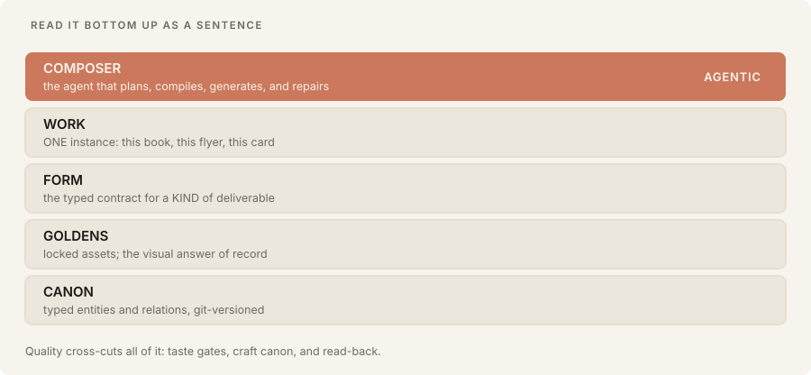
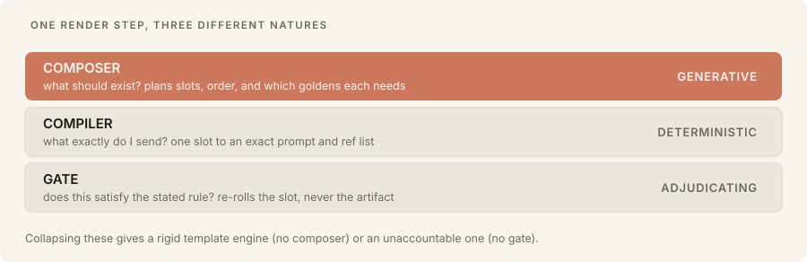
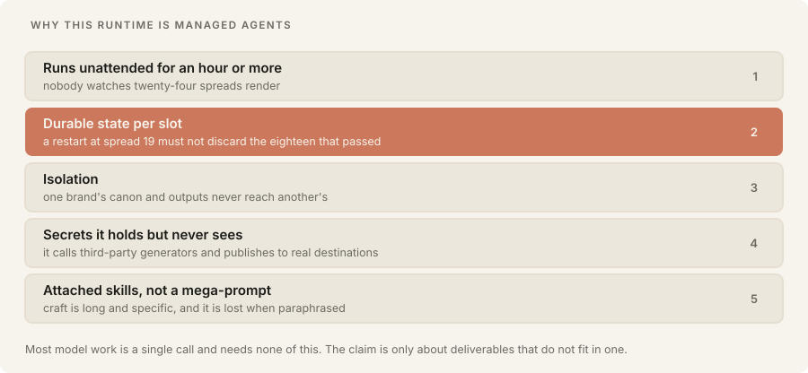

# Architecture

How a brand universe is put together, what runs it, and why the runtime is what it is.

Every diagram below was emitted by this repository's own `explanatory-plate` skill, deterministically,
from the palette in the spec. None was drawn by hand or by a model.

---

## The six layers



Read it bottom up as a sentence. **Canon** is what is true. **Goldens** are what it looks like once
locked. A **projection** is a kind of thing you can make. A **composition** is one of them. The
**composer** is the agent that makes it and answers to a gate.

The split that matters most is between the middle two. **A projection is a type; a composition is an
instance.** Conflating them is what made this standard storybook-shaped for its first five versions:
the one primitive that existed carried a story's required fields (`logline`, `spine`, `refrain`,
`beats`), so every deliverable had to be a story to be expressible. A flyer has no beats.

## The render step is three parts, not one



Collapsing these produces either a rigid template engine (no composer, so nothing new can be
composed) or an unaccountable one (no gate, so whatever the model returned ships).

**The composer** answers an open question and is the only layer where model intelligence belongs.

**The compiler** is deliberately dumb, and that is the point: it assembles the prompt and the
reference list from canon rather than from whatever the operator remembered to type. A rule the brand
already recorded can never be silently dropped.

**The gate** answers a closed question about a specific artifact. It is agentic wherever the rule is
perceptual, so the meaningful split is not agentic versus not, it is **generative versus
adjudicating**. Every invariant is typed accordingly:

| Type | Checkable by | Examples | Cost |
|---|---|---|---|
| `computed` | pure code | palette compliance, content fits its frame, geometry, required metadata | free, runs every time |
| `judged` | a model looking | no text in the image, malformed hands, is this the same person | roughly `judged` rules times slots |

**The judge must not be the maker.** A `judged` invariant is evaluated in fresh context, given the
artifact and the rule and nothing else, never the plan that produced it. An agent shown its own
reasoning defends it instead of inspecting the output. This was earned: a three-element graphic
shipped with one element missing its defining feature, because the maker "knew" the omission was
intentional variety and read its own intent rather than the pixels. An observer with no access to the
plan caught it instantly.

**The judge is a subagent, and that is the whole implementation.** Independence is a property of
context, not of vendor or billing account. A fresh subagent inside the runtime that is already
composing has never seen the plan, which is the only thing the rule asks for, and it needs no second
credential. An earlier implementation required an API key and shelled out to a separate process; with
no key present every slot parked as unjudgeable, which made the correct architecture look like a
blocked one. It was neither. It was the cheapest judge being unreachable.

So the composer does not judge. Per slot it writes a **brief** naming exactly what a judge is shown,
and exactly what it is not:

```jsonc
{ "artifact": "...", "reference": "...", "mode": "identity" | "style",
  "checklist": ["no-text-in-art", "hands-loopy-non-anatomical, four fingers plus a thumb"],
  "withheld": "the plan, the beats, the compiled prompt, and the intent" }
```

The brief is the enforcement. Asking an agent to disregard what it already knows is not a control;
handing a different agent a bounded brief is. `mode` matters because there are two different
questions: `identity` judges against a character golden (*is this the same subject?*), `style` judges
against a pack anchor whose subject is irrelevant (*is this the same visual voice?*).

A slot awaiting a verdict is **`NEEDS-JUDGMENT`**, which is neither PASS nor DEFECT: the artifact
exists and is sound, and one check has not run. Re-running never regenerates it, because re-rolling
something nobody has judged pays twice and throws away the artifact the judge was about to inspect.

## Why the runtime is Managed Agents



Composing one illustrated book is not a request. It is tens of slots, each a prompt assembly plus one
or more model calls plus one or more verification passes, running for an hour or more with nobody
watching.

Requirement 2 is the load-bearing one, and it comes straight from the failure model rather than from
preference. When a slot exhausts its re-rolls it is marked DEFECT, **the remaining slots continue**,
and the artifact emits incomplete with a per-slot report. A person then repairs one slot instead of
re-running an hour of work. That behaviour is impossible without per-slot state that survives a
restart.

**The honest scope.** Most work on a model platform is a single call and needs none of this. One
request, one response, no state, no isolation problem, well served by any SDK. The claim here is
narrower and therefore checkable: once a deliverable needs many interdependent generations, held to
rules no single generation can satisfy, over a run long enough that nobody watches it, the workload
has changed kind. At that point you either operate that infrastructure or you rent it. Both are
legitimate.

## The linter

Everything above is only true if it is checked. `skills/lint-universe` runs static checks over a
universe and everything it declares: packs, projections, slots, emitters, generators, goldens, and
provider quirks. No generation, no API, no cost.

```bash
python3 skills/lint-universe/scripts/lint.py <universe-dir>   # 0 clean, 1 warnings, 2 errors
```

Every check corresponds to a failure that actually shipped:

| Check | The failure it prevents |
|---|---|
| `SLOT-NO-EMITTER` | a slot typed `deterministic` that names nothing capable of producing it |
| `SURFACE-INFEASIBLE` | a declared surface no generator can physically make (the 0.333 class) |
| `SLOT-NO-GENERATOR` | a generated slot nothing is assigned to produce |
| `INVARIANT-UNTYPED` | a rule that is neither `computed` nor `judged`, so nobody knows who checks it |
| `EXTENDS-UNRESOLVED` | a fork pointing at a projection that does not exist |
| `REGISTER-UNLOCKED` | a null style anchor, meaning generation should refuse |
| `GOLDEN-MISSING` | a required reference that will crash at render time |
| `PACK-NO-GATE` | a style pack with no read-back rules, which is a mood board |
| `INVARIANT-VS-QUIRK` | a rule the pinned provider is registered as breaking (warning, not error) |

It earned itself on its first run by finding a generated slot with **no generator declared for it**, a
bug that had been silently parking every cover as a defect. Parking works so well that a real defect
hid behind it, which is an argument for linting rather than against parking.

**`extends` is merged before anything is checked**, exactly as the composer merges it. Checking a
child's raw fields makes every fork that *inherits* a generator, an emitter, or a surface false-fail:
the field is absent from the file and present at run time. This survived until the first fork that
inherited rather than overrode.

**`INVARIANT-VS-QUIRK` is the behavioural twin of `SURFACE-INFEASIBLE`.** One catches a contract that
is internally coherent and geometrically undeliverable; the other catches one that is internally
coherent and *behaviourally* expensive. A projection demanded "four fingers plus a thumb" and pinned a
provider whose registry entry says it loses a digit on stylized hands. Seven artifacts went to
independent judges and six failed on that one item, twice each, with the prompt counter attached.
Nothing was wrong with either file alone; the contradiction lived between them.

It is deliberately a warning. The seventh artifact passed every item, so the rule is satisfiable and
the true cost is re-rolls. A brand is allowed to demand something hard. What it must not be is a
surprise discovered after paying for generation.

There is one more check that runs in the **composer** rather than the linter, because it needs the
composition and not just the universe: a scene may not *name* something its style pack rejects. A beat
described a grid as "receding" for a pack that rejects perspective, and the compiler dutifully
appended "no perspective" to the same prompt, so the model received both instructions and picked one.

## Provider quirks

A **quirk** is what a specific model gets reliably wrong regardless of brand. It belongs to the
capability binding, not to the look: it survives a change of brand and dies with a change of provider,
which is the opposite of a style rule. They live in `registry/providers.json`, framework-owned, so one
project learning something benefits every other.

Quirks bind to the provider a slot **resolves to**, not to its pin. Binding them to the pin left the
one projection deliberately kept provider-agnostic as the only unguarded one, which is backwards.

Each quirk carries a `counter` appended automatically to every compiled prompt, and a `check` that
becomes a gate item, because countering something in a prompt is never assumed to have worked.

## Tests

```bash
./run-tests.sh      # no keys, no network, no generation
./sync-plugin.sh    # mirror skills into the packaged plugin, then PROVE they match
```

The sync script exists because the plugin keeps identical copies rather than symlinks, so a silent
copy failure leaves them out of sync with nothing to notice. It found a skill that lived only in the
plugin and was never tracked here, plus two skills whose scripts *and tests* existed on one side only.

## Further reading

- [SPEC.md](../SPEC.md), the normative standard.
- [PROJECTION.json](https://appliedai.wiki/reference/standards/projection-json), the contract format on its own.
- [hyperagentic-age](https://github.com/garysheng/hyperagentic-age), a universe with eight projections and real committed output.
