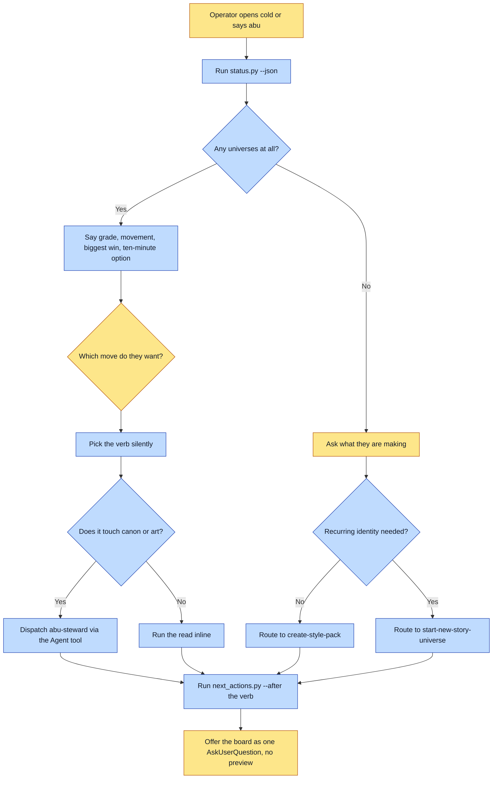

# Purpose

A person who knows nothing about the framework's verbs learns where their universe stands, what
the single highest-leverage next move is, and gets offered that move as something to tap rather
than something to type.

The outcome is a decision made, not a report delivered. A run that prints a grade and stops has
handed the operator the same guessing game they opened the session with.

# When to use (Trigger)

Someone says "abu", "how's my universe", "where am I", "what should I do next", "what can I do",
"I'm bored", "get me to 100", "status", or opens a session cold with nothing specific to ask for.
Also whenever you catch yourself about to show a non-technical user a shell command, and at the
end of any verb that just completed a unit of work.

# Inputs / Prerequisites

- A universe path, or the directory you are standing in, or the registry of universes the status
  script already knows about. Standing in one registers it.
- Nothing else. The script exits 0 when there are no universes at all, because "you have none
  yet" is an answer.

# Roles

| Role | Responsibility |
|---|---|
| **Human operator** | Brings the desire in plain language and picks from the offered moves. Never types a path, a flag, or a verb name. |
| **Agent executor** | Reads the situation with `status.py`, translates the grader's fields into outcomes, routes the wish to a verb silently, dispatches the steward for anything touching canon or art, and ends by offering the next moves through `AskUserQuestion`. |

# Procedure

Steps say WHAT happens. The flowchart says who; Automation Opportunities holds the ROI.

1. Read the situation with `scripts/status.py --json` before saying anything. It resolves the
   universe, grades it via `universe-doctor`, diffs against the last score it saw, and selects
   the moves worth mentioning.
2. If there are no universes, this is an onboarding moment rather than an absence to report. A
   look with no recurring characters routes to `create-style-pack`; something that must appear
   identically everywhere routes to `start-new-story-universe`; an uninstalled framework routes
   to `onboard`.
3. Otherwise open with where they stand in three sentences at most: the grade and the movement
   since last time, the biggest win named as an outcome, and the ten-minute option.
4. Propose rather than await. Offer at most three options, each specific enough to answer yes to.
5. Route a wish to a verb silently. Announce the outcome, never the routing.
6. Dispatch `abu-steward` for any step that scaffolds an entity, shoots or locks references,
   composes a spread, renders a book or a cover, or writes provenance. Reads stay inline.
7. End by running `scripts/next_actions.py <universe> [--after <verb just run>]` and asking its
   result as ONE `AskUserQuestion` call, with no `preview`.

# Process Flowchart

Amber = irreducibly human. Blue = agent-executed or agent-proposed.

# Done / Verification

The operator knows where they stand, what is worth doing next, and what a small version of that
looks like. They were offered something specific rather than asked an open question. **No shell
command appeared in the conversation**, which is checkable by reading the transcript back.

At the end of a work session, `status.py` runs again and the delta is reported. A session that
improved nothing says so rather than narrating activity.

# Exceptions & Troubleshooting

- **A command in the transcript is a defect in this skill**, not a convenience. The single
  exception is a prerequisite the harness genuinely cannot satisfy: installing the console and
  holding an API key, both of which are credentials and consent.
- **Never re-derive the grader's numbers.** Say `plan.headline.human`, never
  `plan.headline.fix`, which is the grader's internal instruction and contains commands. The
  grader aggregates, so one issue record can stand for hundreds of files; never multiply `count`
  by anything.
- **A low score on a young universe is a plan, not a failing grade**, and framing it otherwise
  makes people quit at C.
- **The steward was reachable from nowhere for a while and was invoked zero times** across a full
  book session in which the main agent hand-rolled five shoot scripts. A countermeasure nobody
  can reach is not installed, which is why step 6 exists.
- **No `preview` on the next-moves board.** A preview flips `AskUserQuestion` into a side-by-side
  layout that does not draw the visible `Other` row, and the real answer on a board of next moves
  is very often the fifth one, in the operator's head.
- **A menu of eight is another wall.** Three options maximum at step 4.

# Automation Opportunities

**Already automated:** resolving the universe, grading it, diffing against the previous score,
selecting the moves worth mentioning, and phrasing each one as an outcome with its point value
(`status.py`, `next_actions.py`). The whole factual half is generated rather than recalled.

**Irreducibly human:** which of the offered moves to take, and any taste fork the grader marks as
propose-rather-than-auto. Also the decision to stop.

**Built, v0.49, for the half the framework controls** (it was this map's own strongest next
candidate): the FRAMEWORK's own strings can no longer carry a command to a person.
`workspace.command_in()` is the detector, `humanize()` drops anything command-shaped whichever
argument it arrived in, a command-shaped board label becomes the dimension's outcome sentence, and
a test reads `grade.py`'s `RUBRIC` so a new dimension cannot ship without a plain-language
sentence. The live leak it closed: `setting_nesting` had no sentence, so its fix string -- two JSON
keys in backticks -- was what `plan.headline.human` said out loud.

**Strongest next candidate:** the other half, a command the AGENT types into the transcript on its
own account. Nothing here can see that, and the honest options are a transcript-scoring check
(`pave-the-path/scripts/review_run.py` already reads a run's transcript) or leaving it as
judgement. Worth deciding rather than leaving implied, since the rule now reads as enforced.

# Related

- [universe-doctor](../universe-doctor/SKILL.md): the rubric this skill reports; it does not
  invent its own score.
- [onboard](../onboard/SKILL.md): where an uninstalled framework goes.
- [explore](../explore/SKILL.md): already prints the next-moves board itself at the end of every
  fan-out, and is the pattern every completing verb should follow.

# Revision History

| Version | Date | Changes |
|---|---|---|
| 0.1 | 2026-09-14 | Written from the skill file, read rather than recalled. First map in this plugin. |
