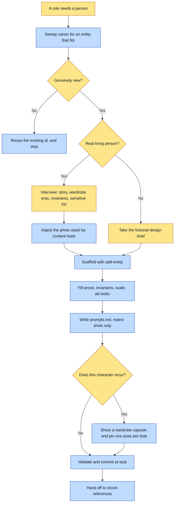

# Purpose

A person or character exists in canon as a typed record that every later render reads from, so
the same face, build, wardrobe and signature details come back on every page instead of being
re-described and re-invented per spread.

This step produces words and slots, never art. It ends at `lock_level: stub` with a validated
entity and a ready-to-run prompt per matrix shot.

# When to use (Trigger)

A story's casting sweep returns NEW for a person-shaped role, or the operator names someone who
has to appear in the universe. The trigger is the sweep's verdict, not the mention: a role an
existing entity can play is a reuse.

# Inputs / Prerequisites

- The target universe, a path containing `universe.json`. Its `identity` block (mark, register,
  voice) and `assetRoot` are read here.
- Whether the character is a REAL living person or FICTIONAL. This decides everything else:
  a real person triggers the dossier, the photo stack and the subject-approval gate.
- For a real person: their story, wardrobe eras, signature physical invariants, the **sensitive
  list** of private detail that must never ship, and eight or more varied photographs.
- For a fictional character: a design brief covering look, silhouette, palette, signature
  invariants and voice.

# Roles

| Role | Responsibility |
|---|---|
| **The subject, when real** | Owns the sensitive list and the approval of words and likeness. Their blessing is not the author's to give. |
| **Human operator** | Supplies the design brief or the dossier, decides what counts as a signature invariant, and answers the reuse question when the sweep is ambiguous. |
| **Agent executor** | Sweeps canon first, interviews one question at a time, runs the scaffolder rather than hand-writing JSON, ingests photos through the hashing importer, writes the prompts, and stops before any image call. |

# Procedure

Steps say WHAT happens. The flowchart says who; Automation Opportunities holds the ROI.

1. Casting sweep first. Sweep `canon/entities/` and any CANON.md for an entity that already fits
   the role. If one fits, stop and reuse it.
2. Interview for exactly what the matrix needs. A real person yields their role in this universe,
   their story and voice, wardrobe eras, signature invariants and the sensitive list. A fictional
   character yields a design brief.
3. For a real person, collect the photo stack with `scripts/ingest_photos.py`, which pulls the
   pasted images out of the harness transcript onto disk and refuses by content hash to write an
   image that already belongs to another entity.
4. Scaffold with `add-entity <universe> character <id>`, which writes the eight matrix slots as
   null, an empty `requiredForRender`, and a gated `realPerson` block when photos are present.
5. Fill `prose` and `structured.invariants` with the load-bearing identity rules the read-back
   will check. State modesty and any body rule as anatomy rather than as adjectives.
6. Fill `structured.scale` when this character will ever share a frame, and record the inverse on
   the other character in the same pass.
7. Declare a declared-future look as `structured.altLooks.era-<year>` with `keepSheets` or
   `keepPhotos`, never as a second entity. Declare `structured.registerNeutral` when this is a
   photoreal identity master, before any shoot.
8. Write `reference/<id>/prompts.md`: matrix shots only, one block per shot, register anchor
   first, rejected poles as negatives, the invariants stated, the output path named. Era and
   alt-look shots go in a separate file.
9. For any character who RECURS, pin the wardrobe to a capsule sheet and add one pose per look
   whose `sheets` list actually passes that capsule.
10. Validate, check for a concurrent writer before the scaffold rather than after, and commit the
    entity, the reference directory and `prompts.md`. Report the stub state and hand off.

# Process Flowchart

Amber = irreducibly human. Blue = agent-executed or agent-proposed.

# Done / Verification

`abu validate <universe>` is green. `abu lock-level <universe> <id>` reports `stub`.
`reference/<id>/prompts.md` exists with one block per matrix shot and no `TODO(author)` body left
where a body was written. A real person's entity carries `realPerson.approval.state: "gated"` and
a populated sensitive list. Nothing under `reference/<id>/` is a generated image, because this
skill never calls an image model.

# Exceptions & Troubleshooting

- **The photo stack is the dangerous input.** A harness transcript can lag behind a paste, so
  "the most recent images" can still be the previous person's. Four photographs of one man were a
  keystroke from landing in another man's stack on 2026-08-21, and a stack rides on every shot of
  a matrix, so that rewrites one face with another and surfaces hours later. If the importer
  refuses, wait for the flush or reach back with `--batch 2`.
- **`prompts.md` holds matrix shots ONLY.** A shot's body runs until the next `## ` heading, so
  any appendix after the last shot is silently appended to it. Four era sections kept at `###`
  produced a 4397-character prompt that leaked a child, a superseded wardrobe and a banned
  pendant into a base plate.
- **A declared-future look inverts the normal sheet rule.** An ordinary alt look changes the face
  and auto-drops the base face sheets; a future look keeps the face and changes the body, so
  without `keepSheets` or `keepPhotos` only the superseded silhouette reaches the model and it
  renders a stranger with the right build.
- **An unshot entity carries `requiredForRender: []`.** Naming a required slot whose sheet is
  still null makes `validate` report a problem per slot.
- **Never invent a real person's measurements.** Write what the author supplied, mark the rest
  NOT ON RECORD, and carry comparisons in `scale.relativeTo`.
- **A public figure's private family does not inherit their public-figure status.** Rendering a
  verified likeness beside invented family faces makes the frame read as a documentary claim
  about how those private people look. The fix is compositional, not a disclaimer, and it applies
  even where a universe has abolished every approval gate.
- **Wardrobe drifts because it is a phrase and the face is a file.** "Refined modern-chic in cream
  and gold" satisfies canon perfectly while inventing a different garment every render; over 20
  spreads that is 20 shirts. `lint-universe` warns `CHARACTER-WARDROBE-NOT-PINNED`.

# Automation Opportunities

**Already automated:** entity scaffolding with the correct slot shape, photo ingestion with the
cross-entity hash refusal, schema validation, and the lint warnings for one-sided scale, unpinned
wardrobe and a look with no identity anchor.

**Irreducibly human:** the sensitive list, what counts as a signature invariant, and the reuse
call when a sweep is ambiguous. All three are judgments about a person rather than facts on disk,
and the first is not the author's to make at all.

**Strongest next candidate:** a refusal when `prompts.md` carries any heading after the last
matrix shot. That defect is silent, it corrupts the art rather than failing, and the shape is
mechanically detectable. `chain_matrix.py` already refuses it downstream; catching it at authoring
time is where it is cheap.

# Related

- [casting-sweep](../casting-sweep/SKILL.md): the reuse gate step 1 runs.
- [shoot-references](../shoot-references/SKILL.md): the art step this hands off to.
- [compose-spread](../compose-spread/SKILL.md): where an alt look's three suppression channels
  are enforced at compile time.

# Revision History

| Version | Date | Changes |
|---|---|---|
| 0.1 | 2026-09-14 | Written from the skill file, read rather than recalled. |
