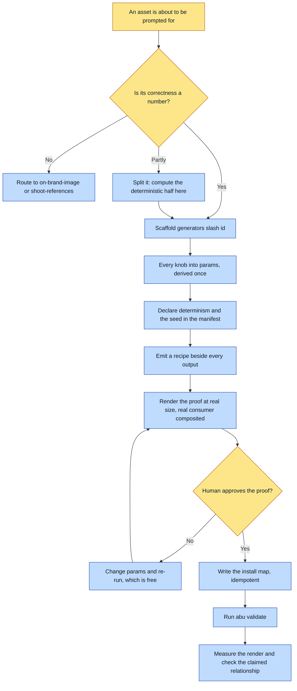

# Purpose

An asset whose correctness is arithmetic rather than judgement gets drawn by code that re-runs
byte-identically forever, instead of being prompted for and then almost-right.

The outcome is a typed, proofed, installable generator: a mark, a favicon set, a starfield, a
grid, a colour-chip sheet, share-card furniture. It is reproducible, iterable at zero cost,
correct by construction where a prompt could only hope, and free.

# When to use (Trigger)

You are about to prompt an image model for something you could compute, or you catch yourself
writing a loose `make_*.py` beside an asset, or hand-copying a generated file into several repos.
Any of those three is the moment.

The dividing line is stated as a question: is the correctness of this output checkable with a
number? Geometry, tiling, noise, palettes and layout furniture are. A scene, a face or a mood is
not, and goes to `on-brand-image` or `shoot-references`.

# Inputs / Prerequisites

- The target universe. The generator lands at `<universe>/generators/<id>/`.
- What it draws, in a sentence, plus the knobs a reviewer would want to turn.
- Where its outputs are consumed: the repos and paths, for the `install` map.
- A human available to approve the proof sheet. A generator is reproducible, so it needs one
  honest look rather than a per-run read-back.

# Roles

| Role | Responsibility |
|---|---|
| **Human operator** | Approves the proof sheet at real size on the real ground, and chooses what fraction of an optical-centre correction to apply, which is taste rather than arithmetic. |
| **Agent executor** | Confirms the output is computable, scaffolds the typed folder, puts every knob in `params`, declares determinism, emits a recipe per output, renders the proof with the real consumer composited in, writes the install map, validates, and MEASURES the render rather than reasoning about the geometry. |

# Procedure

Steps say WHAT happens. The flowchart says who; Automation Opportunities holds the ROI.

1. Confirm it is computable. If any output needs taste, split it: compute the deterministic part
   here and render the rest through a Style Pack.
2. Scaffold `generators/<id>/` with `generator.json`, `generate.py`, `out/` and `proof/`.
3. Write every knob into `params`, never into the code. A value used two ways is DERIVED in one
   place and never retyped in the other.
4. Declare `determinism` as `pure` or `seeded`, with the seed in the manifest rather than in the
   code. Wall-clock and unseeded randomness are defects and the engine validates this.
5. Emit a `.recipe.json` beside every output, naming the generator, its params, its seed and its
   input hashes.
6. Render a proof sheet at REAL size, on the grounds where the thing will actually be seen, with
   the real consumer composited into it, and have a human approve it.
7. Write the `install` map when outputs are consumed elsewhere, and make installing idempotent
   and report-only-what-changed.
8. Run `abu validate <universe>`, which checks kind, entrypoint, determinism and seed coherence,
   declared-versus-written outputs, and install sources.
9. Disprove a design belief rather than asserting it. Checking is cheap here, which is the whole
   advantage.
10. MEASURE the render and compare the relationship you claimed. Never reason about the geometry
    and believe the answer.

# Process Flowchart

Amber = irreducibly human. Blue = agent-executed or agent-proposed.

# Done / Verification

`abu validate <universe>` passes the generator's kind, entrypoint existence, determinism and seed
coherence, declared-versus-written outputs, and install sources. Every output has a
`.recipe.json` beside it. The proof sheet exists and a human has approved it at the sizes and on
the grounds where the asset will be seen. Re-running the entrypoint produces byte-identical
output. Installing twice reports no change the second time.

# Exceptions & Troubleshooting

- **The characteristic bug is two constants that silently mean different things.** A favicon
  generator carried `MARK_SPAN` as a fraction of the tile while the SVG it also emitted used the
  same number as an SVG `scale()`, which multiplies the whole coordinate system. They disagreed
  by 30% and sheared the descender off every raster.
- **A generator that mostly works and needs hand-touching afterward is the artifact you were told
  not to hand-edit.** Split it instead.
- **Reasoning about geometry is where whole sessions go.** The arithmetic is right, the picture is
  wrong, and the assertion checks the numbers you just computed rather than what they produced.
  Text placed by its advance width rather than its ink; a path centred by its bounding box rather
  than its ink; an optical centre that is not the box centre; type outlined without kerning; a
  proof sheet scaled on the wrong axis, which manufactured the exact defect it existed to detect.
  None of these is visible in a thumbnail.
- **A proof sheet is code too**, so a defect it appears to find is a defect in one of two places.
- **Hand-copying a generated file into N repos is how N repos drift.** One site shipped a mark
  fourteen months stale while another shipped an incomplete icon set, because both were copies.
- **A one-off diagram carrying labels does not need a generator** unless you will regenerate it.
  Author it as SVG directly.

# Automation Opportunities

**Already automated:** the typed manifest and its validation, provenance emission, and the
install map's idempotence. All the bookkeeping a hand-rolled `make_*.py` skips.

**Irreducibly human:** approving the proof at real size, and choosing the fraction of an optical
correction to apply. The offset is arithmetic; how much of it looks right is taste.

**Strongest next candidate:** a measurement harness the proof sheet calls, asserting the
composed relationship rather than the inputs. Step 10 is the step that keeps costing sessions,
and it is currently enforced by remembering to look, which is exactly the enforcement this
framework rejects everywhere else.

# Related

- [on-brand-image](../on-brand-image/SKILL.md): where an asset needing judgement goes instead.
- [add-motif](../add-motif/SKILL.md) and [add-prop](../add-prop/SKILL.md): for a recurring element
  that must render identically across many MODEL images rather than being drawn.

# Revision History

| Version | Date | Changes |
|---|---|---|
| 0.1 | 2026-09-14 | Written from the skill file, read rather than recalled. |
