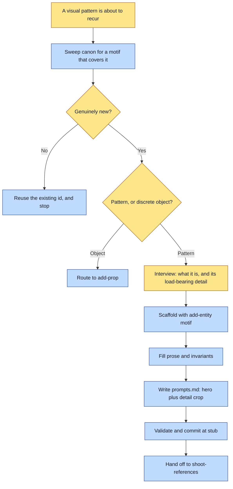

# Purpose

A recurring visual element that must look the same everywhere it appears (a gesture, a light
quality, a repeated symbol, a compositional device) exists as a typed canon record with two
reference slots scaffolded, so every later render conditions on the same pictures rather than on
a paraphrase of a description.

This is authoring, not art. It ends at a validated `stub` entity plus ready-to-run prompts.

# When to use (Trigger)

A pattern is about to appear for the second time, or a story names something that recurs and is
not a discrete object. The distinguishing question is whether the thing is a pattern or an
object: an object a character holds is `add-prop`, a pattern is this.

# Inputs / Prerequisites

- The target universe, a path containing `universe.json`. Its `identity` (mark, register, voice)
  and `assetRoot` are read here.
- What the motif is and where it recurs.
- Its LOAD-BEARING DETAIL: the one specific feature that, if it drifted, would break
  recognizability. This is what the `detail` crop locks down, and without it the motif has no
  checkable identity.

# Roles

| Role | Responsibility |
|---|---|
| **Human operator** | Names the motif and its load-bearing detail, and settles whether an existing entity already covers the pattern when the sweep is ambiguous. |
| **Agent executor** | Sweeps canon first, interviews for exactly what the two slots need, runs the scaffolder rather than hand-writing JSON, writes the two prompts with the register anchor first, and stops before any image call. |

# Procedure

Steps say WHAT happens. The flowchart says who; Automation Opportunities holds the ROI.

1. Casting sweep first. Sweep `canon/entities/` and any CANON.md for an existing motif that
   already covers this pattern. Proceed only if genuinely new.
2. Interview one question at a time, for two things only: what the recurring element is and why it
   must recur identically rather than being redrawn, and its load-bearing detail.
3. Scaffold with `add-entity <universe> motif <id> --name`, which writes
   `structured.sheets: {"hero": null, "detail": null}` and an empty `requiredForRender`.
4. Fill `prose` with when and how the motif is used, and `structured.invariants` with the
   load-bearing rules the read-back will check.
5. Write `reference/<id>/prompts.md` with a hero shot showing the motif in its clearest form and
   a detail crop tight on the load-bearing feature. Each prompt passes `identity.register.anchor`
   FIRST, bakes `register.rejectedPoles` as negatives, states the invariant that must never
   drift, and names the output path.
6. Run `abu validate <universe>`, commit the entity, the reference directory and `prompts.md`,
   and report the stub state with `shoot-references` as the next step.

# Process Flowchart

Amber = irreducibly human. Blue = agent-executed or agent-proposed.

# Done / Verification

`abu validate <universe>` is green. `canon/entities/<id>.json` exists with both sheet slots
present and null, non-empty `structured.invariants`, and prose saying when the motif is used.
`reference/<id>/prompts.md` holds exactly two blocks, each naming its output path and leading
with the register anchor. No image was generated, which is checkable by the absence of any PNG
under `reference/<id>/`.

# Exceptions & Troubleshooting

- **A motif with no load-bearing detail is not ready to scaffold.** The detail crop is what makes
  the record checkable at read-back, and a motif whose identity is an adjective will pass every
  render and drift anyway.
- **The kind boundary is the commonest mistake here.** A discrete physical object a character
  holds, wears or uses is `add-prop`, even when it recurs. A place is `add-setting`. An object a
  whole property argues through across changing states is `add-visual-metaphor`.
- **Reuse wins, and it is a receipt.** A second motif covering a pattern an existing one already
  holds costs the whole reference build and produces two records that will drift.
- **This skill never calls an image model.** If you are generating here, you are in
  `shoot-references`.

# Automation Opportunities

**Already automated:** the entity scaffold with the correct slot shape, and schema validation.

**Irreducibly human:** naming the load-bearing detail, and the reuse call when a sweep is
ambiguous. Both are judgments about what would count as this motif failing to be itself.

**Strongest next candidate:** composing the two prompt bodies from the entity's own strings, the
way `shoot-references/scripts/compose_prompts.py` already does for characters. A hand-typed
prompt paraphrases the invariants slightly, and the read-back then checks the art against the
other wording, which is the exact divergence that tool exists to close. Motifs get no such help
today.

# Related

- [casting-sweep](../casting-sweep/SKILL.md): the reuse gate step 1 runs.
- [shoot-references](../shoot-references/SKILL.md): the art step this hands off to.
- [add-prop](../add-prop/SKILL.md): the sibling for a discrete object rather than a pattern.

# Revision History

| Version | Date | Changes |
|---|---|---|
| 0.1 | 2026-09-14 | Written from the skill file, read rather than recalled. |
