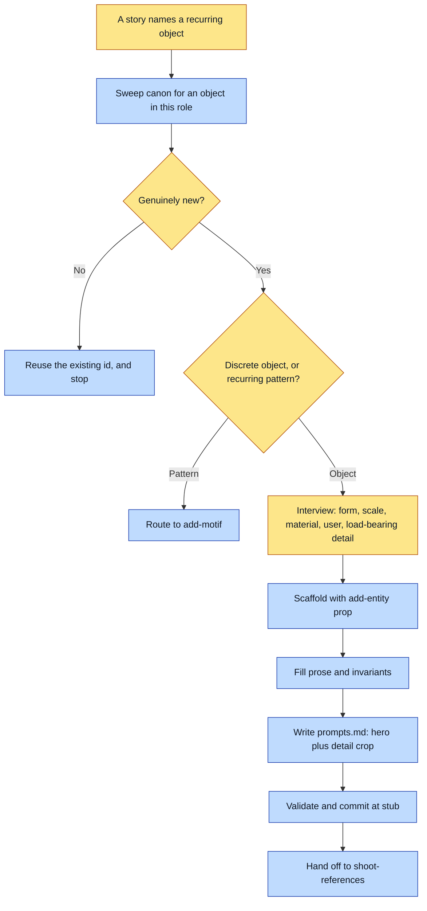

# Purpose

A discrete object a character holds, wears or uses exists as a typed canon record with two
reference slots scaffolded, so it reads as THE SAME object across every render rather than as a
similar one.

This is authoring, not art. It ends at a validated `stub` entity plus ready-to-run prompts.

# When to use (Trigger)

A story names an object that will appear more than once and whose identity matters. Two
characters can share one canonical prop, so the sweep runs before the naming does.

# Inputs / Prerequisites

- The target universe, a path containing `universe.json`. Its `identity` and `assetRoot` are read
  here.
- What the object is: form, scale, material, and who holds, wears or uses it and how.
- Its LOAD-BEARING DETAIL: the one feature that must never drift, such as an engraving, a wear
  mark, a colour, a proportion. Without it the prop reads as a similar object rather than the
  same one.

# Roles

| Role | Responsibility |
|---|---|
| **Human operator** | Names the object and its load-bearing detail, says who is allowed to touch it if that is canon, and settles an ambiguous reuse. |
| **Agent executor** | Sweeps canon first, interviews for exactly what the two slots need, scaffolds with the tested machinery, writes both prompts with the register anchor first, and stops before any image call. |

# Procedure

Steps say WHAT happens. The flowchart says who; Automation Opportunities holds the ROI.

1. Casting sweep first. Sweep `canon/entities/` and any CANON.md for an existing object that
   already covers this role. Proceed only if genuinely new.
2. Interview one question at a time: what the object is, and its load-bearing detail.
3. Scaffold with `add-entity <universe> prop <id> --name`, which writes
   `structured.sheets: {"hero": null, "detail": null}` and an empty `requiredForRender`.
4. Fill `prose` with what the object means and who may touch it, and `structured.invariants` with
   the load-bearing rules the read-back will check.
5. Write `reference/<id>/prompts.md`: a hero shot with the object cleanly framed and its full form
   visible, and a detail crop tight on the load-bearing feature. Each prompt passes
   `identity.register.anchor` FIRST, bakes `register.rejectedPoles` as negatives, states the
   invariant, and names the output path.
6. Run `abu validate <universe>`, commit, and report the stub state with `shoot-references` as the
   next step.

# Process Flowchart

Amber = irreducibly human. Blue = agent-executed or agent-proposed.

# Done / Verification

`abu validate <universe>` is green. The entity exists with both sheet slots present and null,
non-empty invariants, and prose. `reference/<id>/prompts.md` holds exactly two blocks, each
naming its output path and leading with the register anchor. Nothing under `reference/<id>/` is a
generated image.

# Exceptions & Troubleshooting

- **A prop with no load-bearing detail will pass every render and still drift**, because nothing
  in the record says what would count as it being the wrong object.
- **A prop is what makes a rule bind when prose loses.** A house rule written into a setting's
  `dressing` rendered four different slippers across fourteen spreads and was beaten outright by
  a character's own signature-boots invariant, because both are just text in one prompt. It held
  the moment the slippers became a locked prop with art on disk, cast into each affected spread.
  A reference image outranks any number of words.
- **A prop that appears in two states needs both sheets.** When a beat shows an object in a state
  no locked sheet depicts, generate the state rather than letting the model derive it.
- **Two characters can share one canonical prop**, which is exactly what the sweep is for.
- **An object whose correctness is a NUMBER is a generator, not a prop.** A geometric mark, a
  grid, a set of favicons: those are `add-generator`, where they are computed rather than rolled.

# Automation Opportunities

**Already automated:** the entity scaffold, and schema validation.

**Irreducibly human:** the load-bearing detail, the ownership rule, and the reuse call.

**Strongest next candidate:** carrying `structured.scale` into the scaffold prompt for props, the
way `add-setting` forces size and `add-character` forces relative height. A prop's size is
exactly as unconstrained as a room's was, and `compose-spread` already emits a TRUE SIZE line
from `structured.scale` for any kind. A supercharged laptop ranged from a notebook to a small
television across one book because nothing asked.

# Related

- [casting-sweep](../casting-sweep/SKILL.md): the reuse gate step 1 runs.
- [shoot-references](../shoot-references/SKILL.md): the art step this hands off to.
- [add-generator](../add-generator/SKILL.md): for an object whose correctness is computable.

# Revision History

| Version | Date | Changes |
|---|---|---|
| 0.1 | 2026-09-14 | Written from the skill file, read rather than recalled. |
