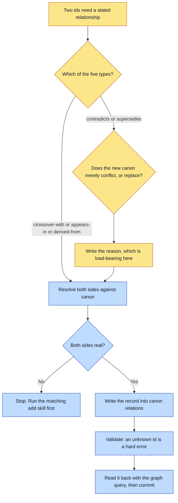

# Purpose

Two ids in a universe carry a stated, typed relationship, so the graph can answer "every crossover
this character has" and "every story touching this doctrine" without anyone reading the whole
canon.

The half that matters most is the contradiction: new canon that conflicts with old is recorded as
a `contradicts` or `supersedes` edge rather than applied as a silent edit to the older entity.
That is how history stays visible and a testimony universe stays honest about what it once said.

# When to use (Trigger)

Two canon entities, or an entity and a story, need a recorded relationship. In practice: a
crossover just happened, a story features an entity, a design was built out of another, or new
canon has just disagreed with old canon.

# Inputs / Prerequisites

- The target universe, with `canon/entities/` and `stories/` readable so both sides can be
  confirmed.
- The two ids, and which of the five relation types actually applies:
  `crossover-with`, `appears-in`, `derived-from`, `contradicts`, `supersedes`.
- For `contradicts` and `supersedes`, the one-line reason. It is load-bearing: the record has to
  explain itself without anyone digging up the git history.

# Roles

| Role | Responsibility |
|---|---|
| **Human operator** | Decides which of the five types applies, and whether new canon merely conflicts with old or actually replaces it. That distinction is a ruling, not a lookup. |
| **Agent executor** | Confirms both sides resolve to real ids, writes the record, validates, and reads it back through the graph queries. Refuses to point a relation at a name that is not canon yet. |

# Procedure

Steps say WHAT happens. The flowchart says who; Automation Opportunities holds the ROI.

1. Determine the relation type. Exactly one of the five applies.
2. Confirm both sides resolve. `from` and `to` must each be a known entity, or a story where a
   story is the natural target. If either side does not exist, stop and run the matching `add-*`
   skill first.
3. Write the relation to `canon/relations/`, as `<from>--<rel>--<to>.json` or appended to an
   existing list file, carrying `from`, `rel`, `to`, `story` and `note`.
4. Validate. An unresolved side is a hard error: "relation references unknown id".
5. Commit, and spot-check with `abu crossovers <universe> <id>` or `abu relations <universe> <id>`
   that the record reads back correctly.

# Process Flowchart

Amber = irreducibly human. Blue = agent-executed or agent-proposed.

# Done / Verification

`abu validate <universe>` is green, which proves both ids resolve. `abu crossovers` or
`abu relations` on either id returns the new record. The older entity in a `contradicts` or
`supersedes` pair is UNCHANGED on disk, which is the point: the diff shows one new file and no
edit to history.

# Exceptions & Troubleshooting

- **The temptation is to fix the old entity instead of recording the conflict.** It is faster, it
  leaves a tidier canon, and it destroys the only evidence that the universe ever believed
  something else. `contradicts` and `supersedes` exist so that the change is a diff a reader can
  find.
- **`contradicts` and `supersedes` are not interchangeable.** The second one wins going forward;
  the first only states that both exist and disagree. Guessing between them is a ruling made by
  accident.
- **A relation to a name that is not canon yet is refused**, and the fix is the matching `add-*`
  skill, never a looser check.
- **`story` is nullable** when the relation is a general canon fact rather than something a
  particular story established or witnessed.
- **This skill touches no art at all**, and never reads or writes `reference/`.

# Automation Opportunities

**Already automated:** both-sides resolution as a hard validation error, and the graph queries
that make the record worth writing.

**Irreducibly human:** the type choice, and specifically the `contradicts`-versus-`supersedes`
ruling. Everything else here is mechanical.

**Strongest next candidate:** emitting `appears-in` edges automatically from a `full` story's
`features` and per-beat `characters`, which are already the same facts written twice. Today a
story can be fully valid while its cast has no `appears-in` edges at all, so the graph query that
justifies the whole primitive answers incompletely and nothing reports it.

# Related

- [add-story](../add-story/SKILL.md): where `features` and per-beat casts are declared, which is
  the same information an `appears-in` edge carries.
- [casting-sweep](../casting-sweep/SKILL.md): every reuse it finds is a crossover receipt, and
  this is where that receipt gets written down.

# Revision History

| Version | Date | Changes |
|---|---|---|
| 0.1 | 2026-09-14 | Written from the skill file, read rather than recalled. |
