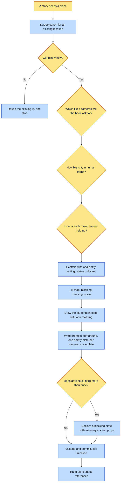

# Purpose

A place exists in canon with a contract that fixes its geometry, its cameras, its dressing and
its SIZE, so twenty spreads set there are the same room rather than twenty rooms sharing a name.

This is authoring, not art. It ends at a validated `unlocked` entity with a code-drawn blueprint
and ready-to-run prompts. `unlocked` is the correct state: the render gate refuses it until
`shoot-references` fills the plates.

# When to use (Trigger)

A story needs to render into a location that canon does not already hold. The sweep decides that,
not the mention: a universe rarely needs two versions of "the kitchen".

# Inputs / Prerequisites

- The target universe, a path containing `universe.json`.
- What the place is, its function in the story, its mood, and who frequents it.
- The FIXED cameras a book will actually shoot from, typically a wide establishing and one closer
  working angle. More cameras cost more locked plates.
- The fixed geometry: walls, furniture positions, doors, sightlines.
- The dressing: props, materials and colours that make it recognizable.
- **The SIZE, in human terms.** Asked explicitly and never skipped.
- **Buildability**: how each major feature is actually held up or vented.

# Roles

| Role | Responsibility |
|---|---|
| **Human operator** | States the size in human measurements, picks the minimum set of cameras the story needs, and answers the buildability question. None of the three is derivable, and all three are silently defaulted when not asked. |
| **Agent executor** | Sweeps canon first, interviews, draws the blueprint in code rather than prompting for it, fills the four descriptor fields, writes one prompt per contract slot, and leaves the entity unlocked. |

# Procedure

Steps say WHAT happens. The flowchart says who; Automation Opportunities holds the ROI.

1. Casting sweep first. Proceed only if no existing location fits.
2. Interview for the contract: what the place is, the fixed cameras, the fixed geometry, the
   dressing, the size in human terms, and how each major feature is held up.
3. Scaffold with `add-entity <universe> setting <id> --name`, which writes `status: "unlocked"`
   and a contract whose fields are all null.
4. Fill `contract.map`, `contract.blocking`, `contract.dressing` and `contract.scale`. These are
   load-bearing text: the resolver requires them non-empty and every render of this setting passes
   them in the prompt. Fill `prose.rules` for any never-render constraint.
5. BUILD THE BLUEPRINT IN CODE with `abu massing`, declaring the room once as boxes and quads with
   the cameras named. It is deterministic, free, and writes its own recipe. Commit the spec JSON
   beside the entity as the editable source.
6. Write `reference/<id>/prompts.md`: a turnaround, one empty plate per fixed camera, and a SCALE
   PLATE with anonymous scale figures. The blueprint is not prompted for. Each prompt passes the
   register anchor first, passes the blueprint as a layout reference, restates the fixed geometry,
   and names the output path.
7. Shoot the SHOT LIST rather than one master: wide establishing, conversational distance,
   reverse where a beat needs it, plus a plate per recurring camera. Name them in
   `structured.sheets` and scope each in `contract.plates`.
8. Declare `contract.blockingPlate` for a setting that recurs with people in it: the room with
   featureless mannequins in the legal seat positions at correct relative size, and the props the
   scene needs where they would actually sit.
9. Validate, commit, and report that the setting stays refused until the plates exist.

# Process Flowchart

Amber = irreducibly human. Blue = agent-executed or agent-proposed.

# Done / Verification

`abu validate <universe>` is green, and an `unlocked` setting validating is correct rather than an
error. `contract.map`, `blocking`, `dressing` and `scale` are all non-empty.
`reference/<id>/blueprint.png` exists with a recipe naming a deterministic generator. A prompt
block exists per contract slot including the scale plate. `assert-story` and `assert-spread` still
REFUSE this setting, which is the load-bearing feature.

# Exceptions & Troubleshooting

- **Never prompt an image model for the blueprint, and never settle for a top-down plan.** A plan
  makes the model infer the perspective, and inference is where geometry drifts: rooms change
  proportion between angles, furniture migrates, and handedness silently flips, so "the bookshelf
  wall is C1-LEFT" stops being true in half the book.
- **Keep the blueprint crude on purpose.** A blueprint that looks like finished art invites the
  model to copy its surface.
- **An empty plate cannot prove its own size.** Figure-free interiors carry no unit of comparison,
  the model picks a size, every render inherits the guess, and a hearth room rendered small and
  cramped through a 25-spread book before its owner said so. The scale plate is a separate file
  from the empty plates and never a replacement, and `contract.scale` carries the same fact in
  words because prose survives a re-render and a plate does not.
- **A close-up is not a wide shot with a tighter crop.** It does not contain the seating, the far
  wall or the crowd, and being told about them is what makes the model paint them.
  `includeBlocking: false` on a close plate drops the room-wide blocking law.
- **A prop written into `contract.dressing` or the blocking plate leaks FOREVER, into every book
  that reuses the place.** `the-park-bench` said its figures hold ice cream cones and its plate
  showed them; three of the first seven spreads of an unrelated book came back with both men
  holding ice cream, through a per-spread negative that banned ice cream by name. A reference
  image plus an injected contract sentence outrank a negative word.
- **Set dressing goes in the PLATE, never in the cast.** A recurring crowd modelled as a cast is
  far too much machinery for scenery; a populated plate of the same camera is one render and
  cannot drift.
- **Never hand-edit `status` to `"locked"`.** The refusal is the feature, and a hand-flip cannot be
  checked by the tool it bypassed. `lint-universe` reports canon whose recorded status the gate
  contradicts.

# Automation Opportunities

**Already automated:** the entity scaffold, the deterministic blueprint render with its own
provenance, the resolver's non-empty requirement on the four descriptors, and lint warnings for a
missing scale plate, a missing scale descriptor, a held prop in the dressing, a status the gate
contradicts, and a setting locking with fewer than two camera plates.

**Irreducibly human:** the size in human terms, the camera set, and buildability. A model will
answer all three confidently and wrongly, and only the first two are even detectable afterwards.

**Strongest next candidate:** refusing a setting that scaffolds with no `contract.scale` at all,
rather than warning after it locks. The size question is the one the skill says never to skip,
which is exactly the shape of rule that gets skipped, and it is free to ask at authoring time and
expensive to discover 25 spreads in.

# Related

- [shoot-references](../shoot-references/SKILL.md): the art step, which finds and passes the
  code-drawn blueprint automatically.
- [compose-spread](../compose-spread/SKILL.md): where the blocking plate rides on every camera and
  where a setting's era plates are gated by `validFor`.
- [add-visual-metaphor](../add-visual-metaphor/SKILL.md): the same contract shape for an object
  rather than a place.

# Revision History

| Version | Date | Changes |
|---|---|---|
| 0.1 | 2026-09-14 | Written from the skill file, read rather than recalled. |
