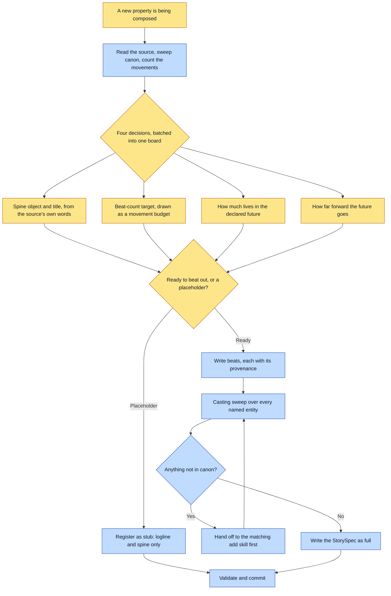

# Purpose

A property exists as a typed, medium-neutral StorySpec: a logline, a declared spine, a refrain,
and an ordered beat sheet where every beat cites a real source. The renderer projects it into a
medium later, so the same story can become a picture book without the words being written for a
picture book.

The outcome is a validated record, not a manuscript and not art.

# When to use (Trigger)

A new property is being composed out of existing or new canon: a book, a chapter, or any other
unit. Also when a planned property should appear on the roster before it is fully built, which
registers as a `stub`.

# Inputs / Prerequisites

- The target universe, with `identity` and existing `canon/entities/` and `stories/` readable.
- The source material: a testimony, a design brief, a braindump. Read BEFORE anything is asked.
- Whether it is ready to be beaten out or only worth registering as a placeholder.
- The author, available for four decisions that change the work materially and cannot be derived.

# Roles

| Role | Responsibility |
|---|---|
| **Author** | Owns the spine object and title, the beat-count target, how much of the book lives in a declared future, and how far forward that future goes. These are story-shaping decisions and they are theirs. |
| **Agent executor** | Does the reading first, counts the movements, batches the four decisions into ONE `AskUserQuestion` call with previews and a marked recommendation, runs the casting sweep over the beats, writes the StorySpec directly, and validates. |

# Procedure

Steps say WHAT happens. The flowchart says who; Automation Opportunities holds the ROI.

1. Do the reading FIRST: the source material, a canon sweep, and a count of the movements, before
   anything is asked.
2. Interview with `AskUserQuestion`, batching the four recurring decisions into one call, each
   with a `preview` showing the concrete artifact, and a recommendation first and marked. Do not
   ask what can be decided: register defaults to the universe's, so state the default and move on.
3. Capture the logline, the spine drawn from an open set, the refrain, any per-story register
   override, and the features plus ordered beats with per-beat provenance.
4. Decide `status`: `stub` for logline plus spine only, `full` when features, beats and provenance
   are filled.
5. Run the casting sweep over every entity named in `features` or a beat's `characters` and
   `location`. Reuse what exists; hand anything missing to the matching sibling `add-*` skill
   BEFORE finalizing.
6. Write `stories/<id>.json` directly. A story is a StorySpec, not an `add-entity` kind.
7. Validate and commit the story plus any entities the sweep created. Report the status and that
   rendering still requires `assert-story` separately.

# Process Flowchart

Amber = irreducibly human. Blue = agent-executed or agent-proposed.

# Done / Verification

`abu validate <universe>` is green. A `stub` is exempt from the features and beats requirements; a
`full` story must have non-empty `features` and `beats`, every beat's `provenance` non-empty, and
every featured id known to canon. Count the beats spent diagnosing against the beats spent on the
answer, and the beats living in the declared future, and confirm both ratios match what the author
chose rather than what drafting fatigue produced.

# Exceptions & Troubleshooting

- **There is no default length, and inventing a small one silently is the commonest authoring
  failure here.** A beat sheet written without a declared target lands around fifteen to twenty
  beats because that is where drafting fatigue sits, not because the argument ended. Shipped books
  range from about thirteen to well over thirty.
- **Cheap to add a beat now, expensive after the art exists.** Every later beat renumbers the
  render-spec, the manuscript, the platform manifest, the staged assets and the narration.
- **Proportion is a way of hedging that obeys every word of an anti-hedging rule.** Thirty beats
  on the problem and one on the promise has hedged, whatever the wording says. A quarter to a
  third of the beats is a normal share for a declared future, and more is fine when the future IS
  the subject.
- **Never assume hero-journey.** An explainer is a `primer`; a property built around one object's
  argued states is a `thesis`. Ask which shape this actually is.
- **An unsourced vivid detail does not go in a beat.** Provenance is per beat and it is validated.
- **A beat that only asserts needs a beat that shows.** A claim about a character's gift, wound or
  capacity that is stated and never depicted is a missing beat rather than economical writing.
- **The manuscript-to-story converter is DECLINED, deliberately.** The mechanical half is about
  ten lines; the valuable half, the cast and the provenance, is authored content that varies per
  book and per source. Promoting it would invent a manuscript-format contract the framework does
  not own, so the next book would be writing its manuscript to please a parser.

# Automation Opportunities

**Already automated:** schema validation of the stub-versus-full contract, the unresolved-feature
error, and the per-beat provenance requirement.

**Irreducibly human:** all four interview decisions, the spine, and every beat's text. This is the
skill in the framework with the least automatable core, and that is correct: it is where the work
is authored rather than assembled.

**Strongest next candidate:** a static proportion check reporting the diagnosis-to-answer ratio
and the declared-future share off a `full` story's own beats. Both rules are already written as
numbers, both are checked today by an agent remembering to count, and `render-book` names the same
check again at render time, which is the last cheap moment rather than the first.

# Related

- [casting-sweep](../casting-sweep/SKILL.md): the reuse gate step 5 runs.
- [compose-spec](../compose-spec/SKILL.md): turns this record into a render-spec, and carries a
  beat's `when` onto the spread for the era gate.
- [render-book](../render-book/SKILL.md): resolves the declared spine and genre against
  `list-craft` and stops when either does not exist.

# Revision History

| Version | Date | Changes |
|---|---|---|
| 0.1 | 2026-09-14 | Written from the skill file, read rather than recalled. |
