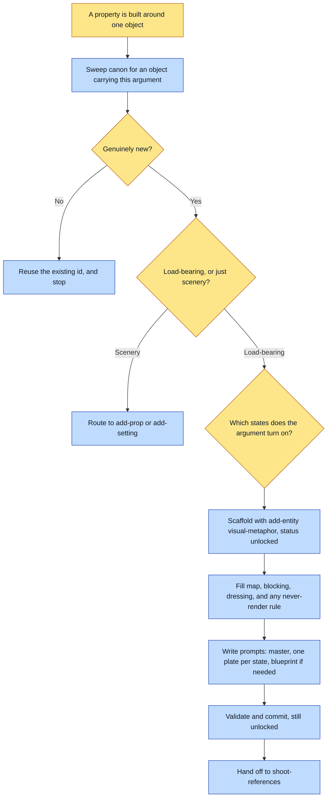

# Purpose

A spine-object, the single thing a whole property argues through, exists in canon carrying a
setting-style contract: a locked master plus one plate per argued state, with map, blocking and
dressing prose. Every page of the property then conditions on the same object rather than on a
description of it.

This is authoring, not art. It ends at a validated `unlocked` entity, which is the correct state:
the render gate refuses it until the plates exist.

# When to use (Trigger)

A story is built by zooming into one recurring object across changing states, rather than by
following a character or a place. The tell is that every page depends on the object.

# Inputs / Prerequisites

- The target universe, a path containing `universe.json`.
- The object, and the property it is the spine of: what it is, its material, its scale, and why
  IT rather than any other object can carry the argument.
- Its ARGUED STATES, named explicitly. A visual metaphor is not static: it is the same object
  shown across the states the argument turns on, and each state becomes a plate.

# Roles

| Role | Responsibility |
|---|---|
| **Human operator** | Confirms the object is genuinely load-bearing rather than scenery, and names the argued states. Both are claims about what the property is arguing, which nothing on disk can settle. |
| **Agent executor** | Sweeps canon first, interviews for the contract, scaffolds with the tested machinery, fills the three descriptor fields, writes a prompt per state, and leaves the entity unlocked. |

# Procedure

Steps say WHAT happens. The flowchart says who; Automation Opportunities holds the ROI.

1. Casting sweep first. Proceed only if no existing object already carries this argument.
2. Interview for three things: the object itself and why it can carry the whole argument, its
   argued states named one by one, and confirmation that it is genuinely load-bearing rather than
   scenery.
3. Scaffold with `add-entity <universe> visual-metaphor <id> --name`, which writes
   `status: "unlocked"` and a contract whose fields are all null or empty.
4. Fill `contract.map`, `contract.blocking` and `contract.dressing`. These three are load-bearing
   text: the resolver requires them non-empty and every render passes them in the prompt. Fill
   `prose.rules` for any never-render constraint.
5. Write `reference/<id>/prompts.md`: a locked master in the object's default state mapped to
   `contract.turnaround`, one state plate per argued state mapped into `contract.emptyPlates`, and
   a blueprint where internal structure matters. Each prompt passes the register anchor first,
   bakes the rejected poles as negatives, states which state it depicts and what must stay
   invariant across all of them, and names the output path.
6. Validate and commit. An `unlocked` visual metaphor validating is correct, not an error. Report
   that it stays refused by `assert-story` and `assert-spread` until the plates exist.

# Process Flowchart

Amber = irreducibly human. Blue = agent-executed or agent-proposed.

# Done / Verification

`abu validate <universe>` is green with the entity still `unlocked`. `contract.map`, `blocking`
and `dressing` are all non-empty. `reference/<id>/prompts.md` holds one block for the master and
one per argued state, each naming its output path. `assert-story` and `assert-spread` still refuse
the entity, which is the load-bearing feature rather than a bug to route around.

# Exceptions & Troubleshooting

- **Never hand-edit `status` to `"locked"` without the real plates.** A null contract field is a
  hard refusal, the same discipline as a setting, and the refusal is the feature.
- **The states must read as ONE object.** State explicitly, in every prompt, what stays invariant
  across all of them, and put it on the entity as an invariant so the read-back can catch it and
  the next state inherits it.
- **Seed the state chain on a code-drawn blueprint, never on a sibling state plate**, whenever the
  object has fixed geometry across states. Parallel state renders from prose come back as
  different objects. That rule lives in `add-setting` and applies here in full.
- **A blueprint constrains geometry and a prompt constrains framing, and a state set needs both
  pinned**, or the states are siblings rather than the same thing twice. Two states of one book
  seeded off the same blueprint came back with different cover proportions, which is fatal in a
  property whose whole argument is that it is the same life and it got fuller.
- **Scenery is not a visual metaphor.** The contract shape here is heavy on purpose, because it
  is paying for an object every page depends on.

# Automation Opportunities

**Already automated:** the entity scaffold with the contract shape, the resolver's non-empty
requirement on the three descriptors, and the gate refusal until the plates are real.

**Irreducibly human:** whether the object is genuinely load-bearing, and what its argued states
are. Both are statements about the argument the property is making.

**Strongest next candidate:** carrying `add-setting`'s scale plate and `contract.scale` discipline
across to this kind. A visual metaphor is contracted like a setting in every respect except size,
and it is exactly as free to render at any scale, which is the defect the scale plate exists for.
`universe-doctor` already scores settings and visual metaphors together on that dimension, so the
gap is visible in the grade while nothing asks for it at authoring time.

# Related

- [add-setting](../add-setting/SKILL.md): the same contract shape for a place, and the home of the
  code-drawn blueprint rule this kind inherits.
- [shoot-references](../shoot-references/SKILL.md): the art step, whose `--star` flag exists for a
  state set rather than an angle matrix.

# Revision History

| Version | Date | Changes |
|---|---|---|
| 0.1 | 2026-09-14 | Written from the skill file, read rather than recalled. |
