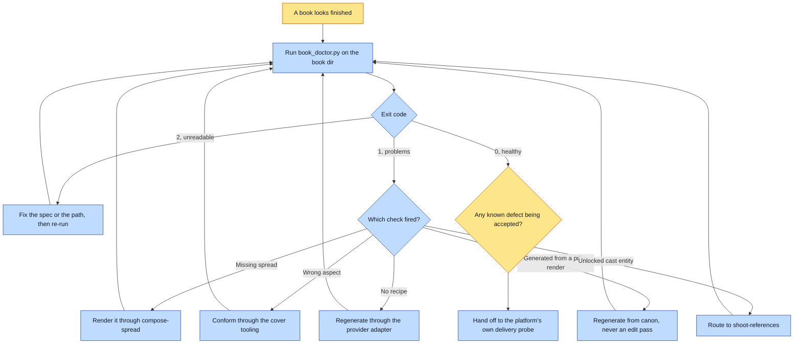

# Purpose

A finished book is graded against what its own render-spec declares, so "done" is an exit code
rather than a feeling. Every declared spread exists, the endcaps are portrait while the interiors
are landscape, every asset carries its provenance, and nothing was generated from another spread's
render.

`assert-story` gates BEFORE a render, when there is no output to measure. This grades AFTER, when
there is.

# When to use (Trigger)

Before declaring ANY rendered book finished, and before it is delivered anywhere. Also when the
operator says "book doctor", "is this book done", "check the book", "grade this book".

# Inputs / Prerequisites

- A book directory on local disk holding `render-spec.json`, `spreads/` and `cover/`.
- The rendered assets AND their `.recipe.json` sidecars. Recipes are build artifacts that never
  ship, which is why this is the only place provenance is checkable at all.
- Optionally the universe path, which enables the cast-registered-and-locked check.
- The manuscript at `stories/<id>.manuscript.md` when the universe keeps one, because that is the
  source the caption check compares against.

# Roles

| Role | Responsibility |
|---|---|
| **Human operator** | Decides what to do with a real finding: re-render, accept a known defect, or fix the spec. Also owns any per-book aspect override, which should be rare because the defaults are the contract. |
| **Agent executor** | Runs the grader, reads its exit code rather than skimming its output, and works the punch-list with the right verb. Never edits the spec to make a check pass. |

# Procedure

Steps say WHAT happens. The flowchart says who; Automation Opportunities holds the ROI.

1. Run `scripts/book_doctor.py <book-dir>`, adding `--universe` to enable the cast check and
   `--json` for machine output.
2. Read the exit code: 0 healthy, 1 problems, 2 unreadable.
3. For each finding, identify which of the six checks fired: a missing declared spread, an
   interior at the wrong aspect, an endcap that is not portrait, an asset with no recipe, an asset
   generated from another spread render, or an unregistered or unlocked cast entity.
4. Fix at the source. A missing spread renders through `compose-spread`; a wrong endcap aspect
   conforms through the cover tooling; a missing recipe regenerates through the provider adapter;
   a self-referencing asset regenerates from canon; an unlocked entity goes to `shoot-references`.
5. Re-run until the exit code is 0, then hand off to the delivery platform's own probe, which
   answers a different question.

# Process Flowchart

Amber = irreducibly human. Blue = agent-executed or agent-proposed.

# Done / Verification

`book_doctor.py` exits 0. That is the whole verification, and it is the point of having an exit
code: a book is not finished because the spreads you happened to look at exist.

Then run the delivery platform's own doctor. **Both, and neither replaces the other**: this one
answers whether the book is finished and internally consistent, the platform's answers whether it
arrived. Checks 4 and 5 here are structurally impossible for a delivery probe, because the recipes
never leave the machine.

# Exceptions & Troubleshooting

- **A doctor that fails every book is worse than no doctor**, because it teaches its operator that
  the doctor is wrong, so the run it finally catches something real is the run nobody reads. This
  tool has been in that state twice, and both are why the rules below are specific.
- **An endcap may be declared inside `spreads`**, and it is not an interior. `compose-spec` emits
  `cover` and `closing-plate` as ordinary members of that array; grading them twice produces
  `aspect 0.75 want 1.5` on a cover that is exactly right. Endcap names are matched by WORD rather
  than against a fixed list, because a fixed list made checks 2 and 3 contradict each other and
  the only escape was renaming the spec id.
- **The caption check reads the MANUSCRIPT when there is one.** A beat's `text` is instruction for
  the renderer; a spread's `_caption` is what the reader reads. Comparing them reported 29 of 29
  verbatim-correct captions as stale on a shipped book. The defect it was built for survives,
  because the manuscript is what gets rewritten.
- **A caption that is a SUBSTRING of its beat passes**, since one beat set across two spreads is
  legitimate. A caption matching a DIFFERENT beat is reported as an ordering mistake rather than a
  rewrite.
- **Do not extend this tool toward delivery.** Pulling a platform's bucket logic in here would fork
  a tested check into an untested copy, which is the exact bug those platforms tend to have had
  once already.
- **Per-book aspect overrides exist under `"doctor"` in the spec** and should be needed rarely. The
  defaults are the contract.

# Automation Opportunities

**Already automated:** all six checks, the endcap naming tolerance, the manuscript-aware caption
comparison with its three parsing conventions and its whitespace and typography normalisation, and
a machine-readable mode. This is among the most automated skills in the framework.

**Irreducibly human:** accepting a known defect, and any per-book aspect override. Both are
decisions about what this particular book is allowed to ship with.

**Strongest next candidate:** running this automatically at the end of `make-a-book`'s render step
rather than as a remembered call. Every failure mode in the section above was found by a human
noticing, and the chain already runs `land`, `pave-the-path` and `universe-doctor` as wired steps
while the grader of the actual deliverable is invoked by memory.

# Related

- [lint-universe](../lint-universe/SKILL.md): static pre-flight, with no output yet to measure.
- [universe-doctor](../universe-doctor/SKILL.md): grades the whole universe rather than one book.
- [update-book](../update-book/SKILL.md): where a finding about a shipped book gets fixed.

# Revision History

| Version | Date | Changes |
|---|---|---|
| 0.1 | 2026-09-14 | Written from the skill file, read rather than recalled. |
