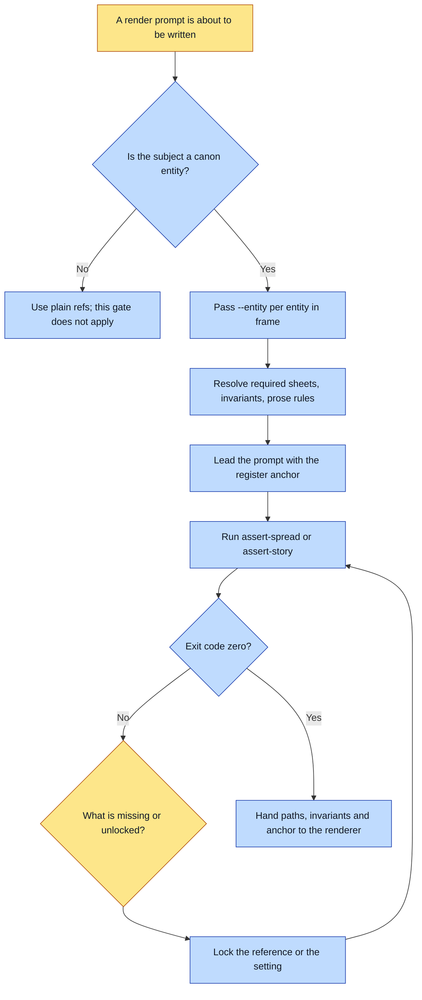

# Purpose

Before any render prompt is written, every named character, setting and motif is resolved to its
canon entity: the locked sheet paths that must be passed, the invariants to enforce, and the
entity's own prose rules. A non-zero exit blocks the render.

The outcome is that no design is ever described from memory or from a guessed filename, which is
the single failure this gate exists for.

# When to use (Trigger)

Before writing any prompt for a spread or a shot. Every renderer in the framework runs this first,
and none of them may write a prompt until it passes.

# Inputs / Prerequisites

- The target universe, with `identity` for `register.anchor` and `assetRoot` readable.
- The entities in frame: a spread's cast plus an optional location, or a whole story id.

# Roles

| Role | Responsibility |
|---|---|
| **Human operator** | Fixes what the gate names as missing, which usually means locking a reference or a setting. Never routes around the refusal. |
| **Agent executor** | Does the resolve with the `--entity` flag rather than by hand, reads the exit code, and hands the resolved paths, invariants and anchor to the renderer. |

# Procedure

Steps say WHAT happens. The flowchart says who; Automation Opportunities holds the ROI.

1. Do it with the flag, not by hand:
   `on-brand-image/scripts/generate.py --entity <universe>:<id>[@look]`, repeated per entity in
   frame. That single flag performs this entire resolve.
2. When resolving by hand for a reason (a dry run, a gate audit, a renderer that is not this one),
   read `canon/entities/<id>.json` per entity: resolve `structured.requiredForRender` to real
   files under `assetRoot`, collect `structured.invariants`, and read `prose.rules`.
3. Assemble the scaffolding: the exact reference files to pass, the invariants to bake as
   positives, the failure modes to bake as negatives, and `identity.register.anchor` leading every
   prompt.
4. Run the load-bearing gate: `assert-spread <universe> --characters a,b [--location X]`, or
   `assert-story <universe> <id>`. A non-zero exit BLOCKS the render and names what is missing or
   unlocked.
5. Fix what it named, then re-run. Never render around it.
6. Hand the resolved paths, invariants and register anchor to the renderer.

# Process Flowchart

Amber = irreducibly human. Blue = agent-executed or agent-proposed.

# Done / Verification

`assert-spread` or `assert-story` exits zero. Every path handed to the renderer resolves to a real
file. The recipe written by the adapter records what was resolved, so an auditor can later tell
what actually conditioned the render rather than what canon said.

# Exceptions & Troubleshooting

- **Do NOT hand-pick `--ref` paths for a canon entity.** That is what this skill used to ask for,
  and it is a memory test rather than a gate: on 2026-07-27 seven consecutive batches were
  rendered with a hand-picked subset of an entity's plates, the canonical face never reached the
  model, and every batch drifted to the base model's bias. Nothing objected, because nothing was
  checking. Reserve `--ref` for inputs that are not canon entities.
- **A missing required sheet or an unlocked setting is a hard stop, not a silent skip.** The
  refusal is the feature. Locking the reference is the fix; loosening the gate is not.
- **The flag refuses a look that does not exist**, which is a different and cheaper failure than
  rendering the default look and never noticing.
- **Never guess a path by filename**, and never describe an entity from memory. Both produce a
  plausible picture of the wrong thing, which is the most expensive kind of wrong here because it
  survives review.

# Automation Opportunities

**Already automated:** the whole resolve, through a single repeatable flag that composes the look,
prepends every resolved sheet ahead of the style pack anchor, bakes the live invariants and prose
rules into the prompt, records what it resolved in the recipe, and refuses on a missing sheet or
an unknown look.

**Irreducibly human:** nothing in the resolve itself. What stays human is the response to a
refusal, which is a decision about what to lock and when.

**Strongest next candidate:** a check that catches a canon entity being passed as a bare `--ref`
rather than through `--entity`. That is the exact bypass the 2026-07-27 incident describes, it is
mechanically detectable by comparing a recipe's ref paths against `canon/entities/`, and it is
today prevented only by this skill's prose telling people not to do it.

# Related

- [compose-spread](../compose-spread/SKILL.md): invokes this as its step 1, and refuses a render
  whose resolve failed.
- [shoot-references](../shoot-references/SKILL.md): where an entity named as missing gets its art.
- [render-readback](../render-readback/SKILL.md): the other half, after the render rather than
  before it.

# Revision History

| Version | Date | Changes |
|---|---|---|
| 0.1 | 2026-09-14 | Written from the skill file, read rather than recalled. |
