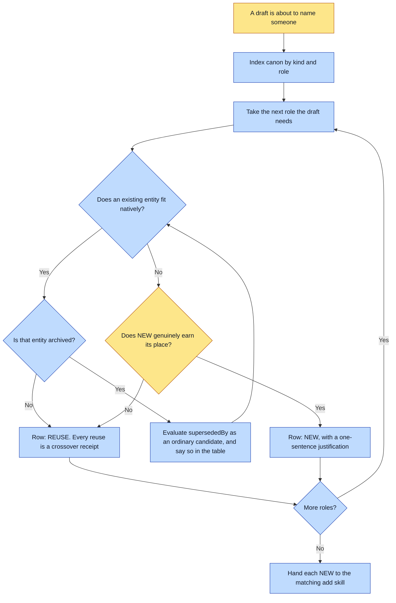

# Purpose

A universe stops growing redundant entities, and every reuse becomes a crossover. Before a
manuscript names anyone, each role the draft needs is matched against canon, and reuse is the
default.

The saving is concrete: a reused entity costs nothing, and a new one costs its whole
reference-matrix build plus every later render that has to keep it consistent.

# When to use (Trigger)

During story brainstorming, before the draft commits to names. Also on any revision that adds a
proper noun, because canon may hold an entity the book could not have used at ship time.

# Inputs / Prerequisites

- The target universe, with `canon/entities/` and any CANON.md readable.
- The roles the draft needs: the protagonist, a mentor, a place, a recurring object.
- `abu archived <universe>` to know what has been retired, since a retired entity fits a role as
  well as it ever did.

# Roles

| Role | Responsibility |
|---|---|
| **Human operator** | Settles a genuinely ambiguous match, and approves a NEW row whose justification is a matter of taste rather than of kind. |
| **Agent executor** | Indexes canon by kind and role, matches each role, emits the table with a one-sentence justification per NEW, and hands each NEW to the matching authoring skill. |

# Procedure

Steps say WHAT happens. The flowchart says who; Automation Opportunities holds the ROI.

1. Sweep the canon: read `canon/entities/` and any CANON.md, and index the existing entities by
   kind and role.
2. Match each role the draft needs to the existing entity that fits it natively, on kind,
   compatible description and era. Prefer reuse.
3. Skip any entity whose `lifecycle` is `archived`. If it declares `archived.supersededBy`,
   evaluate that id instead, the same as any other reuse rather than adopting it blindly.
4. Emit the casting table: one row per role, `role -> reused-entity-id` or `role -> NEW` with a
   one-sentence justification. Say in the table when an archived entity was considered and why it
   was skipped, so the decision is visible rather than silent.
5. Hand off each NEW row to the matching authoring skill.

# Process Flowchart

Amber = irreducibly human. Blue = agent-executed or agent-proposed.

# Done / Verification

A casting table exists with one row per role the draft needs, every REUSE naming a real id, and
every NEW carrying a justification against the swept canon. Any archived candidate that was
considered appears in the table with the reason it was skipped.

The downstream proof is the spread compiler: it refuses an archived cast before spending, so a
sweep that misses one is caught. Catching it here is cheaper.

# Exceptions & Troubleshooting

- **Archived canon is NOT a reuse candidate.** This is the failure mode that only appears once a
  universe is old enough to retire things: the sweep is looking for an entity that fits, and a
  retired one fits perfectly. Reusing it is a regression rather than a crossover receipt.
- **A NEW entity must earn its place against the swept canon.** A mentor role an existing mentor
  can play is a reuse, not a new character.
- **This skill does not create anything.** Creating the NEWs is the `add-*` skills and writing the
  story is `add-story`.
- **A revision is a new sweep.** Skipping it on a revision because it felt like a text tweak is
  named in `update-book` as one of three sweeps a real revision skipped: a revision that names a
  person canon already has either invents a duplicate or misses a locked likeness.

# Automation Opportunities

**Already automated:** the archived-entity listing, and the compiler's downstream refusal of an
archived cast before any spend.

**Irreducibly human:** whether a near-match is the same role. Two characters who read as
interchangeable in a table may be distinct in the story, and a table cannot tell.

**Strongest next candidate:** a script that reads a `full` story's `features` and per-beat casts
and reports which named ids are already canon, which are archived, and which do not exist. All
three facts are mechanical, the sweep is run by hand today, and the case it most often misses is
the revision, where nobody re-reads the whole entity list.

# Related

- [add-story](../add-story/SKILL.md): runs this over the beats' named entities at its step 5.
- [update-book](../update-book/SKILL.md): names this as the first of three sweeps a revision must
  re-run.

# Revision History

| Version | Date | Changes |
|---|---|---|
| 0.1 | 2026-09-14 | Written from the skill file, read rather than recalled. |
