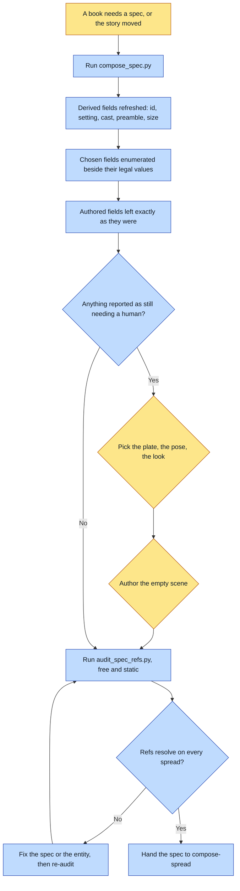

# Purpose

A book's render-spec is a build artifact you can re-run at any time without fear. Everything canon
DETERMINES is refreshed on every run, everything canon merely CONSTRAINS is enumerated beside its
legal values, and everything a human AUTHORED is never touched.

The outcome is that no per-book authoring script survives the session, because every one of them
rots: the spec gets hand-edited afterwards, the script does not, and re-running it silently
reverts the edits.

# When to use (Trigger)

Starting a new book's render-spec; after adding or removing a beat; after shooting a new plate or
wardrobe look; or the moment you catch yourself hand-writing a per-book authoring script. The
operator's phrasing is "scaffold the render-spec", "re-sync the spec", "the spec is out of date
with the story", "I added a beat".

# Inputs / Prerequisites

- The target universe and the story id. The story already knows its beats, their locations and who
  is in them, which is what makes restating them by hand wasteful.
- The book folder, and the output path for `render-spec.json`.
- For a beat that records `when`, that field carries onto the spread and the era gate uses it.

# Roles

| Role | Responsibility |
|---|---|
| **Human operator** | Chooses every `plate`, `pose`, `look` and `bake` from the enumerated legal values, and authors every `scene`. The scaffold will not choose for them, on purpose. |
| **Agent executor** | Runs the composer rather than writing a driver, reads what it reports as still needing a human, and never passes `--force` to get a clean run. |

# Procedure

Steps say WHAT happens. The flowchart says who; Automation Opportunities holds the ROI.

1. Run `scripts/compose_spec.py <universe> <story-id> --book <folder> --out render-spec.json`.
2. Read what it printed. It names every spread whose setting has no plate chosen, every cast
   member with poses and none selected, and every scene still empty.
3. Fill the chosen fields from the enumerated legal values, and author every empty scene.
4. Re-run after any beat change, any new plate, any new wardrobe look. New beats append; existing
   authored scenes are untouched.
5. Read the KEPT-and-reported items: a spread not in the story, and a cast member in the spec but
   not in the beat, are both preserved on the assumption they were deliberate.
6. Audit the refs before rendering, with `compose-spread/scripts/audit_spec_refs.py`, which is free
   and catches the silent case.

# Process Flowchart

Amber = irreducibly human. Blue = agent-executed or agent-proposed.

# Done / Verification

Re-running the composer changes nothing you did not want changed, which is the actual definition
of done: the spec is a build artifact you can re-run without fear. Nothing it reports as needing a
human is still outstanding. `audit_spec_refs.py` resolves every spread's refs. No per-book
authoring script exists in the session's working tree; if one does, it will rot.

# Exceptions & Troubleshooting

- **A `null` plate beside its legal values is VISIBLE. A missing wardrobe pose is INVISIBLE**,
  which is exactly how one character went twenty spreads with her clothes unpinned. That asymmetry
  is why the enumeration is the point rather than a convenience.
- **`--force` is the only way to lose authored text, and it says so.** If you are reaching for it,
  check what you are about to overwrite.
- **A spread not in the story is KEPT and reported, never deleted.** A cover, a closing plate, or a
  beat you removed all look identical to the composer, and deleting on that ambiguity would
  silently discard a deliberate artifact.
- **The stale-generator failure this replaced is worth knowing.** In nation-of-fire on 2026-07-30 a
  book's own generator still carried an identity-overriding `bake` and crowd prose that six hours
  of fixes had removed. Re-running it would have undone the lot.
- **`audit_spec_refs.py` catches the silent one** that this composer cannot: a spread-level `plate`
  selects the SETTING's plate, so on a spread with no setting it is ignored and the entity's plates
  never reach the model. That shipped once with five candle spreads carrying zero spine-object
  plates, and recurred on a 26-spread book with zero arch plates. "Dry-run and look at the ref
  count" was already the instruction; looking is the part that fails.

# Automation Opportunities

**Already automated:** the whole derived class, the enumeration of every chosen field's legal
values, the merge rules that make a re-run safe, the shot-rhythm suggestion on a new spread, and
the separate free static ref audit.

**Irreducibly human:** the chosen fields and the scene text. These are composition and taste, and
a scaffold that picked them would be a generator nobody could trust.

**Strongest next candidate:** running `audit_spec_refs.py` from inside `compose_spec.py` rather
than as a separate remembered call. The audit is free, static, and catches a defect that has now
shipped twice in books whose specs the composer had just written, and the two tools are already
run back to back by every caller that remembers both.

# Related

- [compose-spread](../compose-spread/SKILL.md): consumes the spec, and owns the ref audit.
- [update-book](../update-book/SKILL.md): where a mid-book beat change is applied, with the
  descending renumber this composer does not do.

# Revision History

| Version | Date | Changes |
|---|---|---|
| 0.1 | 2026-09-14 | Written from the skill file, read rather than recalled. |
