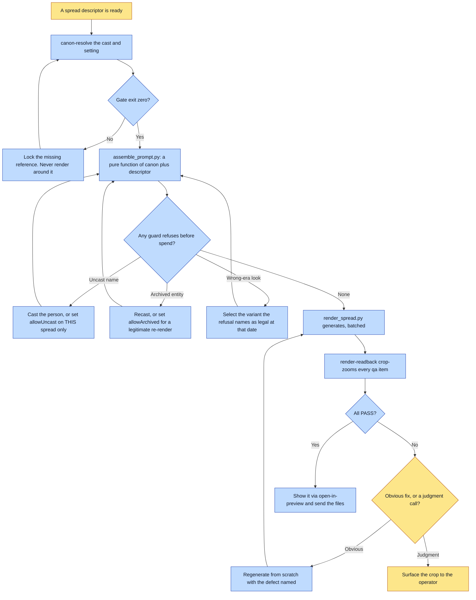

# Purpose

One spread descriptor becomes a read-back-clean render, with everything load-bearing about a
character or setting, including which LOOK it is in, coming from `canon/entities/<id>.json`
rather than from a retyped per-book description.

The rule this enforces is that the composition is deterministic software, not a fresh
improvisation each render. The per-book `render-spec.json` carries only composition and book-wide
style, and it cannot contradict canon, because the block, its refs and the guarded negatives are
all computed from the SAME selected look.

# When to use (Trigger)

`render-book` and `update-book` invoke this once per touched spread. Also the moment you catch
yourself about to write a per-book `gen-spread.py`, which is where drift bugs live.

# Inputs / Prerequisites

- The target universe.
- The book's `render-spec.json`: book-wide `style`, `negatives`, `guardedNegatives`, `anchorRef`,
  plus one descriptor per spread.
- The spread id and the output path.
- Each descriptor carries `cast` with an optional `look` per member, `setting`, `plate`, the
  single free-text `scene`, and optionally `when`, `anonymous`, `shot` and per-spread overrides.

# Roles

| Role | Responsibility |
|---|---|
| **Human operator** | Chooses the camera the argument needs, authors the scene, and rules on a defect whose fix is a judgment call rather than an obvious re-roll. |
| **Agent executor** | Resolves canon through the gate, runs the assembler rather than editing its output, generates in batch through the one script, reads back every invariant, and shows the render to the operator. |

# Procedure

Steps say WHAT happens. The flowchart says who; Automation Opportunities holds the ROI.

1. Resolve, as a gate. Invoke `canon-resolve` on the spread's cast and setting; a non-zero exit
   blocks the render.
2. Assemble with `scripts/assemble_prompt.py`, which returns prompt, refs, size and qa as a pure
   function of canon plus the descriptor: register anchor first, each in-frame entity's block for
   its selected look, auto-disambiguation when two castmates share a frame, negatives computed
   from the selected looks, and a qa list of every in-frame entity's invariants plus its
   `structured.render.qa`.
3. Generate with `scripts/render_spread.py`, which does assemble plus generate in one call with
   three retries. A whole book goes through the SAME script in batch with `--all --jobs N
   --skip-existing`. Do not write a driver.
4. Read back with `render-readback`: crop-zoom every invariant in the returned qa list. Any DEFECT
   regenerates from scratch, never an edit pass.
5. Show the render through `open-in-preview`, naming the viewing order, and send the files to the
   operator.

# Process Flowchart

Amber = irreducibly human. Blue = agent-executed or agent-proposed.

# Done / Verification

The gate exited zero, the assembler produced the prompt rather than a human, every qa item came
back PASS under crop-zoom, and the operator has actually seen the image. Describing an image is
not showing it.

A dry-run over the whole book with `--all --dry-run` is a free pre-flight: every refusal is a pure
text check, so every uncast character, wrong-era look, bad plate key and missing ref is caught
before a cent is spent.

# Exceptions & Troubleshooting

- **Never fork this into a universe-local compiler.** Nation of Fire ran one for months and the
  two implementations drifted into DISJOINT feature sets: the fork held all four guards, the
  framework held alt-looks, auto-disambiguation, guarded negatives and `anchorRef`. Every guard
  earned in one universe was invisible to every other.
- **Do not edit the assembled prompt by hand.** If it is wrong, the fix is in canon or the
  descriptor, never a one-off patch to the prompt string.
- **`allowUncast` is per-spread for a reason.** False positives are expected, because the check
  matches a bare given-name token. A book-level waiver to unblock one false positive silently
  disarms the most expensive defect class this pipeline has.
- **A prohibition loses to a strong prior; describe the anatomy instead.** Seven of nine read-back
  defects across one eight-book run were this or the anchor-depiction case. "No mouth" fails at
  roughly coin-flip rates; "the lower half of the orb is featureless, like the blank underside of
  a white egg, count the features: exactly two, both eyes" holds. An absence is not something a
  renderer can draw, and a COUNT is checkable where an adjective is not.
- **Two rolls wrong in DIFFERENT ways means an ambiguous scene, not a bad model.** Re-rolling is
  right when a spread fails the SAME way twice. When roll two is wrong in a NEW way, read the
  scene against itself: a fact asserted in one paragraph and denied in another, or an EXCLUSIVE
  claim the scene itself violates. Every further roll is a coin flip you are paying for.
- **Put a load-bearing exclusion FIRST.** A rule at the end of a two-hundred-word scene is a rule
  the model has stopped reading. Order the scene: hard exclusions, camera, subject, dressing.
- **The book `style` must describe the BOOK, never the CAST.** A style naming a character is
  prepended to every spread and sails straight past the uncast guard, which reads the SCENE.
- **State a device's orientation RELATIONALLY, never camera-relative.** "Over his shoulder so we
  see the back of his laptop" is only true when the camera sits exactly behind him, which it
  almost never does, and the model obeys the words and turns the screen away from its user.
- **Do not compose for the read-back.** Side-on three-quarter shots make invariants easy to verify
  and quietly become the default, which is how a book whose thesis is that a man stands OUTSIDE
  the machine rendered every interior side-on and never used the blueprint's own
  over-the-shoulder camera.
- **The model fills silence with cliché**, and near sacred material that is reliably the wrong
  thing. Close the gap explicitly rather than trusting a negative, and forbid a payoff motif by
  name in every earlier spread that could attract it.
- **An alt look must suppress the base look in all THREE channels**: `supersedes` for invariants,
  `dropSheets` for sheets, and its own `render` block for prose. A reference image beats a word
  and canon prose beats a slug, so suppressing only invariants ships the base look anyway, and
  the readback key that would have caught it was superseded.

# Automation Opportunities

**Already automated:** the deterministic prompt assembly from canon, five compile-time guards that
refuse before any spend, the era gate, batch rendering with per-spread failure isolation, the free
whole-book dry run, and the qa list that feeds read-back.

**Irreducibly human:** the camera the argument needs, the scene text, and the ruling on a defect
whose fix is a judgment call. Everything the guards can check is already checked.

**Strongest next candidate:** a static scene self-contradiction check, looking for a fact asserted
and later denied and for an exclusive claim the same scene violates. Both shapes are named
precisely in this skill, both cost paid re-rolls every time they occur, and the diagnosis today is
an agent remembering to read the scene against itself after the second bad roll rather than before
the first.

# Related

- [canon-resolve](../canon-resolve/SKILL.md): step 1, the pre-render gate.
- [render-readback](../render-readback/SKILL.md): step 4, and the owner of the crop and measure
  scripts.
- [compose-spec](../compose-spec/SKILL.md): writes the spec this consumes, and owns the free ref
  audit that catches a plate selected on a settingless spread.

# Revision History

| Version | Date | Changes |
|---|---|---|
| 0.1 | 2026-09-14 | Written from the skill file, read rather than recalled. |
