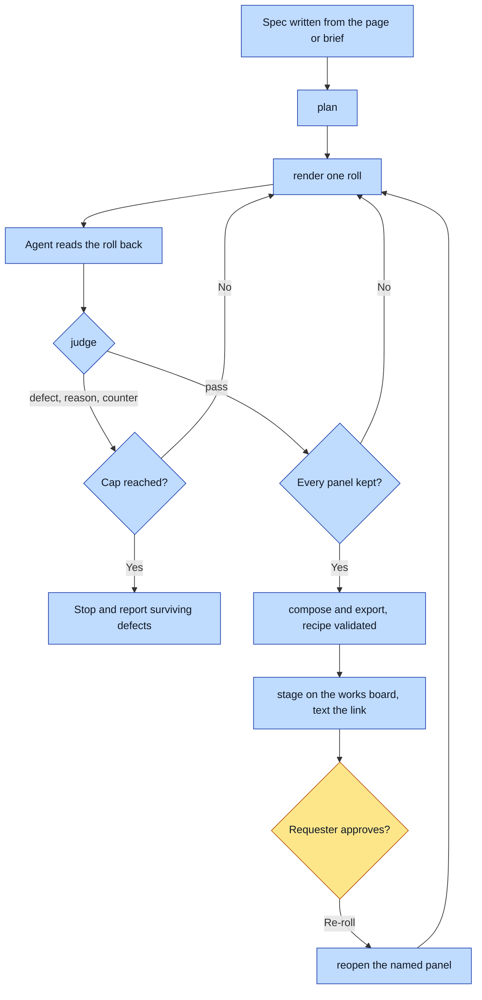

# Purpose

A strip (two to four panels in one image) is made from a spec file, with every panel rendered
through the entity route, judged by an agent who looked at it, and composed in code, so that the
one recipe a wiki keeps answers every provenance question and passes the wiki's gate.

# When to use (Trigger)

A hero or header argues in beats. Someone says "make a strip", "three-panel hero", "compose these
panels", or you are about to write a `compose.py` beside a work.

# Inputs / Prerequisites

- A universe with the panels' entities locked.
- A strip spec, usually written by a universe's form (for example `wiki-hero`).

# Roles

| Role | Responsibility |
|---|---|
| **The requester** | Approves or re-rolls the finished strip on the works board. |
| **Agent executor** | Writes or fills the spec, renders one roll at a time, LOOKS at each roll and records the verdict, composes, stages, texts the link. |
| **The script** | Assembles prompts, renders through the adapter, checks the binding, enforces the cap, moves rejects, composes, validates the recipe. |

# Procedure

1. `strip.py plan <spec>`; fix anything it refuses.
2. Per panel: `render`, read the roll back at full size, `judge` pass (with each fired guard's
   verdict) or defect (with a reason and a counter). Repeat until kept or the cap refuses.
3. `compose`, with `--export` when the strip is headed for a wiki.
4. `stage` onto the works board and text the phone link.

# Process Flowchart

Amber = irreducibly human. Blue = agent-executed or agent-proposed.

# Done / Verification

The composite and its recipe sit at the spec's `out`; `check-recipe` passes on it and on the
export; every reject is in `panels/rejected/` with a reason; the strip is on the works board.
