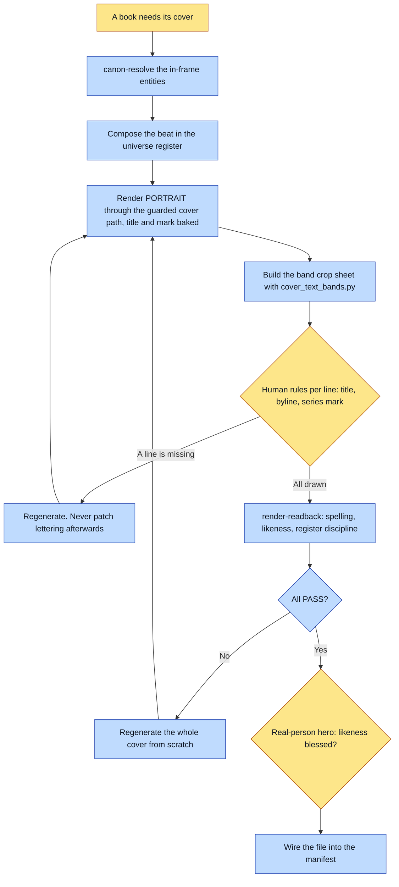

# Purpose

Every book ships a cover, and a cover is not done until the TITLE and the universe MARK are baked
into it. A beautiful hero render with no title on it is cover art, not a cover.

The second half of the purpose is shape: interiors render at the story's landscape spread size and
a cover renders PORTRAIT, because the reader platform displays covers taller and centre-crops
anything shipped landscape.

# When to use (Trigger)

Once per book, as chain step 5 after the interiors. Also whenever you find you generated portrait
hero art with a raw generate call and moved on, which means the cover was skipped.

# Inputs / Prerequisites

- The target universe, with `identity.register` and `identity.mark` readable.
- The story id and its exact title string.
- The hero's locked references, resolved through the gate like any other spread.
- A pair of eyes. The lettering check is a human look at band crops, and there is no substitute.

# Roles

| Role | Responsibility |
|---|---|
| **Human operator** | Rules on the lettering from the band crops: is the title drawn, is the byline drawn, is the series mark drawn. Also owns the likeness approval when the hero is a real person. |
| **Agent executor** | Resolves canon, composes the beat, renders portrait through the guarded cover path, builds the band sheet, reads back title spelling and register discipline, and wires the finished file into the manifest. |

# Procedure

Steps say WHAT happens. The flowchart says who; Automation Opportunities holds the ROI.

1. `canon-resolve` the cover's in-frame entities exactly as for an interior spread. No cover prompt
   is written except from that output.
2. Compose the cover beat: the hero in the universe's register, oriented toward whatever the story
   sends them toward, honouring the universe's register-rule craft records.
3. Render at PORTRAIT aspect through the renderer's guarded cover path. Bake the diegetic title and
   the `identity.mark` byline into the render, quoting the exact strings. Register anchor first,
   rejected poles as negatives.
4. VERIFY THE LETTERING WITH YOUR EYES, FROM THE BANDS, BEFORE ANYTHING ELSE. Build the sheet with
   `scripts/cover_text_bands.py`, then open it and rule per cover, per line.
5. `render-readback` the cover: the title spelled exactly, the hero's likeness against their
   entity's invariants, and the register discipline. Any DEFECT regenerates the whole cover from
   scratch.
6. Wire the finished file into whatever manifest the target renderer or platform uses.

# Process Flowchart

Amber = irreducibly human. Blue = agent-executed or agent-proposed.

# Done / Verification

The cover is portrait, not the interior's landscape size. Its title is spelled exactly, judged
from band crops by a person rather than from a contact sheet or from the baked-text block. The
universe mark is present. The hero's invariants pass crop-zoom. The story's cover field points at
the finished file. `book-doctor` grades the cover as an ENDCAP at portrait aspect and finds a
recipe beside it.

# Exceptions & Troubleshooting

- **Never hand-roll a cover render.** The title-bake and the title-spelling read-back live here and
  nowhere else, so a cover produced by a raw generate call has skipped both.
- **The BAKED TEXT block is not evidence.** It records what was REQUESTED. A batch of twelve covers
  was reported as "all three lines present" off that block on 2026-08-05, and four had no byline
  and no series mark at all. The operator caught it, not the pipeline. If you have not looked at
  pixels, you have not checked.
- **Do not use OCR as the judge.** On that same batch it produced THREE FALSE NEGATIVES out of
  twelve, reading LOOKE for LOOKED and missing two titles outright. These are stylised painted
  letters, often light on dark. A false negative re-rolls art that was already correct, which is
  the most expensive mistake available.
- **Do not judge from a full-cover contact sheet either.** Covers downscale to thumbnails and small
  lettering stops being readable, which is exactly how a missing byline survived review. That is
  what the band crops are for.
- **Never patch lettering after the fact.** A typo regenerates the whole cover; an edit pass on a
  defective render compounds artifacts.
- **Never `cp cover-raw.png cover.png`.** `render_cover.py --out .../cover-raw.png` publishes the
  platform-facing `cover.png` itself, byte-identical and with its own recipe. The hand copy failed
  `book-doctor` on provenance until the sidecar was hand-copied too.
- **Conform the aspect with `conform_cover.py --mode pad`, never a hand-rolled pad.** Models emit a
  producible 2:3 and the reader wants 3:4; flat side bars seam visibly against textured art.
- **The closing plate needs its OWN title-free art.** A baked-title cover leaves no untitled
  version to fall back on, and the plate sits behind the overlaid closing verse.
- **A revised cover is regenerated from references, never edited on top of the old attempt.** The
  guard forbidding a prior render as an input applies here in full.

# Automation Opportunities

**Already automated:** the portrait aspect enforcement, the conform, the byte-identical platform
publish with its own recipe, the band-crop sheet, and `book-doctor`'s endcap aspect and provenance
checks afterwards.

**Irreducibly human:** ruling on the lettering. Both automated alternatives have been tried and
both were worse: the baked-text block reports intent rather than pixels, and OCR produced a 25%
false-negative rate on real painted covers. The script prepares what a pair of eyes needs; it does
not replace them.

**Strongest next candidate:** a refusal when a portrait hero render lands in a book folder with no
title string recorded. That is the "cover art, not a cover" failure the skill opens with, it is
the single most-forgotten step by its own account, and the evidence sits in the recipe: a render
with no declared title strings is not a cover.

# Related

- [render-book](../render-book/SKILL.md): the interiors, which render at the spread size.
- [book-doctor](../book-doctor/SKILL.md): grades the endcaps portrait and demands a recipe.
- [reroll-slot](../reroll-slot/SKILL.md): the one-command route for an art-only re-roll of an
  already-rendered cover, which replays the recorded conform and publish steps.

# Revision History

| Version | Date | Changes |
|---|---|---|
| 0.1 | 2026-09-14 | Written from the skill file, read rather than recalled. |
