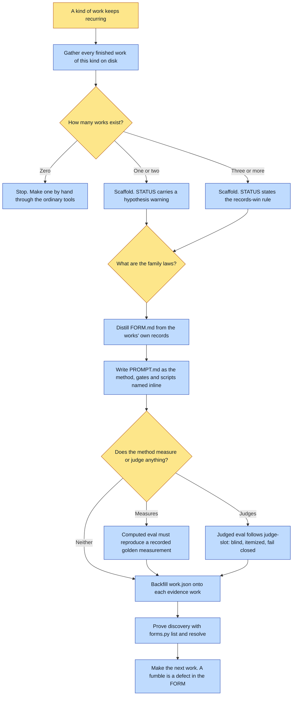

# Purpose

A new KIND of work becomes a folder `make-a-work` can make things from: `FORM.md` stating what it
is and how much evidence it rests on, `PROMPT.md` carrying the method, and optional evals. The
form is data, so adding a kind of work is a folder rather than a new skill.

The outcome that matters is honesty about the evidence base. A form written before anything exists
in it is the failure this framework spent a day removing.

# When to use (Trigger)

`make-a-work` has no form for a kind of work that already exists as finished pieces, or someone
says "create a form", "extract a form from these works", "this kind of work keeps recurring".

The trigger is finished work on disk. If the work does not exist yet, make it first by hand
through the ordinary tools, then come back and extract.

# Inputs / Prerequisites

- The target universe, and the form id.
- **Every finished work of this kind, on disk, with its own records**: READMEs, recipes, candidate
  and raw folders. These are the ground truth the form is distilled from.
- Zero works REFUSES. ONE work is the legal minimum and stamps a hypothesis warning. THREE is the
  comfortable base, at which the STATUS section states the records-win rule instead.

# Roles

| Role | Responsibility |
|---|---|
| **Human operator** | Blesses the evidence works, and rules on the family laws, which are the criteria a future candidate is judged against. Also owns any override of where the work is filed, which needs a stated reason. |
| **Agent executor** | Gathers the evidence on disk, runs the scaffolder rather than stamping a folder by hand, distills both files from the works' own records, verifies every computed eval against a recorded golden measurement, backfills the declarations, and proves discovery. |

# Procedure

Steps say WHAT happens. The flowchart says who; Automation Opportunities holds the ROI.

1. Gather the evidence: every finished work of this kind, on disk, with its records. If there are
   none, stop here and make one.
2. Scaffold with `scripts/scaffold.py <universe> <form-id> --work <path> [--work ...]`. It
   validates the id, refuses on zero evidence, refuses to clobber, and stamps the skeleton with
   the evidence base counted and listed.
3. Distill `FORM.md` from the works rather than from memory: what it is, the family laws written
   as testable claims each earned by a real work, where the work goes and why, the goldens by path
   with one line each, and any known debts named rather than hidden.
4. Write `PROMPT.md` as the method, step by step in the order the work is actually made, with
   words before art, gates named at the step where they run, and scripts named inline at the step
   that uses them.
5. Write evals where the method measures or judges. A computed eval must reproduce the goldens'
   recorded measurements before the form lands. A judged eval follows the `judge-slot` protocol:
   blind, itemized, against the golden, failing closed.
6. Backfill the declarations: each evidence work gains a `work.json` naming this form with a
   retrofit note. No historical README, recipe or attestation is ever rewritten.
7. Prove discovery: run `forms.py list` and `forms.py resolve`, and confirm the form shows as
   usable AND its STATUS line surfaces.
8. Make the next work through `make-a-work`. Whatever the method fumbles is a defect in the FORM.

# Process Flowchart

Amber = irreducibly human. Blue = agent-executed or agent-proposed.

# Done / Verification

`forms/<id>/FORM.md` and `PROMPT.md` exist, and `forms.py resolve` reports usable AND surfaces the
STATUS line. STATUS states the evidence count and lists the works, carrying the hypothesis warning
below three. Every computed eval has reproduced a recorded golden measurement. Every evidence work
carries its `work.json` with a retrofit note, and `git diff` shows no historical README, recipe or
attestation was touched. Any remaining hand-roll is in the debts section AND flagged to
`evolve-abu`.

# Exceptions & Troubleshooting

- **A rung is earned by works, not by ambition.** The retired universal composer built the mature
  rung first, from zero works, and died of it: 896 lines, 91 tests, zero works. The book chain
  built each rung only after dozens of books had walked the previous one by hand.
- **A form that resolves but whose status does not surface has a malformed STATUS heading.** Fix it
  immediately: that warning is what keeps the next agent's confidence honest, and an agent reading
  only the method will follow it with unearned confidence.
- **An eval that has never reproduced a known number is a hope, not an instrument.**
- **Fail closed on a judged eval.** An unanswered judgement is UNJUDGED, which is a failure rather
  than a pass.
- **Never rewrite the evidence works' records to match the form.** They are what the form was
  distilled FROM, so altering them inverts the evidence. Change live instructions; leave every
  attestation alone.
- **When a `PROMPT.md` step has been executed identically across several works, that step is asking
  to become code**, and it routes through `pave-the-path` and `evolve-abu` rather than growing a
  bespoke script beside one work.
- **The book chain is the chief precedent and it stands outside `forms/` for historical reasons.**
  Migrating it in is a large architectural move with many dependents, filed as an open question
  rather than attempted ad hoc.

# Automation Opportunities

**Already automated:** id validation, the zero-evidence refusal, the clobber refusal, the evidence
count and listing stamped into STATUS, the automatic hypothesis warning below three works, and the
discovery check.

**Irreducibly human:** the family laws, and the decision that a form is ready to climb a maturity
rung. Both are judgments about what a good one of these looks like, and coding a judgment call is
how a framework becomes a straitjacket.

**Strongest next candidate:** a check that every family law in `FORM.md` cites the work that earned
it. The rule is already stated, the `living-diorama` precedent already does it, and the failure is
silent: a law with no citation reads exactly like one with an origin, and it is the shape a
speculated rule takes when it slips into an extracted form.

# Related

- [make-a-work](../make-a-work/SKILL.md): the one door for making works in a form this produces.
- [judge-slot](../judge-slot/SKILL.md): the protocol a judged eval follows.
- [evolve-abu](../evolve-abu/SKILL.md): where a form's proven method is promoted into the framework.

# Revision History

| Version | Date | Changes |
|---|---|---|
| 0.1 | 2026-09-14 | Written from the skill file, read rather than recalled. |
