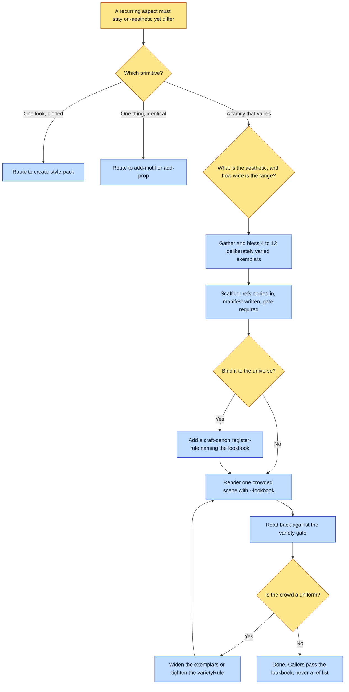

# Purpose

A recurring aspect that must stay on-aesthetic yet DIFFER per instance (a wardrobe, a range of
building silhouettes, a crowd of faces) gets a portable folder defining that variety: exemplars, a
`varietyRule`, and a read-back gate that checks for variety.

It exists because every alternative is wrong. A motif or prop locks a thing to render identically,
which is the exact opposite of fashion. A Style Pack is a rendering medium, not subject content.
And an improvised folder of "clothing refs" with no manifest is the drift this kills.

# When to use (Trigger)

You want variety from a primitive that enforces sameness. The four-way test: one look cloned every
render is a Style Pack; one thing identical every render is a motif or prop; a family that must
VARY per instance is this; and the law that governs it is a craft-canon register-rule naming the
lookbook.

# Inputs / Prerequisites

- **4 to 12 VARIED exemplars.** Range is the whole point. A lookbook of near-identical images
  teaches uniformity, which is the failure it exists to prevent.
- The aesthetic, in one line naming the vocabulary.
- The `varietyRule`: the instruction the renderer applies on EVERY use.
- Gate assertions that check VARIETY in the output. A lookbook with no variety gate silently
  drifts back to a uniform.

# Roles

| Role | Responsibility |
|---|---|
| **Human operator** | Blesses the exemplars and owns the range: what counts as enough variety, and what the aesthetic actually is. A range is a taste judgment about a family. |
| **Agent executor** | Gathers and generates exemplars that deliberately span, runs the scaffolder, binds it to the universe through a register-rule where wanted, and PROVES it varies with a crowded render read back against the variety gate. |

# Procedure

Steps say WHAT happens. The flowchart says who; Automation Opportunities holds the ROI.

1. Gather and bless 4 to 12 deliberately varied exemplars, importing what exists and generating a
   spread that spans body types, cultures, colours and silhouettes.
2. Scaffold with `scripts/scaffold.py`, passing the refs, the aesthetic, the variety rule and the
   gate assertions. It copies every exemplar into the lookbook's own `refs/`, writes
   `lookbook.json`, and fails loudly on fewer than four refs, more than twelve, or a missing gate.
3. Bind it to the universe, optionally but recommended, with a craft-canon register-rule whose
   rules name this lookbook, so every renderer honours it.
4. PROVE IT VARIES. Render one crowded scene with `on-brand-image --lookbook`, and read back
   against the variety gate.
5. If the crowd is uniform, the variety rule is too weak or the exemplars too similar: widen the
   range, tighten the rule, and re-prove.

# Process Flowchart

Amber = irreducibly human. Blue = agent-executed or agent-proposed.

# Done / Verification

`<lookbook>/lookbook.json` and `refs/*` exist, with 4 to 12 exemplars resolving inside the folder,
a real `varietyRule` and a real variety gate. One `on-brand-image --lookbook` render passed its
variety gate, meaning the crowd is not a uniform. A craft-canon register-rule names the lookbook
where the universe wants it enforced everywhere. No caller hand-lists clothing refs.

# Exceptions & Troubleshooting

- **A lookbook of near-identical images teaches uniformity.** That is the failure it exists to
  prevent, and it passes the scaffolder happily, so the proving render at step 4 is the only thing
  that catches it.
- **A lookbook with no variety gate silently drifts back to a uniform.** The scaffolder refuses to
  write one without a gate for exactly this reason.
- **The lookbook rides ALONGSIDE the Style Pack**, never instead of it. The pack sets the render
  medium; the lookbook sets the varied subject vocabulary.
- **The consumer samples 2 to 4 refs per render, not all of them**, and not the same subset every
  time. A caller passing every ref has defeated the sampling.
- **Modelling a wardrobe as a motif or prop is the mistake this primitive was built to stop.**
  Those force sameness, and a uniform is not a fashion.

# Automation Opportunities

**Already automated:** the ref-count bounds, the missing-gate refusal, copying every exemplar into
a self-contained folder, and the consumer's sampling plus variety-gate injection.

**Irreducibly human:** the range. What counts as enough variety in a family, and what the family
IS, are taste judgments that a count of files cannot reach.

**Strongest next candidate:** a static similarity check across the exemplars at scaffold time,
reporting a set that is too alike before the proving render is paid for. The scaffolder already
enforces a COUNT, which is the cheap half of the same question, and the expensive half is caught
today only by rendering a crowd and looking at it.

# Related

- [create-style-pack](../create-style-pack/SKILL.md): the complement, for one look cloned every
  render.
- [on-brand-image](../on-brand-image/SKILL.md): the consumer, which samples the refs, prepends the
  variety rule and adds the gate to its read-back.

# Revision History

| Version | Date | Changes |
|---|---|---|
| 0.1 | 2026-09-14 | Written from the skill file, read rather than recalled. |
