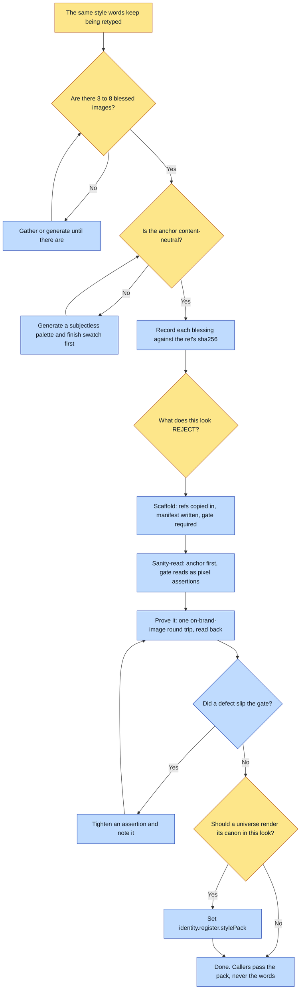

# Purpose

A look stops living in re-typed style words and becomes an artifact: `pack.json` plus `refs/`,
self-contained and copyable, with a read-back gate that decides whether a render actually matched.

The look lives in the REFERENCES, not in the wording. The pack is what makes that reusable, and
the gate is what makes it checkable. A pack without a gate is a mood board, and the scaffolder
refuses to write one.

# When to use (Trigger)

You notice you are generating "in a look" by re-typing the same style words each time, or you have
a set of blessed images that share a look and want to make more that match, or a universe's
register should source its anchor and rejected poles from a shared pack.

# Inputs / Prerequisites

- **3 to 8 blessed reference images** sharing the look. Fewer than 3 and the model has too little
  to lock onto; more than 8 and you are curating rather than defining.
- **A content-neutral ANCHOR**: a swatch of palette, light and finish with no subject. A reference
  outranks negative words, so a busy anchor leaks its content into every render.
- The style line: one sentence naming medium, line, fills, light, finish.
- The palette as hex: ground, fill, line.
- Rejected poles, each naming a specific FAILURE rather than a whole visual mode.
- Gate assertions: the read-back checklist the consumer verifies against the pixels.

# Roles

| Role | Responsibility |
|---|---|
| **Human operator** | Blesses each reference by name, and decides the rejected poles, which is where a careless line deletes a capability. Both are judgments about what the brand is. |
| **Agent executor** | Generates a content-neutral anchor when the blessed set has none, records each blessing against the ref's hash, scaffolds, sanity-reads the manifest, and proves the pack round-trips through one real render. |

# Procedure

Steps say WHAT happens. The flowchart says who; Automation Opportunities holds the ROI.

1. Gather and bless the refs. Only images a human approved. If the anchor is not content-neutral,
   generate a content-neutral swatch first and use that.
2. RECORD the blessing with `scripts/bless_ref.py --ref <name> --by "<who, when>"`. It writes a
   sidecar bound to the ref's sha256, so a re-rolled ref reads STALE rather than quietly
   inheriting an approval. `--by` is required and is never defaulted.
3. Run `--status` before describing the pack to anyone. Partial coverage is fine and common;
   reporting a half-blessed pack as blessed is not.
4. Scaffold with `scripts/scaffold.py`, which copies every ref into the pack, writes `pack.json`,
   and fails loudly on a missing ref, a count outside 3 to 8, an anchor that is not among the
   refs, or no gate.
5. Sanity-read the manifest: the anchor is the content-neutral one and listed first, and the gate
   reads as checkable pixel assertions rather than as vibes.
6. Prove it round-trips: run `on-brand-image` once against the pack with a simple scene and read
   back against the gate. A defect that slips the gate means the gate is too loose.
7. Optionally wire a universe to it by setting `identity.register.stylePack`, so canon renders and
   one-off images share ONE definition of the look.

# Process Flowchart

Amber = irreducibly human. Blue = agent-executed or agent-proposed.

# Done / Verification

`<pack>/pack.json` and `<pack>/refs/*` exist, every ref resolves inside the folder, the anchor is
content-neutral and first, and the gate carries real read-back assertions. One `on-brand-image`
round trip passed its own gate. `bless_ref.py --status` reports the coverage honestly. No caller
re-types the style words.

# Exceptions & Troubleshooting

- **Reject a specific FAILURE, never a whole visual mode.** A pole broad enough to name a
  capability deletes that capability, and the model cannot tell you it did. A Christofuturist pack
  rejected "glowing blue holograms", which removed augmented reality from a brand whose entire
  thesis is a Christian FUTURE, and every render came back as brass lamps and Victorian
  workbenches. Nobody could fix it by prompting harder, because the gate forbade the alternative.
  The rule that survived was narrower and truer: reject COLD BLUE sci-fi light, not AR itself.
  Before writing a pole, ask what it forbids besides the thing you dislike.
- **The pack's ID names the MEDIUM, never the subject.** Painterly, hyperrealistic, illuminated,
  inkline all survive the subject changing; community, fellowship, hero do not, because the moment
  you render something else the name lies. Earned renaming three packs at once, all of which had
  drifted to subject names.
- **"A human approved it" is a claim, so record it.** Every ref lands in the pack the same way, so
  nothing distinguishes one the operator blessed by name from one swept in beside it, and the
  anchor is passed FIRST on every render the pack will ever make.
- **A style anchor must never depict a canon character.** That is the Nation of Fire lesson, and a
  reference outranks a negative word every time.
- **A pack influences a render; it does not reproduce anything.** When a specific designed object
  must appear, pass its locked plates with `--ref-first`. The rule is pack for the look,
  `--ref-first` for the object.

# Automation Opportunities

**Already automated:** the ref-count bounds, the anchor-membership check, the missing-gate
refusal, copying refs into a self-contained folder, and hash-bound blessing records that go STALE
on a re-roll rather than lying.

**Irreducibly human:** the rejected poles and the blessing. The poles are the field where one
careless line silently deletes a capability, and only a person who knows what the brand is for can
see that.

**Strongest next candidate:** a check that the declared anchor is actually content-neutral, by
reading it back against "no subject, no character, no legible object". The rule is stated three
separate ways in this skill, it has already cost a universe a photoreal seed, and today it is
enforced by an agent remembering to look at the swatch.

# Related

- [on-brand-image](../on-brand-image/SKILL.md): the consumer, and the round trip that proves the
  gate.
- [create-lookbook](../create-lookbook/SKILL.md): the complement, for curated VARIETY rather than
  one cloned look.
- [shoot-references](../shoot-references/SKILL.md): refuses at plan time when a register declares
  both a pack and an inline anchor.

# Revision History

| Version | Date | Changes |
|---|---|---|
| 0.1 | 2026-09-14 | Written from the skill file, read rather than recalled. |
