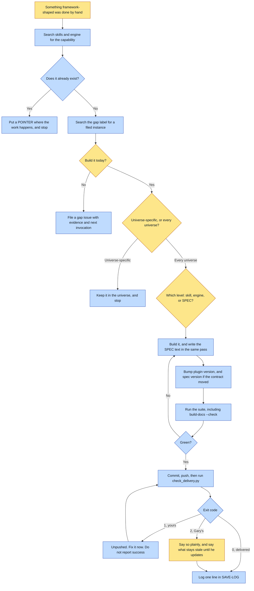

# Purpose

A thing that was hand-rolled to keep momentum becomes something the framework owns, versioned and
delivered, so no universe hand-rolls it again. The outcome is a shipped capability with its spec
text written in the same commit, and an exit code proving whose move it is next.

The failure this exists to prevent is not the hand-roll. It is the hand-roll calcifying.

# When to use (Trigger)

Mid-session, the moment you catch yourself or the operator catches you doing framework-shaped work
by hand: a bespoke generate or provenance script, a repeated manual step, a missing scaffolder, a
look with no Style Pack, provenance saved by memory. Also when the framework's own update process
changed, in which case this skill updates itself.

Hand-rolling ONCE, consciously, is fine. Hand-rolling the SAME thing a second time, or leaving the
one-off in place, is the failure.

# Inputs / Prerequisites

- The repo, which is both the framework and the marketplace: `source: "."`, so an install carries
  the engine and the vendored providers with it.
- The thing that was hand-rolled, and an honest answer to whether every universe would want it.
- `gh` for searching the `gap` label, the standing register of found-and-proven, not-yet-closed
  gaps.

# Roles

| Role | Responsibility |
|---|---|
| **Gary** | Runs `/plugin update`. Nobody else can, so a change is not live until he does, and exit 2 is a real handoff rather than a status line. |
| **Human operator** | Decides when a change is large enough to be its own project, and rules on anything that changes behaviour for work already shipped. |
| **Agent executor** | Proves it is a gap before building, picks the level, writes the SPEC text in the same pass, bumps both versions, runs the suite including the generated-docs check, ships, RUNS the delivery check and reports its exit code, and logs one line. |

# Procedure

Steps say WHAT happens. The flowchart says who; Automation Opportunities holds the ROI.

0. PROVE IT IS A GAP. Search the framework for what you are about to build, then search the `gap`
   label. Hand-rolling is not proof of absence; it is equally often proof the thing exists and was
   not found, and the two have opposite fixes.
0b. Record a gap you are not going to build today as a `gap` issue with its evidence and its next
   invocation, never in the save log alone.
1. Name the gap in one line. If it is genuinely universe-specific, stop.
2. Pick the level: a skill, the engine, or the SPEC contract. Write the SPEC text in the SAME pass
   for any change a universe author could observe, in the section a reader would look in, stating
   what it does, when it applies, and the defect that earned it. Prefer generating the factual half
   over asserting it.
3. Register a new skill in the plugin manifest catalog.
4. Bump the versions: the plugin always, the spec when the contract changed, along with every
   `conformsTo` and `SPEC_VERSION` reference.
5. Run `./run-tests.sh`, which also runs `build-docs --check`, so adding a skill, verb, form or
   provider makes the derived docs stale and the suite RED. The fix is `build-docs`, not a prose
   edit.
6. Ship: commit, push, bump. Then run `scripts/check_delivery.py --expect <the path you added>`
   and READ ITS EXIT CODE.
7. Log ONE LINE in `SAVE-LOG.md`, under about 80 words, leading with the change.
8. Update this skill if the process itself changed.

# Process Flowchart

Amber = irreducibly human. Blue = agent-executed or agent-proposed.

# Done / Verification

The gap is a real framework artifact, universe-agnostic, tested where applicable. Every observable
change is in `SPEC.md` in the SAME commit as the code. Versions bumped, committed and pushed.
`check_delivery.py --expect <the thing you built>` was RUN and its exit code reported: exit 1 means
it is still sitting on this machine, and only exit 2 earns "over to you". `SAVE-LOG.md` has the
entry. `./run-tests.sh` is green including its docs line. The universe that triggered this no
longer hand-rolls the thing.

# Exceptions & Troubleshooting

- **A version bump that never reaches the remote is indistinguishable from no work at all.** This
  is not hypothetical: 1.6.0 shipped a script, three stewards then ran it from repo paths because
  the plugin did not carry it, and the commit filing that gap sat unpushed itself along with two
  versions. Gary ran `/plugin update`, was told he was current, and was.
- **Promoting a duplicate is worse than the hand-roll**, because two implementations drift and
  neither is canon. A session hand-rolled a contact-sheet montage fifteen times with the script
  already in the repo.
- **A tool nobody finds at the moment of need is indistinguishable from a missing tool, and the fix
  is not more documentation.** The pointer goes in the file read DURING the task.
- **The SPEC text feels like paperwork and it is the only thing a user of the framework can read.**
  A guard shipped and the spec still read "four rules" months later, so the spec described a
  compiler that no longer existed. Two more landed the same way and were caught only because a
  test now enforces it.
- **When RENAMING anything, sweep with `find -L`, never `rg` and never `Path.rglob`.** Both
  silently skip directories reached through a symlink. During one rename `rg` reported 5 external
  references where `find -L` found 12, and a later `rglob` pass missed a whole cartridge skill.
- **Never rewrite a historical record.** Recipes and dated attestations state what actually ran,
  under the name it had then. In the rename that taught this, the split was 5 files to fix and
  1,213 to leave.
- **The save-log limit is real and routinely blown.** Four consecutive entries shipped at 74 to 172
  words when the limit is 80, and the operator's note was that the version descriptions are way
  too long. The pull is always the same: the defect feels worth explaining. Anyone who needs why
  will open the commit.

# Automation Opportunities

**Already automated:** the delivery check with its three-way exit code, the generated-docs check
inside the suite so a stale reference fails red, the guards-documented test covering the reasoning
half, and the engine's own validation of anything schema-shaped.

**Irreducibly human:** whether a change is large enough to be its own project, and anything that
changes behaviour for already-shipped work. Both are judgments about churn.

**Strongest next candidate:** a check that a commit touching an observable behaviour also touches
`SPEC.md`. The rule has failed at least three times by its own account, the generated fences
already prove the mechanism works for the enumerable half, and the reasoning half is caught today
only for guards.

# Related

- [pave-the-path](../pave-the-path/SKILL.md): decides WHAT to promote; this does the promoting.
- [create-form](../create-form/SKILL.md): where a form's method goes when it is proven portable.

# Revision History

| Version | Date | Changes |
|---|---|---|
| 0.1 | 2026-09-14 | Written from the skill file, read rather than recalled. |
