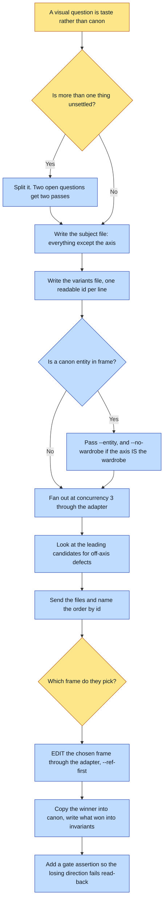

# Purpose

A human decides a visual question by LOOKING at a comparison set, rather than by reading a
description of what you were about to build. The framework had verbs for making a thing you had
already decided on and no verb for DECIDING, which is why every taste question got improvised.

The economics are the whole argument: a wrong guess costs a full render cycle plus the correction,
a second wrong guess reads as not listening, and two variants side by side settle in one round
what three sequential attempts do not.

# When to use (Trigger)

You are about to type a hedge: "I think he means", "this should be what you want", "let me know if
this is the right direction". Also when the operator says outright that they do not know. "Idk"
and "give me visual options" are a request for this verb, not a stall.

# Inputs / Prerequisites

- A subject file holding the INVARIANT half of the prompt, which is concatenated in front of every
  variant.
- A variants file, one per line as `id: text`. Ids become filenames, so they must be readable,
  because the id is how the operator answers.
- The style pack, and `--entity <universe>:<id>[@look]` for any canon entity in frame.
- An out-dir. Every roll writes its PNG, its prompt and its log there.

# Roles

| Role | Responsibility |
|---|---|
| **Human operator** | Picks the frame. That is the entire point of the verb, and it is the one thing that cannot be derived. |
| **Agent executor** | Isolates the variable, fans out through the adapter, looks at the leading candidates FIRST for defects unrelated to the axis, sends the set rather than opening it, and closes the loop into canon afterwards. |

# Procedure

Steps say WHAT happens. The flowchart says who; Automation Opportunities holds the ROI.

1. Isolate the variable. Everything except the axis under study is identical across the set: the
   subject file holds the invariant half, the variants file holds the axis. Two open questions get
   two passes, never one grid.
2. Pass `--entity` for a canon entity, never hand-picked plates. When the axis under study IS the
   wardrobe, add `--no-wardrobe` or the adapter pins the clothes you are trying to vary.
3. Run `scripts/explore.py` at concurrency 3. Higher queues server-side and times rolls out
   together, and a timeout means no image AND no recipe.
4. Look at the leading candidates yourself first, for a defect that has nothing to do with the
   axis: a missing limb, invented lettering, a broken reflection.
5. Send the images with the harness's file tool, and name the order in the same message, in id
   order, one clause each.
6. Once one is chosen, EDIT it. Do not re-roll it. Go through the ADAPTER with `--ref <the chosen
   roll> --ref-first`, and say what STAYS as well as what changes.
7. Close it into canon: copy the winner into the entity's sheet or a pack's refs, write what won
   into `invariants` and `render.always`, and add a gate assertion for anything that could
   silently regress.

# Process Flowchart

Amber = irreducibly human. Blue = agent-executed or agent-proposed.

# Done / Verification

The operator picked a frame off the set rather than off a description. Every roll is still on disk,
with its prompt beside it. The winner is in canon as-is, and what won is written into the entity's
invariants and `render.always` with a gate assertion behind it.

An explore that ends in a picture and no canon change was a conversation, not a decision, and that
is the check worth applying: read the diff.

# Exceptions & Troubleshooting

- **If two things change between rolls, the set has told them nothing**, because the operator
  cannot attribute the difference. When exploring FORM, hold the material constant even if the
  material is also unsettled, and vice versa.
- **A comparison set of the same person is worthless if the rolls come back as six different
  people**, which is exactly what happens when the identity plates are not on every roll. Earned
  on one gym-outfit fan-out with three plates hand-passed as `--ref`, which worked and which the
  next caller would have done differently.
- **Once a frame is chosen, re-rolling spends what was already approved.** The operator picked it
  for its face, its light, its colour AND its composition, so a fresh generation trades a solved
  problem for a new one and the set never converges. The tell is an operator repeating a correction
  they already gave.
- **Go through the ADAPTER, not the provider.** This skill told people to call the provider script
  directly for a week, which produced edits with no provenance, the one thing this framework exists
  to prevent. The adapter already forwards every `--ref` as an input image, so a single `--ref` IS
  an edit.
- **Say what STAYS, not just what changes.** An edit prompt naming only the change invites the
  model to reinterpret everything it was not told to keep.
- **Send the images; do not just open them.** A Preview window on the desktop is useless to an
  operator on Remote Control.
- **Every roll is kept.** There is no seed, so a deleted candidate is gone. Prune only after a
  winner is locked, and never regenerate "a clean version" of the winner: you will get a different
  image and the approval will not transfer.

# Automation Opportunities

**Already automated:** the parallel fan-out through the adapter with provenance per roll, the
invariant-half concatenation that makes isolation mechanical, the staging of every roll with its
prompt, a dry-run mode, and the next-moves board this verb already prints at the end.

**Irreducibly human:** the pick. Nothing else in this skill is a judgment call, which is unusual
and is exactly why the verb exists.

**Strongest next candidate:** a refusal when the variants file's lines differ in more than the
declared axis, or at least a report of what else moved. The one law of this skill is isolation, it
is enforced today by the author being careful about which file each sentence goes in, and a set
that violates it looks exactly like a good set until the operator cannot answer.

# Related

- [on-brand-image](../on-brand-image/SKILL.md): making a finished asset once the look is settled,
  and the adapter every roll here goes through.
- [reroll-slot](../reroll-slot/SKILL.md): re-running an existing recipe with a small delta, which
  is a different job from deciding.

# Revision History

| Version | Date | Changes |
|---|---|---|
| 0.1 | 2026-09-14 | Written from the skill file, read rather than recalled. |
