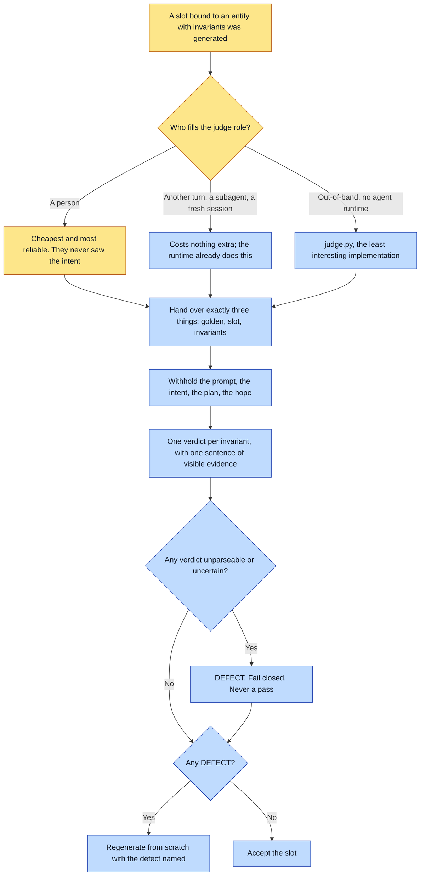

# Purpose

A `judged` invariant actually gets judged. Without this, a `judged` rule is a wish.

The outcome is a PASS or DEFECT per declared invariant, each with one sentence of evidence
describing what is visible in the slot versus the golden, produced by a context that has NOT been
told how the slot was made.

# When to use (Trigger)

After generating any slot bound to a canon entity that declares invariants. That is the whole
trigger, and it fires often.

# Inputs / Prerequisites

The judge gets exactly three things and nothing else:

- The locked GOLDEN for the entity.
- The generated SLOT.
- The entity's declared INVARIANTS, verbatim, as a checklist.

Withheld on purpose: the prompt, the intent, the plan, and what anyone hoped the slot would look
like.

# Roles

| Role | Responsibility |
|---|---|
| **The judge, whoever fills it** | Returns a verdict per invariant with one sentence of evidence. A person is cheapest of all and the most reliable, because someone who never saw the intent spots drift in one glance. |
| **The maker** | Supplies the three inputs and withholds everything else. Cannot fill the role themselves while still holding the plan. |
| **Agent executor** | Fills the role from another turn inside the composer, a subagent, a fresh session, or a person, and fails closed on anything unparseable. |

# Procedure

Steps say WHAT happens. The flowchart says who; Automation Opportunities holds the ROI.

1. Decide who fills the role. Another turn inside the composer is the production case and costs
   nothing extra, because the agent already has model access. A subagent or fresh session suits
   interactive work where the maker is still holding the plan. A person is cheapest and most
   reliable. The script exists only for judging out-of-band, outside any agent runtime.
2. Give the judge the golden, the slot, and the invariants verbatim as a checklist. Nothing else.
3. Ask for a verdict PER INVARIANT, each with one sentence of evidence describing what is visible
   in the slot versus the golden.
4. Fail closed: unparseable output is not a pass, and "I cannot tell" is a DEFECT.
5. Act on the result, which for a render means regenerating from scratch on any DEFECT.

# Process Flowchart

Amber = irreducibly human. Blue = agent-executed or agent-proposed.

# Done / Verification

Every declared invariant has its own verdict with its own sentence of evidence. No verdict is
gestalt. Every comparison was against the golden rather than against a sibling slot. Nothing
unanswered was counted as a pass.

# Exceptions & Troubleshooting

- **The judge never sees the plan.** A maker shown its own reasoning defends it instead of
  inspecting the pixels. A three-element graphic once shipped with one element missing its
  defining feature because the maker read its own intent; an observer with no access to the plan
  caught it instantly.
- **Itemized, never gestalt.** Asked "is this the same character?" a judge says yes while a
  declared property is plainly violated. Measured on a locked mascot: ten of twelve invariants
  held, and `translucent-holographic-digital-being` failed in every slot, rendering as opaque felt.
  The gestalt question passes that. The itemized one does not.
- **Against the golden, never slot-to-slot.** Slots drift together, inheriting the same drift from
  the same master-to-generation step. Compared with each other they look consistent and are
  uniformly wrong. **Consistency is not fidelity.**
- **Reaching for the script first is the mistake this file was rewritten to correct.** It invents
  an external dependency for something the runtime already does.
- **The load-bearing property is a fact about CONTEXT, not about transport.** Anything that can
  look at two images with a clean context can fill the role.

# Automation Opportunities

**Already automated:** the protocol itself, which is the valuable part, plus an out-of-band script
for the case where no agent runtime is available.

**Irreducibly human:** nothing, strictly. But a person filling the role is explicitly the cheapest
and most reliable option, which is unusual in this framework and worth preserving rather than
automating away.

**Strongest next candidate:** wiring this into `shoot-references` and `compose-spread` as a second
pass on any entity declaring `judged` invariants, rather than leaving it as a verb somebody
invokes. The protocol is written and the blind-context requirement is satisfiable by one extra
turn at zero cost, and a gate nobody invokes is the failure this framework names everywhere else.

# Related

- [render-readback](../render-readback/SKILL.md): the sibling check, which the maker does perform
  and which is QA rather than blind judgment.
- [create-form](../create-form/SKILL.md): a form's judged evals follow this protocol exactly.

# Revision History

| Version | Date | Changes |
|---|---|---|
| 0.1 | 2026-09-14 | Written from the skill file, read rather than recalled. |
