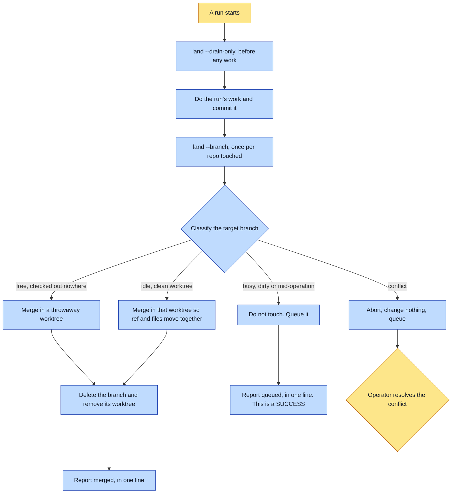

# Purpose

A finished branch gets merged, and the run reports what happened in one line rather than handing
back a decision. The operator has no opinion about merges and never will; every "committed but
parked, master is checked out elsewhere" report cost a round trip whose answer was always "use
your judgment, merge it".

The second outcome is that it compounds no further. Parked branches and their worktrees accumulate
until a repo carries a dozen of them, which is the same defect a dozen times.

# When to use (Trigger)

At the START of any pipeline run, to drain merges a previous run could not do. At the END, once
per repo the run touched. Also when a report is about to say "parked", when worktrees have piled
up, or when the operator says "merge it", "land this", "use your judgment on the merge", "clean up
the worktrees", "why is this never merged".

# Inputs / Prerequisites

- Any git repo, not just a universe. A book run usually touches both the canon repo and the
  platform repo, so it runs once per repo.
- The work branch, already committed. `land` assumes that and refuses if it is not.
- The target branch, defaulting to `main` then `master`.

# Roles

| Role | Responsibility |
|---|---|
| **Human operator** | Resolves a genuine CONFLICT, which is the only outcome worth surfacing, and identifies a target branch the tool cannot. |
| **Agent executor** | Runs the drain at the start and the land at the end, classifies the target before acting, and reports the outcome in one line without asking. |

# Procedure

Steps say WHAT happens. The flowchart says who; Automation Opportunities holds the ROI.

1. FIRST thing in a run, before any work: `land <repo> --drain-only`. Previously blocked merges
   land now that the other session has moved on.
2. Do the work.
3. LAST thing, after the run's own commits: `land <repo> --branch <work-branch>`, which drains
   first automatically.
4. The tool classifies the target: free, idle, busy or conflict, and only acts where action is
   provably safe.
5. Report what actually happened in one line and move on. Merged: say it merged and what was
   cleaned up. Queued: say it is queued and the next run lands it, as a normal outcome rather than
   a decision. Conflict: surface it, naming which files, and that nothing was changed.
6. Optionally `--prune-stale` to delete worktrees whose branch is already fully merged.

# Process Flowchart

Amber = irreducibly human. Blue = agent-executed or agent-proposed.

# Done / Verification

Every branch the run opened is merged or queued, and the report says which in one line. On a
merge, the work branch is deleted and its worktree removed, with containment verified in the
TARGET rather than in HEAD, because `git branch -d` asks the wrong question whenever the main
checkout sits on an unrelated branch.

No report ends with "parked". That is the check.

# Exceptions & Troubleshooting

- **The hazard is real and it is why parking felt safer.** The target branch is frequently checked
  out in a sibling worktree belonging to a LIVE session. Moving a branch under a live worktree
  corrupts that session: their files stay on disk but HEAD now lists yours, so their index reports
  YOUR files as deletions, and their next bare commit reverts your work as part of their unrelated
  commit.
- **It never uses `git update-ref` or `git branch -f`**, which are exactly the two ways to move a
  branch out from under a live worktree.
- **A queued merge is a SUCCESS, not a failure.** The work is committed and safe and the next run
  finishes it. No daemon, no cron, no human. Do not present it as a decision, a risk, or something
  the operator must act on.
- **Only a genuine conflict is worth surfacing**, plus a repo whose target branch cannot be
  identified. Everything else is handled or queued.
- **This is local history only.** Pushing to a remote, opening a PR and deploying are not this
  skill, and neither is deciding whether work is finished.

# Automation Opportunities

**Already automated:** the whole thing. The classification, the safe merge in a throwaway or idle
worktree, the queue, the abort-untouched on conflict, the branch and worktree cleanup, the
containment check against the right ref, and the drain on the next run.

**Irreducibly human:** resolving a conflict. That is a genuine judgment call about two sets of
changes.

**Strongest next candidate:** wiring the drain and the land into every chain that opens a branch,
rather than naming them in each chain's prose. `make-a-book` does this; other verbs that commit do
not, and a step invoked by memory at the end of a long run is the step that gets dropped, which is
the entire origin of the parked-branch problem this skill exists for.

# Related

- [make-a-book](../make-a-book/SKILL.md): wires this in as chain steps at both ends.
- [evolve-abu](../evolve-abu/SKILL.md): ships to a remote, which this deliberately does not do.

# Revision History

| Version | Date | Changes |
|---|---|---|
| 0.1 | 2026-09-14 | Written from the skill file, read rather than recalled. |
