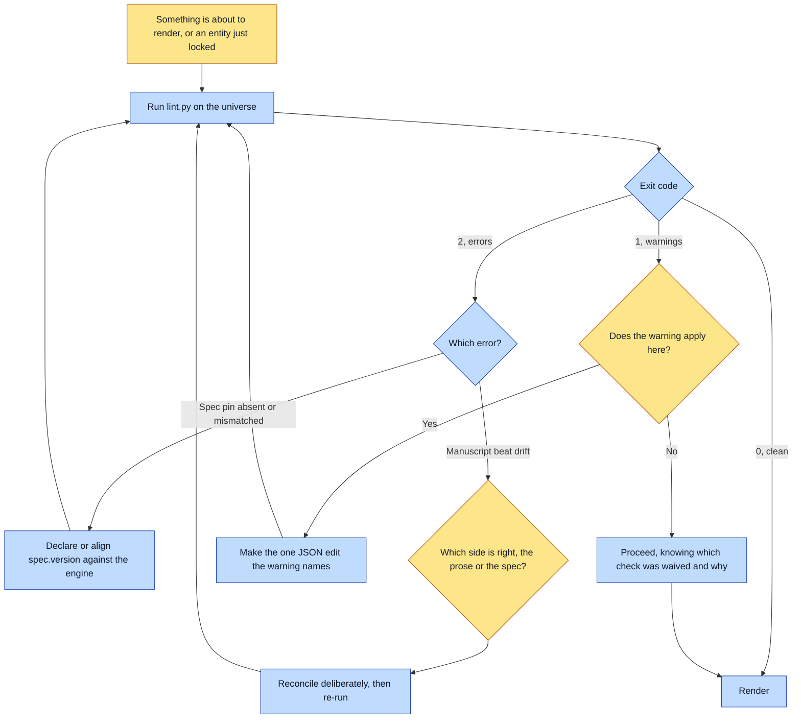

# Purpose

Every failure class that used to be discovered by rendering, sometimes an hour into one, is
discovered statically instead. No generation, no API calls, no cost.

Canon can be internally valid, reviewed by two people, and still be impossible to put in a
picture. This moves those discoveries to the cheapest possible moment.

# When to use (Trigger)

Before rendering anything, always. AND after locking, before casting anything old, which is where
`make-a-book` names it specifically.

# Inputs / Prerequisites

- A universe directory. Nothing else: no key, no network, no model.
- The engine, so the spec pin can be verified against `SPEC_VERSION` rather than trusted.

# Roles

| Role | Responsibility |
|---|---|
| **Human operator** | Reconciles a manuscript-versus-spec drift, which the linter deliberately does not adjudicate, and fills in an approver where the scaffolder left a placeholder. |
| **Agent executor** | Runs it before any render, reads the exit code, and fixes at the source rather than tuning the check until it goes quiet. |

# Procedure

Steps say WHAT happens. The flowchart says who; Automation Opportunities holds the ROI.

1. Run `scripts/lint.py <universe-dir>`.
2. Read the exit code: 0 clean, 1 warnings only, 2 errors.
3. On an error, fix it before rendering. The spec pin and manuscript-beat drift are errors because
   renumbering after art exists is expensive.
4. On a warning, decide whether it applies. Each names the one JSON edit that closes it: register
   the value as a craft record, re-lock a golden with its recipe, add a scale plate, pin a
   wardrobe, fill the approver.
5. Re-run until the exit code is what the run can proceed under.

# Process Flowchart

Amber = irreducibly human. Blue = agent-executed or agent-proposed.

# Done / Verification

The exit code is 0, or it is 1 and every warning has been read and either closed or consciously
waived. The spec pin matches the engine's constant. Every required sheet resolves. Every locked
golden carries a provenance sidecar whose recorded input bytes still exist and still match. Every
manuscript has the same beat count as its StorySpec, numbered as a contiguous run.

# Exceptions & Troubleshooting

- **The commonest manuscript drift, by a wide margin, is a missing closing plate.** All five drifts
  found in one universe on 2026-07-26 were the identical shape: the spec's final beat is a refrain
  or closing plate, art plus one line and no prose, so whoever wrote the manuscript stopped at the
  last prose spread. Check the tail before assuming a beat went missing in the middle.
- **`MANUSCRIPT-BEAT-DRIFT` does not tell you which side is right.** Sometimes the prose gained a
  beat that belongs in the spec; sometimes the spec gained one the prose correctly dropped.
- **A manuscript using a fifth marker convention raises `MANUSCRIPT-UNPARSED` rather than passing
  silently.** Teach the linter the new pattern; do not leave the file unchecked. A detector that
  knows one convention and reports zero for the others reads as "unchecked" and trains people to
  ignore it.
- **Consistency is not truth.** On 2026-07-24 `SPEC.md` said v0.6, the engine constant said 0.4.1,
  and the reference universe pinned 0.5, and every one was internally consistent. The pin is now
  verified against the engine rather than trusted.
- **`SETTING-DRESSING-NAMES-HELD-PROP` deliberately lets some noise through.** The version tuned
  until it was silent on everything questionable was also silent on the entity that earned it,
  which is the right trade for a warning.
- **A golden with no recipe is un-auditable and cannot enter a divergence check.** `GOLDEN-STALE`
  and `GOLDEN-INPUT-GONE` are the free half of the divergence loop: the whole approved corpus
  audited statically at zero cost.
- **A lint that exists and is never run is a discovery problem, not a missing check.** Four locked,
  actively-cast entities carried `authority.lockedBy: TODO-you` in a shipped universe, and the
  check for it had been there the whole time.

# Automation Opportunities

**Already automated:** every check here. Universe parse and register anchor resolution, the spec
pin against the engine, spine and genre registration, style pack integrity, golden declaration and
provenance staleness, the held-prop detector, locked-versus-gate disagreement, entities guarded
only by `render.qa`, provider quirks, and manuscript coherence with four marker conventions.

**Irreducibly human:** which side of a manuscript drift is right, and who the approver is.

**Strongest next candidate:** running this automatically as a precondition of the render verbs
rather than as a named step in prose. It is free and instant, the alternative is finding the same
problem after paying for generation, and the one documented failure of this tool was not a wrong
check but a correct check nobody invoked.

# Related

- [universe-doctor](../universe-doctor/SKILL.md): the holistic completeness grade, where this is
  the advisory static list.
- [book-doctor](../book-doctor/SKILL.md): the same posture applied to one rendered book.

# Revision History

| Version | Date | Changes |
|---|---|---|
| 0.1 | 2026-09-14 | Written from the skill file, read rather than recalled. |
