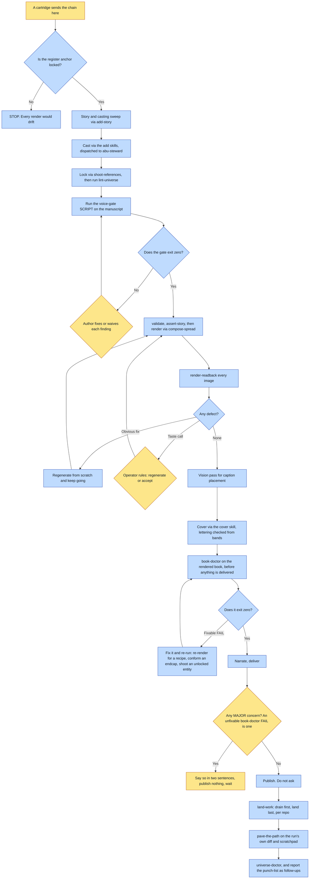

# Purpose

One illustrated, narrated picture book gets made, end to end, in any universe, without a human
being asked "should I proceed to narration?" at every hand-off.

The order is the product: story, cast, lock, render, cover, doctor, narrate, deliver, publish, land,
pave, checkup. Invoking `render-book` first cannot work, because nothing is cast or locked yet.
That list is a contract: `tests/test_chain.py` refuses a step that loses its number and a
frontmatter chain that has drifted from the body.

# When to use (Trigger)

A universe's cartridge skill was invoked and sent you here, or a book is being made in a universe
that has no cartridge yet, in which case run this directly and read `universe.json` for the facts a
cartridge would have supplied.

# Inputs / Prerequisites

- The universe path, the register, the mark, the delivery wiring and the universe's own law. A
  cartridge supplies these; without one, read them from `universe.json`.
- `identity.register.anchor` non-null. If it is null the style is not locked and every render will
  drift, so STOP.
- The engine, run from its repo directory, since it is not pip-installed.
- The source material for the story.

# Roles

| Role | Responsibility |
|---|---|
| **Human operator** | Two gates only: a voice-gate failure on the manuscript, and a readback defect whose fix is a genuine taste call. Plus the story-shaping decisions delegated to `add-story`, and a HOLD on a major concern. |
| **abu-steward** | Owns verb selection for every chain step that touches canon or art, from a fresh context that is not carrying the book's momentum. |
| **Agent executor** | Sequences the chain, auto-advances through everything else including the public publish, never reimplements a step, and owns the final report. |

# Procedure

Steps say WHAT happens. The flowchart says who; Automation Opportunities holds the ROI.

1. Story, through `add-story`: logline, spine, refrain, beats with provenance. Then the casting
   sweep, reuse-first.
2. Cast, through the matching `add-*` skills. Check `structured.render.poses` on every character;
   a character with no render block does not crash the compiler, it silently loses its
   prompt-craft, which is worse.
3. Lock, through `shoot-references`. Independent renders run parallel; a reference matrix runs
   chained. Then RUN `lint-universe` before casting anything old.
4. Words and render. Run the voice-gate SCRIPT on the manuscript, then `validate` and
   `assert-story`, then render through `compose-spread` and read back every image.
   4b. Caption placement by a VISION PASS over the finished art, never by the heuristic alone.
   4c. Any mid-book beat change goes through `insert_spread.py`, never by hand.
5. Cover, through `cover`: portrait, register anchor first, the mark, the title baked and checked
   letter by letter.
6. Doctor, through `book-doctor`, on every book, once the last spread and the cover exist and
   before a single asset leaves the machine. A FAIL you can fix, you fix and re-run; a FAIL you
   cannot fix is a MAJOR concern and nothing publishes.
7-9. Narrate, deliver, publish. Cartridge-specific wiring; the universal parts are that changed
   words mean re-cut narration, and that delivery is verified at the reader's own path AND at the
   live page.
10. Land, through `land-work`, drain first and land last, once per repo.
11. Pave, through `pave-the-path`, after the book ships and the branches land, on every book.
12. Checkup, through `universe-doctor`, reporting its top punch-list items as follow-ups.

# Process Flowchart

Amber = irreducibly human. Blue = agent-executed or agent-proposed.

# Done / Verification

The book is published and PROVEN at the reader's own path, then at the live page: a storage probe
shows the bucket has the assets and does not show that the page renders. Every branch is merged or
queued. `pave-the-path` has run and the framework is not byte-identical to how it started if the
scratchpad holds throwaway scripts. `universe-doctor` has re-graded and its punch-list is reported
as named follow-ups.

Every gate is honoured: words-before-art plus voice-gate; casting reuse-first; register-anchor-
first on every render; readback-from-scratch on any defect; spine declared not assumed; provenance
per beat; render only against locked references; the finished book graded by `book-doctor` before
anything is delivered.

# Exceptions & Troubleshooting

- **Default to CONTINUE.** The failure this fixes is turning every hand-off into a checkpoint. When
  torn between asking and continuing, continue and report.
- **Publish is auto-advanced.** A finished, readback-clean book ships without asking, and it ships
  even when the run was imperfect: a re-rolled spread or an accepted known defect is not a major
  concern. HOLD only for a real person depicted in a way that could dishonour them, a doctrinal
  claim you are unsure of, a defect you could not fix, or a contradiction with a shipped sibling.
- **Prose does not bind; refusals bind.** Every rule this chain BROKE on 2026-07-30 existed as
  prose. Every rule it OBEYED was a refusal in code. When a rule is being broken, do not restate it
  more emphatically: move it into something that stops you, at the choke point every path goes
  through.
- **`ls <skill>/scripts/` BEFORE writing a helper.** A run hand-rolled two bespoke shoot scripts
  and a contact-sheet script that all duplicated shipped tooling badly, because a SKILL.md reads
  like instructions to a human. The prose describes the JUDGEMENT; `scripts/` holds the mechanics.
- **A rule that must BEAT another entity's invariant needs an entity of its own.** A house rule
  written into a setting's dressing was beaten outright by a character's own signature-boots
  invariant in four of fourteen spreads. It held the moment the rule became a locked prop with art.
- **The first sentence of a scene decides whether the people exist.** A scene opening with a PLACE
  comes back as that place, beautifully, and unpopulated, however clearly the figures are named
  later. Five times in one book.
- **Do NOT background the renderer with `nohup`.** The parent exits, the harness reaps the process
  group, and you get empty logs and zero PNGs.
- **Park every roll the operator has seen before anything overwrites it.** A shoot's output path is
  a mutable slot; `candidates/` is the only history. A single-axis reroll overwrote a seed the
  operator had watched render and then asked for back.
- **Every image reaches the human, or the step is not done.** Opening it in a local viewer is not
  delivery, and reading it back yourself is QA.

# Automation Opportunities

**Already automated:** the whole per-step mechanics, plus five compile-time guards, the voice-gate
script, the spec shot audit, the batch renderer with per-spread failure isolation, the descending
renumber, the caption review sheet, the endcap conform and publish, and the land, pave and checkup
steps wired into the chain rather than remembered.

**Irreducibly human:** the two gates, the story-shaping decisions, and the HOLD judgment. Each is a
taste or values call, and the whole auto-advance design exists to make sure these are the ONLY
interruptions.

**Strongest next candidate:** wiring `book-doctor` into the chain between render and publish. Every
other retrospective step in this chain (`land`, `pave`, `universe-doctor`) is a numbered step for
exactly the reason `pave-the-path` gives about itself, that a step depending on somebody
remembering it does not run, and the grader of the actual deliverable is still invoked by memory.

# Related

- [render-book](../render-book/SKILL.md) and [compose-spread](../compose-spread/SKILL.md): the
  render half, per spread.
- [pave-the-path](../pave-the-path/SKILL.md): step 10, the real last step.
- [update-book](../update-book/SKILL.md): editing a book this chain already shipped.

# Revision History

| Version | Date | Changes |
|---|---|---|
| 0.1 | 2026-09-14 | Written from the skill file, read rather than recalled. |
