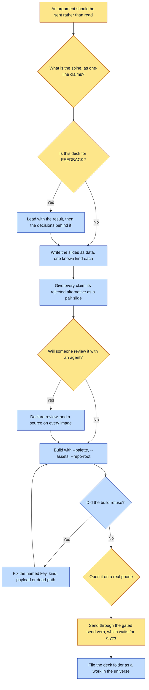

# Purpose

Someone receives an argument they can move through on their phone: one self-contained HTML file
that scales to the viewport so nothing scrolls, swipes horizontally, deep-links its slides, and
carries a scrub bar across the whole argument.

A deck is DATA plus a shell. The slides file is the authored artifact; re-running the builder
reproduces the HTML byte-for-byte, so `deck.json` plus the assets ARE the deck.

# When to use (Trigger)

The operator says deck, slides, present this, walk someone through it, send it to X for feedback,
or asks for an artifact someone should reflect on rather than read as a document.

Not for a printed PDF and not for a document. A deck is a sequence someone moves through.

# Inputs / Prerequisites

- `deck.json`: the slides, each of a known kind with only its known keys.
- The universe's palette tokens, passed with `--palette`, or the deck says in its own provenance
  comment that it is unthemed.
- The images, passed with `--assets` so the folder travels and the deck works offline.
- For a deck built to be REVIEWED: a `review` block with a `baseUrl`, and a `source` on every
  image carrying at minimum a path and what it depicts.
- A phone. The fit is measured at run time against a real viewport.

# Roles

| Role | Responsibility |
|---|---|
| **Human operator** | Owns the spine, which is the work, and approves any send. Sending it to a person is a separate, gated act. |
| **Reviewer** | Reads it, and their agent reads `llms.txt` beside it rather than guessing from captions. |
| **Agent executor** | Writes the data, builds through the one shell, opens it on a phone before sending, and never edits the shell per deck. |

# Procedure

Steps say WHAT happens. The flowchart says who; Automation Opportunities holds the ROI.

1. Decide the SPINE before writing a slide. Write it as a list of one-line claims first; two
   adjacent claims that are the same claim means a slide to cut.
2. Lead with the RESULT when the deck is for feedback. A reader cannot evaluate a journey until
   they know what it arrived at.
3. Give every claim its alternative. A `pair` slide showing the rejection beside the pick invites a
   real reader to disagree; a gallery of finals does not.
4. Surface the flaws early and name them. A reader who finds a hidden weakness stops trusting the
   rest; one who meets it on slide three reads the whole deck as an audit.
5. Declare `review` when the deck will be reviewed, and give every image its `source`. The build
   refuses until every image is traceable.
6. Build with `scripts/build_deck.py`, passing `--palette`, `--assets`, and `--repo-root` so every
   source path, `governs` entry and canon path is checked to exist.
7. OPEN IT ON A PHONE before sending it. This is the step that gets skipped and the only one the
   generator cannot do.
8. Send it through the gated send verb, which shows the draft and waits for a human yes.
9. File it as a WORK in the universe's works folder, not a scratch directory.

# Process Flowchart

Amber = irreducibly human. Blue = agent-executed or agent-proposed.

# Done / Verification

The deck builds without a refusal, opens on a real phone with nothing scrolling, and every link is
https. With `review` declared, `llms.txt` exists beside the HTML and every image carries an
absolute URL and a repo-relative source path that resolves under `--repo-root`. The deck folder
lives with the universe's other works, and re-running the builder reproduces the HTML byte for
byte.

# Exceptions & Troubleshooting

- **An unknown key is REFUSED BY NAME, because a mistyped key is the one defect a deck cannot show
  you**: the content is simply absent, on one slide, and the deck still looks finished.
- **If the shell cannot express something, that is a gap in the SHELL** and it gets fixed there.
  The second deck is where a per-deck edit silently diverges from the first.
- **Links are https only, and that is the security boundary rather than a style rule.**
  `javascript:` and `data:` would otherwise become live handlers on a page that escapes everything
  else it is handed.
- **A review file with holes is worse than no review file**: the one image with no source is the
  one the reviewer's agent quietly guesses about. The build refuses for that reason.
- **A dead path is worse than no path**, because the agent goes looking, finds nothing, and has to
  decide whether the deck is lying. Paths rot for ordinary reasons: a plate promoted out of
  `rejected/`, a roll renamed, an output folder cleaned.
- **The desktop proves almost nothing.** The fit is measured at run time against a real viewport,
  and iOS `vh` hides the footer behind the address bar, which is why the shell uses `100dvh`.
- **The ten slide kinds are a hypothesis**, extracted from one deck already used in front of a real
  audience on real phones.

# Automation Opportunities

**Already automated:** every refusal, the viewport fit and re-measure on image load, the horizontal-
intent swipe, the deep links and history handling, the palette injection with an honest provenance
comment when it is absent, the asset copy, and the `llms.txt` emission with path existence checks.

**Irreducibly human:** the spine, and opening it on a phone. The first is the work; the second is
the one verification the generator structurally cannot perform.

**Strongest next candidate:** a form declaring this universe's own deck register (which kinds it
uses, what its covers look like, how much evidence the method rests on), through `create-form`.
The skill already says a universe that makes decks repeatedly should have one, the mechanism
carries no taste today, and the ten kinds remain a hypothesis resting on a single work.

# Related

- [create-form](../create-form/SKILL.md): where a universe's deck register would live.
- [make-a-work](../make-a-work/SKILL.md): the generic door, and where the works convention this
  deck folder follows is defined.

# Revision History

| Version | Date | Changes |
|---|---|---|
| 0.1 | 2026-09-14 | Written from the skill file, read rather than recalled. |
