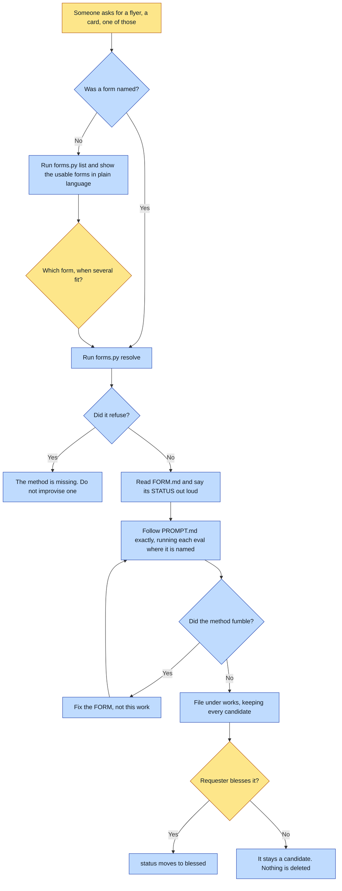

# Purpose

One work gets made in a form the universe already declares, through a single door, so that adding
a new KIND of work means adding a FOLDER rather than writing a new skill.

The rule this enforces: if making a flyer needs a `make-a-flyer` skill and a card needs a
`make-a-card` skill, the framework has moved the hand-rolling up one level instead of removing it.
Forms are data.

# When to use (Trigger)

Someone says "make a flyer", "make a card for X", "make one of those", "what can this universe
make", or names any form. Also whenever you are about to write a one-off skill for a new kind of
artifact.

Not for picture books, which `make-a-book` owns, and not for a single on-brand image with no form.

# Inputs / Prerequisites

- The target universe, and a form id or none.
- A form at `<universe>/forms/<id>/` holding both `FORM.md` and `PROMPT.md`. A folder without
  `PROMPT.md` is a note about a form rather than a form: nothing can be made from it.
- Whatever that form's own method declares it needs.

# Roles

| Role | Responsibility |
|---|---|
| **The requester** | Blesses the work. `status` starts at `candidate` and only the requester moves it to `blessed`. Looking at the thing is the gate, and the maker is not the one who passes it. |
| **Human operator** | Picks the form when several fit, rather than having one quietly chosen for them. |
| **Agent executor** | Discovers rather than guesses, lets the resolver refuse, reads `FORM.md` FIRST and surfaces its status out loud, follows `PROMPT.md` exactly, and files the work with its candidates kept. |

# Procedure

Steps say WHAT happens. The flowchart says who; Automation Opportunities holds the ROI.

1. Discover, do not guess. With no form named, run `scripts/forms.py list <universe>` and show the
   usable forms in plain language. Never invent a form that is not there, and never quietly pick
   one when several fit.
2. Resolve, and let it refuse: `scripts/forms.py resolve <universe> <form-id>`. Do not work around
   a refusal by reading the folder yourself; an unusable form means the method is missing.
3. Read `FORM.md` FIRST and surface its STATUS to the operator. Most forms are derived from one
   work, which is a hypothesis rather than a standard.
4. Read `PROMPT.md` and follow it exactly. It is the composer: it owns the gates, the order and
   the refusals. Where it names an eval, run that eval at that point.
5. File the work where the universe says: `workRoot` if declared, else `works/<id>/`, holding
   `work.json`, the blessed artifact under a STABLE name, its recipe, and a `candidates/` folder.
6. `status` starts at `candidate`. Only the requester moves it to `blessed`.

# Process Flowchart

Amber = irreducibly human. Blue = agent-executed or agent-proposed.

# Done / Verification

The work sits at `works/<YYYY-MM-DD>-<slug>/` with a `work.json` whose id matches the folder name,
the artifact under a stable name so consumers do not break on a re-roll, a recipe beside it, and
every attempt still in `candidates/`. `status` is `candidate` unless the requester moved it. The
form's own gates, whatever they are, were honoured at the steps that named them.

# Exceptions & Troubleshooting

- **An unusable form refuses rather than improvising**, and improvising around that is how a form
  silently becomes whatever the last agent felt like.
- **Surface the STATUS before starting.** An agent that reads only the method will follow it with
  unearned confidence. If the form says the next work is expected to correct it, say so out loud.
- **A method that fumbles is a defect in the FORM, not in this work.** Fix the form. This is
  `fix-the-generator` applied to forms.
- **A render is not reproducible, so an un-blessed candidate is the only record that attempt
  existed.** Keep all of them.
- **Only the requester blesses.** Looking at the thing is the gate, and the maker does not get to
  pass it.
- **`forms/<id>/form.json` in the old slot encoding was RETIRED.** A folder holding only that is
  reported as retired, never offered as usable.
- **A new kind of work is still a FOLDER**, and authoring it is `create-form`, whose scaffolder
  refuses on zero evidence. The retired 896-line zero-works composer is the cautionary tale.

# Automation Opportunities

**Already automated:** discovery, the unusable-form refusal, the STATUS surfacing, the retired-
encoding report, and a machine-readable listing that emits an empty array for a universe with no
forms so a consumer never parses prose to learn "none".

**Irreducibly human:** the blessing, and picking among several fitting forms. Both are decisions
about what this work is for.

**Strongest next candidate:** a check that a filed work's folder actually matches the convention
this skill states, meaning `work.json` with a matching id, a stable artifact name, a recipe beside
it, and a non-empty `candidates/`. The convention is written here and enforced nowhere, and the
candidates half is the one that cannot be recovered once it is skipped.

# Related

- [create-form](../create-form/SKILL.md): produces the folder; this door makes works in it.
- [make-a-book](../make-a-book/SKILL.md): owns the book chain, which stands outside `forms/` for
  historical reasons rather than category ones.

# Revision History

| Version | Date | Changes |
|---|---|---|
| 0.1 | 2026-09-14 | Written from the skill file, read rather than recalled. |
