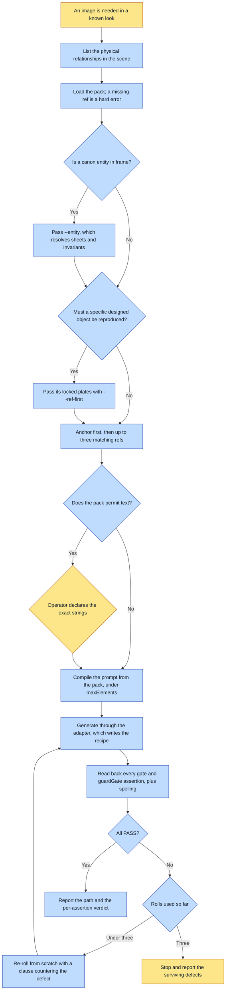

# Purpose

One image is generated in a defined look and verified against that look's own read-back gate,
without needing a universe at all. This is the framework's lightweight front door: deck plates,
page heroes, section art, icons, one-off brand illustration.

It is also THE provider adapter. Every render in the framework goes through this script, because
this is what writes the `.recipe.json`. There is no un-provenanced image.

# When to use (Trigger)

"Here is a folder of images, make more that look like them." The subject changes every time and
only the LOOK is shared.

Reach for the full canon flow instead only when a specific thing must render identically
everywhere.

# Inputs / Prerequisites

- **The style pack**: a folder with `pack.json` and `refs/`. Its `anchor`, `refs`, `styleLine`,
  `palette`, `rejectedPoles`, `gate`, `textPolicy` and `maxElements` are all read.
- **The scene**: what the image depicts, in one or two sentences. The ONLY free text in the prompt.
- The output path, and a size.
- Optionally `--entity <universe>:<id>[@look]`, repeatable, for any canon entity in frame.
- Optionally `--lookbook` for a crowd or a wardrobe, and locked masters passed with `--ref-first`
  for a specific designed object.

# Roles

| Role | Responsibility |
|---|---|
| **Human operator** | Declares the exact text strings when the pack permits text, and rules on a surviving defect after the roll cap. |
| **Agent executor** | Loads the pack, selects references with the anchor first, COMPILES the prompt rather than free-writing it, generates through the adapter, reads back every gate assertion against the pixels, and re-rolls defects from scratch. |

# Procedure

Steps say WHAT happens. The flowchart says who; Automation Opportunities holds the ROI.

0. Before generating, LIST THE PHYSICAL RELATIONSHIPS in the scene: what faces what, what supports
   what, what reflects what, what the light passes through. Any you cannot state in one sentence
   is one the model is about to invent.
1. Load the pack. A ref that does not resolve is a hard error, because the look IS the references.
2. Select references: the anchor FIRST, then up to three more, choosing at least one whose motif
   matches the scene. Locked masters go AFTER the style refs, or ahead of the anchor with
   `--ref-first` when a specific object must be reproduced rather than suggested.
3. For a canon entity, pass `--entity`, never hand-picked refs. That resolves its sheets,
   alt-looks, invariants and prose rules from canon and hard-fails on a missing plate.
4. COMPILE the prompt rather than free-writing it, choosing the text clause from `pack.textPolicy`
   and keeping the element count at or under `maxElements`.
5. Generate via `scripts/generate.py`, the framework provider adapter, NEVER the raw model script.
   Provenance is a side effect of generating here.
6. READ BACK against the gate, per assertion, plus every `guardGate` assertion the recipe carries.
   Where the pack permits text, compare every glyph character by character to the declared strings.
7. Re-roll defects FROM SCRATCH with a clause countering the specific defect. Cap at 3 rolls, then
   stop and report the surviving defects rather than shipping a silent failure.

# Process Flowchart

Amber = irreducibly human. Blue = agent-executed or agent-proposed.

# Done / Verification

The output exists with a `.recipe.json` beside it recording provider, prompt, spec version, refs
and hashes. Every gate assertion returned PASS against the actual pixels, not against the prompt.
Every declared string is character-exact and no undeclared text appears. The per-assertion verdict
is reported alongside the path.

# Exceptions & Troubleshooting

- **The commonest defect in a finished-looking image is UNSTATED PHYSICS**, not style, anatomy or
  composition. Five in one session: a phone filming a selfie with its rear camera facing the
  subject, a floor hatch that could not fit its own hole, burning letters reflected the same way
  up, a man standing INSIDE the well he stood beside, and a beam passing through a crowd and
  striking none of them. Each was fixed by stating the relationship, saying which way it must
  read, and saying what the wrong version looks like.
- **A geometry rule belongs in canon, not in the prompt.** The hatch rule was fixed once and
  silently regressed when the piece was re-shot with a character added.
- **A pack carries the LOOK; only `--ref-first` carries the OBJECT.** A locked pearl-and-gold
  eyeglass frame came back as a plain clear frame three rolls running, because nothing was
  reproducing it.
- **`--ref-first` reproduces PROPORTIONS too**, which makes it the wrong flag the moment one
  dimension is meant to depart from the reference. A mast asked for at three times the reference
  height came back at the reference's own height six times running. Drop to plain `--ref`, give
  the dimension a RATIO rather than an adjective, and put the scale anchor fully inside the frame.
- **A reference fixes what the reference SHOWS.** The same frame whose front was finally correct
  still rendered wire temple arms, because the plate barely showed the arms.
- **A render that HANGS with no error is a stale SDK, not a slow API.** A months-old cached client
  hangs on a multi-image edit: the request goes out, the socket is ESTABLISHED, and the process
  sits at 0% CPU. It presents as throttling, so the instinct is to raise the timeout, which makes
  it strictly worse. Same call: 14 minutes hung stale, 58 seconds refreshed.
- **A render is NOT reproducible. Never delete an un-locked candidate.** A blessed roll was lost
  exactly that way.
- **Concurrency of 3 is the working number.** Six queue server-side and time out together, and a
  timeout means no image AND no recipe.
- **A mark destined for a transparent cutout renders on a GREEN SCREEN**, not on a "nice" ground,
  which bakes a contact shadow that reads as high-chroma gold and defeats every heuristic cutout.
- **Anatomy is a gate concern, not a prompt concern.** You cannot reliably prompt away a bad hand.
- **A set must be uniform in kind.** Varying by OMISSION reads as failure: three winged towers
  where one lacks wings says that one is broken, not that they are different companies.

# Automation Opportunities

**Already automated:** provenance on every render by construction, the missing-ref hard error, the
entity resolve with its look composition and hard-fail, the text clause selection from
`textPolicy`, ref downscaling for throughput with the ORIGINAL paths still recorded, the chroma
keyer, and the guard gate carried into the recipe for the read-back to evaluate.

**Irreducibly human:** the declared text strings, and the ruling on a defect that survives three
rolls. Both are decisions about what this particular image is for.

**Strongest next candidate:** a pre-generation prompt for the physical relationships, emitted as a
checklist the caller must answer rather than as step 0 prose. It is named here as the commonest
defect class, all five examples were invisible until a human pointed at them, and it is the only
step in this skill enforced purely by remembering to do it.

# Related

- [create-style-pack](../create-style-pack/SKILL.md): authors the pack this consumes.
- [render-readback](../render-readback/SKILL.md): the crop, measure and guard-gate mechanics step 6
  uses.
- [compose-spread](../compose-spread/SKILL.md): for a full book spread with poses and a setting.

# Revision History

| Version | Date | Changes |
|---|---|---|
| 0.1 | 2026-09-14 | Written from the skill file, read rather than recalled. |
