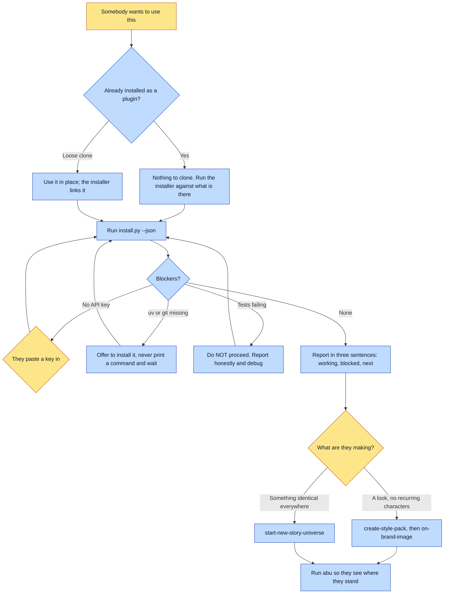

# Purpose

Somebody who wants to use this ends up with it working, and hears what happened in plain
sentences, without ever being handed a list of things to type.

The rule it enforces: **you run the commands, they run nothing.** A quickstart full of bash
addresses the wrong reader. In a cartridge model the human states intent and the console operates.

# When to use (Trigger)

Someone says "install this", "set me up", "how do I start", "get me running", "I want to try
this". Also when a friend has been handed the framework and needs it working, or when `abu` finds
no universes and nothing installed.

# Inputs / Prerequisites

- Their machine, and their harness.
- Two things only the human can supply, because both are credentials and consent: the console
  itself, and an API key. Everything else is yours.
- Possibly nothing to clone at all. The framework ships as a plugin from its own public repo, so
  if they added the marketplace and installed, every skill is already present.

# Roles

| Role | Responsibility |
|---|---|
| **The new person** | Installs the console and holds an API key. That is the entire list, and it is short because credentials and consent cannot be delegated. |
| **Agent executor** | Runs the installer, translates every blocker into a human action, refuses to proceed on failing tests, and hands off to a first real artifact rather than stopping at an install. |

# Procedure

Steps say WHAT happens. The flowchart says who; Automation Opportunities holds the ROI.

1. Check whether they are already installed. If they ran the marketplace add and the install,
   there is nothing to clone. If they have a loose clone, use it in place.
2. Run `scripts/install.py --json`, which links every skill into the harness, resolves both image
   providers, checks for the API keys and for `git` and `uv`, runs the full suite, and returns a
   verdict with an explicit blockers list. `--check` reports without changing anything, and the
   installer is idempotent, so a partial install is fixed by running it again.
3. Report in OUTCOMES, not output: three sentences saying what is working, what is blocked, and
   what happens next.
4. Translate each blocker into a human action. A missing key is a sentence asking them to paste
   one in. A missing `uv` or `git` is an offer to install it, not a command printed at them.
   Failing tests means do not proceed: report honestly and debug.
5. Hand off to the first real thing. Ask what they are making: a look with no recurring characters
   goes to `create-style-pack` and then `on-brand-image`, which needs no universe and is the
   smallest path to a first image; something that must appear identically everywhere goes to
   `start-new-story-universe`.
6. Run `abu` so they see where they stand, because that is the loop they will live in.

# Process Flowchart

Amber = irreducibly human. Blue = agent-executed or agent-proposed.

# Done / Verification

The suite is green, both providers resolve, and at least one API key is present. They have made
one real artifact, or know exactly what the next step produces. **They never saw a command**,
which is checkable by reading the transcript back.

# Exceptions & Troubleshooting

- **An install that half-works wastes more of their time than one that refuses.** Failing tests
  means stop, report and debug, not proceed and hope.
- **An install with no first win is an anticlimax.** Step 5 is not a courtesy; a session that ends
  at "it is installed" has delivered nothing they can see.
- **Two sentences for a non-technical person, no more:** this runs inside their AI harness, and
  they will talk to it in plain language. Do not explain canon, goldens, registers, gates or the
  spec. The vocabulary arrives when a specific decision needs it, which is what makes it stick.
- **Do not print a command and wait.** That is the failure this skill exists to remove, and it
  reads as helpfulness.
- **The installer is idempotent**, so a partial install is fixed by running it again rather than by
  diagnosing what got half-done.

# Automation Opportunities

**Already automated:** skill linking, provider resolution, key and dependency checks, the full
test run, an explicit blockers list, a read-only `--check` mode, and idempotence.

**Irreducibly human:** installing the console and holding an API key. Both are credentials and
consent, which is why the list is exactly two items long.

**Strongest next candidate:** the installer returning the first-win routing question as structured
data rather than leaving step 5 to prose. Everything before it is already a verdict object, the
routing rule is a simple branch on one question, and the step that gets dropped is always the last
one.

# Related

- [abu](../abu/SKILL.md): the loop they live in afterwards, and where an uninstalled framework is
  routed back here from.
- [create-style-pack](../create-style-pack/SKILL.md): the smallest path to a first image.

# Revision History

| Version | Date | Changes |
|---|---|---|
| 0.1 | 2026-09-14 | Written from the skill file, read rather than recalled. |
