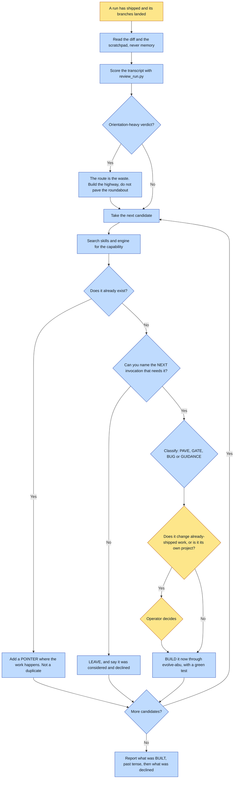

# Purpose

A completed run's improvised code and repeated manual steps become deterministic substeps the
framework owns, so the next invocation does not improvise them again.

It fires AFTER the deliverable ships, not mid-flinch, because you cannot see a path you are still
walking. The path has already been worn, so you are paving a real desire path rather than
speculating about one.

# When to use (Trigger)

A book, work or universe run is finishing. Wired in as the last step of `make-a-book`'s chain so
it fires on every book rather than waiting to be remembered. Also when the operator says "pave the
path", "what did we hand-roll", "memorialize this", "turn that into a step".

# Inputs / Prerequisites

- The run's DIFF and the SCRATCHPAD, never your memory of the run. Memory is unreliable and
  flattering: you will remember the interesting problems and forget the repetitive ones, which is
  exactly backwards.
- The run's transcript, when it left one, for `review_run.py`.
- `gh` for the `gap` label, the standing register of known-open gaps.

# Roles

| Role | Responsibility |
|---|---|
| **Human operator** | Two decisions only, and they are exceptions rather than the default: a pave that changes behaviour for work someone else already shipped, and a pave large enough to be its own project. |
| **Agent executor** | Gathers evidence rather than recalling it, searches before classifying, classifies each candidate, BUILDS everything that clears the bar through `evolve-abu`, and records what it declined. |

# Procedure

Steps say WHAT happens. The flowchart says who; Automation Opportunities holds the ROI.

1. Gather the evidence from the diff and the scratchpad. The highest-yield sources in order: every
   throwaway script, retry loops and sleeps, verification written by hand, anything done N times
   by hand where N is over 2, and rules enforced by being careful.
1b. SEARCH BEFORE YOU CLASSIFY. A hand-roll is not proof of a gap. The two cases have opposite
   fixes: a real gap wants a BUILD, a discovery failure wants a POINTER placed where the work
   happens.
1c. Score the run itself with `review_run.py`, and read an orientation-heavy verdict as evidence of
   a missing DIRECT ROUTE rather than a missing capability. The same pass reports every shell
   command the run SHOWED the operator, which is the half of the no-command rule no in-run gate
   can see; each one is a gap, not a scolding.
2. Classify each candidate: PAVE, GATE, BUG, GUIDANCE or LEAVE.
3. Apply the bar. Pave only when you can complete the sentence "I hand-rolled X, and the next
   invocation that needs X is Y" with a specific named case. If you cannot name Y, do not pave.
4. BUILD it, in this session, through `evolve-abu`. Integrate by default; the caution lives in the
   bar and nowhere else.
5. File any PAVE, GATE or BUG you are not building today as a `gap` issue with its evidence and its
   next invocation.
6. Report what you BUILT, in past tense, then what you declined.

# Process Flowchart

Amber = irreducibly human. Blue = agent-executed or agent-proposed.

# Done / Verification

The report's rows are in PAST TENSE and each carries its named next invocation. Every candidate
above the bar was built, tested and landed through `evolve-abu`; invoking the verb is not the
finish line, a green test on the new behaviour is. Everything declined is recorded so a later
reader knows it was considered rather than missed.

**The tell that this step was skipped: a scratchpad full of throwaway scripts and a framework
byte-identical to how it started.**

# Exceptions & Troubleshooting

- **Shipping a list instead of a change is the single worst outcome available here, because it
  looks like diligence.** The first run wrote six ranked proposals into a log and shipped none,
  which is a to-do nobody does. If the sweep's artifact is a log entry and the repo is otherwise
  unchanged, the sweep did not run; it rehearsed.
- **A hand-roll feels like evidence of absence and often is not.** On 2026-08-01 a session
  hand-rolled the same contact-sheet montage roughly FIFTEEN times while the shipped script sat in
  the repo the whole session, along with the crop tool it also hand-rolled.
- **A tool nobody finds at the moment of need is indistinguishable from a missing tool, and the fix
  is not more documentation.** Two structural causes worth checking: filed by OWNER rather than by
  JOB, and named for its mechanism rather than its outcome.
- **Paving the wrong thing is worse than hand-rolling twice.** A hand-roll costs one session; a bad
  abstraction calcifies into every future run. That is what the bar is for, and it is not a reason
  to defer a candidate that already cleared it.
- **Do not automate a roundabout.** An orientation-heavy run means the walked route is itself the
  waste. `reroll-slot` is the precedent: an 85-call walk became ONE command reading ZERO canon.
- **Coding a judgment call is how a framework becomes a straitjacket.** Taste goes in a SKILL.md as
  GUIDANCE and nowhere else.
- **Never swallow a BUG as a PAVE.** Building a helper on top of a broken cap leaves the cap broken
  for everyone else.
- **Run the detector first.** Its first outing found 79 findings across at least SEVEN different
  sessions, when the assumption going in was five scripts that day. Hand-rolling was the normal
  usage pattern, invisible because nothing looked.

# Automation Opportunities

**Already automated:** the hand-roll detector with its three mechanical signatures and its non-zero
exit so a chain step can gate on it, the run scorer with its orientation verdict, and the wiring of
this step into `make-a-book` so it fires without being remembered.

**Irreducibly human:** the two exception decisions, and the classification of a candidate as
GUIDANCE. The bar itself is mechanical once the naming sentence is attempted.

**Strongest next candidate:** running `detect_handroll.py` as a hard gate at the end of the chain
rather than as a step inside a skill somebody invokes. It already exits non-zero by design for
exactly this, and the failure it catches is invisible from inside the run by this skill's own
account: five of six rows in its worked example felt like getting unstuck at the time.

# Related

- [evolve-abu](../evolve-abu/SKILL.md): does the paving. This skill decides WHAT to pave and never
  edits the framework itself.
- [make-a-book](../make-a-book/SKILL.md): wires this in as chain step 10.

# Revision History

| Version | Date | Changes |
|---|---|---|
| 0.1 | 2026-09-14 | Written from the skill file, read rather than recalled. |
| 0.2 | 2026-09-14 | v0.50: the run scorer also reports commands the agent showed the operator. |
