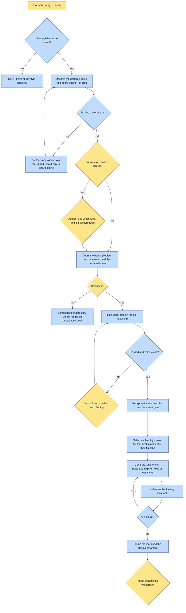

# Purpose

A validated StorySpec becomes an illustrated, narrated picture book that looks and sounds like ITS
universe, with every universe-specific fact read from that universe's `identity` block and its
`canon/craft/` records rather than from this file.

Nothing here is universe-specific. This is the universe layer over the general picture-book
pipeline, which owns the mechanics.

# When to use (Trigger)

A story's words are ready and its cast is locked. Chain step 4 of `make-a-book`. Not for editing
an already-built book, which is `update-book`.

# Inputs / Prerequisites

- The target universe. `identity.register.anchor` must be non-null; if it is null, STOP, because
  the universe's style is not locked.
- The story id at `stories/<id>.json`, with its spine, features, beats and any per-story register
  override.
- The story's declared `spine` and `genre` craft records, which must RESOLVE against `list-craft`.
- A blessed, voice-clean manuscript before any art.
- Subject approval from any real person in the cast, for both words and likeness.

# Roles

| Role | Responsibility |
|---|---|
| **The subject, when real** | Blesses the words and the likeness. No spread featuring them renders first, and their confusion-flags count the same as the author's. |
| **Human operator** | Blesses the manuscript, rules a craft-record conflict by writing down which record wins, and accepts the story's `writesBack` before it commits. |
| **Agent executor** | Loads universe and story, resolves the craft records and stops if either is unregistered, runs the voice gate, then per spread resolves, selects the era-correct look, generates and reads back. |

# Procedure

Steps say WHAT happens. The flowchart says who; Automation Opportunities holds the ROI.

1. Load the universe and the story. If `identity.register.anchor` is null, STOP and point at the
   style-lock step.
2. Read the craft. Load the story's declared `spine` and `genre` records plus any `register-rule`
   records. RESOLVE both against `list-craft` BEFORE rendering, and STOP if either does not exist.
   When two records conflict, find the supersession and write down which one wins in
   `aimDiscipline`.
3. Words before art, as a gate. Draft or confirm the manuscript against the beats, run `voice-gate`
   on the whole thing, and do not proceed until the words are blessed and voice-clean.
4. Per spread: resolve through `canon-resolve` and its assert gate; SELECT each cast entity's
   pose or look for the beat's moment in that character's OWN timeline; generate with the register
   anchor first and the rejected poles plus honoured register-rules as negatives, honouring the
   genre record's format canon; then read back and regenerate any defect from scratch.
5. Close and write back: stamp the mark in the back matter, use the closing ornament on the final
   plate, and propose the story's `writesBack` for the author to accept.

Before rendering, count the beats spent on the problem against the beats spent on the answer, and
in an expectant story count how many live in the declared future. Rendering is the LAST cheap
moment to catch a hedge by proportion.

# Process Flowchart

Amber = irreducibly human. Blue = agent-executed or agent-proposed.

# Done / Verification

Every gate this skill names is honoured and each is checkable: no spread rendered before the
manuscript was blessed and voice-clean; every prompt came from a resolved entity record; every
generation led with the register anchor; every defect regenerated from scratch rather than being
edited; the story was checked against its declared spine, its genre's format canon and the
universe's discovered laws; and a real person in the cast blessed words and likeness before any
spread featuring them rendered.

# Exceptions & Troubleshooting

- **A story can declare a genre that reads perfectly and matches no record**, in which case that
  record's rules are silently never applied and nothing errors. A book declared
  `prophetic-biography`, which is not registered; the real record EXPLICITLY SUPERSEDES the
  `testimony-over-prediction` register-rule, so unresolved, the superseded rule would have governed
  and forced the book's whole declared-future act back into "imagine, one day" hedging, inverting
  what the book was for.
- **An entity with poses has a DEFAULT that is silently applied whenever a spread omits one, and
  it is usually their resolved post-arc self.** So any beat set during their valley, their before,
  or their childhood renders them as already healed. Nothing errors and the plate looks fine. A
  character was rendered in the wardrobe his canon ties to life AFTER his deliverance, on the beat
  depicting his own psychiatric emergency, when that same canon named the valley-era look
  explicitly. That is a doctrinal error about a real person, not a wardrobe nit.
- **Craft records are not independent.** A genre record may explicitly retire a register-rule it
  contradicts. State the resolution in `aimDiscipline` so the next reader sees a ruling rather than
  apparent drift.
- **A story that spends thirty beats diagnosing and one declaring has hedged by proportion**,
  whatever its wording says, and every beat added after the art exists renumbers five artifacts.
- **A universe with no craft records has none to honour.** Proceed on the declared spine alone.
- **An unsourced vivid detail does not ship.** Each beat's provenance must trace to a real source.

# Automation Opportunities

**Already automated:** the null-anchor stop, the craft-record resolution against `list-craft`, the
voice gate as a non-zero-exit script, the whole per-spread compile through `compose-spread` with
its five guards and its era gate, and the read-back's crop and measure tooling.

**Irreducibly human:** the manuscript blessing, the craft-conflict ruling, the subject's approval,
and accepting the `writesBack`. Every one is an authority question rather than a fact.

**Strongest next candidate:** an era sweep that reports, per spread, which cast entities have poses
and which pose was selected, so a silently-defaulted post-arc look is visible before spending.
`compose-spread` already refuses a look selected outside its declared `validFor` window, so the
machinery exists; what is missing is the case where no window was declared at all, which is
precisely the shape that produced the doctrinal error above.

# Related

- [compose-spread](../compose-spread/SKILL.md): the atomic per-spread unit this invokes.
- [voice-gate](../voice-gate/SKILL.md): step 3, and a script rather than a reading.
- [update-book](../update-book/SKILL.md): editing a book this already built.

# Revision History

| Version | Date | Changes |
|---|---|---|
| 0.1 | 2026-09-14 | Written from the skill file, read rather than recalled. |
