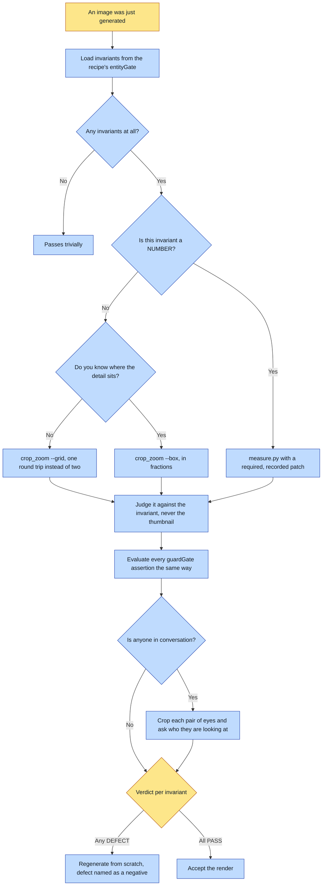

# Purpose

A defective render is caught before it ships or locks. A render that looks fine at thumbnail can
be wrong at the invariant level: a lens that should not be there, a missing patch, a wrong
pendant. This forces a per-invariant check against the pixels.

# When to use (Trigger)

Immediately after each generated image, before accepting or locking it. Every renderer in the
framework calls it, and no shot locks without it.

# Inputs / Prerequisites

- The just-generated image.
- Its `.recipe.json`, whose `entityGate` key holds one entry per bound entity with the invariants
  that render was ACTUALLY conditioned on. Fall back to the entity's `structured.invariants` for a
  render made without it.
- The recipe's `guardGate`, listing one read-back assertion per standing prompt guard that fired.
- For a numeric invariant, a declared patch in fractions of the frame, which is required and is
  recorded.

# Roles

| Role | Responsibility |
|---|---|
| **Human operator** | Judges a mark's geometry against its blessed plate, which is the one thing a computed proxy got wrong five times out of five. A golden IS human judgement, frozen. |
| **Agent executor** | Loads the invariants from the recipe rather than from memory, crops or measures each one, returns a verdict per invariant, and regenerates from scratch on any defect. |

# Procedure

Steps say WHAT happens. The flowchart says who; Automation Opportunities holds the ROI.

1. Load the entity's invariants from the render's OWN recipe, key `entityGate`, which is what that
   render was actually conditioned on. No invariants means the render passes trivially.
2. Read the image back. For EACH invariant, crop-zoom the relevant region and judge it directly.
   Use `contact_sheet.py` for the wide pass over a batch and `crop_zoom.py` for the narrow pass,
   where most invariants live. Both take FRACTIONS, so a box survives a re-render at another size.
   Pass `--grid 4x4` instead of a box when you do not already know where the detail sits.
2a. Evaluate EVERY `guardGate` assertion the recipe carries, the same way as an entity invariant,
   and crop-zoom to do it. A prompt guard is an instruction to the model and it loses some
   fraction of the time; this gate is what refuses when it lost.
2b. Run the standing EYELINE check on every scene with a conversation in it: crop-zoom each
   participant's eyes and ask who they are looking at.
3. Return PASS or DEFECT per invariant, with a one-line reason on any DEFECT.
4. All PASS accepts the render. Any DEFECT regenerates FROM SCRATCH with the defect named as an
   explicit negative. Never stack an edit pass.

For a NUMERIC invariant, use `measure.py` rather than cropping: `figure` for a body ratio,
`periodic` for a screen or weave, `patch` for a colour against a target. The patch is required, in
fractions, and the same patch must be used across a set or the numbers mean nothing.

# Process Flowchart

Amber = irreducibly human. Blue = agent-executed or agent-proposed.

# Done / Verification

Every invariant has its own verdict, judged from a crop rather than from a thumbnail or from
memory of the prompt. Every guard that fired has been evaluated. Every numeric claim has a
`<image>.measure.json` beside it recording HOW it was measured, because a bare number is not a
measurement.

# Exceptions & Troubleshooting

- **Use `crop_zoom.py` BEFORE calling a defect.** A contact sheet is downsampled; a lace hem called
  "vertical stripes" from a 3-up was a correct horizontal band when zoomed.
- **Guess a box, get a rectangle of empty shadow, guess again: two round trips.** The grid costs
  one, and one run guessed wrong twice.
- **A guard can fire, reach the prompt verbatim, and still lose.** On an appliedai.wiki hero the
  guard fired, the prompt carried it, the render put the screen toward the camera with its user
  behind the lid, and the read-back passed it because no line told the reader to look.
- **A warm grin toward camera is the model's strongest prior for a likeable subject.** Three
  renders in one batch put the subject's eyes on the lens mid-conversation. The rule is: if the
  camera is not representing your interlocutor's eyes, why are you looking at it?
- **A pitch is invisible by eye at any size a person reviews at.** One project asked for a COARSE
  halftone screen three rounds running and got a fine one every time; nobody could tell, because
  "coarse" is not a number. Any gate phrased as "short", "one place only", "does not reach the
  edge" is an extent claim and is an opinion until measured.
- **The chin is not auto-detected, deliberately.** A luminance-minimum detector locks onto the
  shadow under the lower lip and returns a confident 1:8.8 on a figure that is really 1:7.2.
- **Do NOT measure a mark's geometry.** `measure star` existed for one afternoon and was withdrawn
  the same day: wrong five times out of five, and finally passing an obviously equilateral compass
  star the operator rejected on sight. It assumed away the defect it existed to catch. False
  precision is worse than no number, because it survives review.
- **Three consecutive sessions hand-rolled the figure ruler** and reported incompatible numbers,
  because none of them recorded their landmarks. Nobody could tell whether a plate had improved or
  the method had changed.

# Automation Opportunities

**Already automated:** the crop, contact-sheet and measurement tooling with fraction-based boxes,
the recipe-carried entity gate and guard gate, the required-and-recorded patch, the self-validating
detectors that REFUSE rather than guessing, and the measurement sidecar.

**Irreducibly human:** judging a mark against its blessed plate, and any invariant where a computed
proxy would produce false precision. The distinction worth keeping: measure a quantity a human
cannot eyeball reliably, never a judgement a human makes instantly.

**Strongest next candidate:** a refusal when a render is accepted with a `guardGate` in its recipe
and no recorded verdict per assertion. The gate exists precisely because a prompt guard loses some
fraction of the time, and today it is evaluated by an agent reading step 2a and remembering, which
is exactly how the shipped hero passed with its screen facing the wrong way.

# Related

- [judge-slot](../judge-slot/SKILL.md): the blind, itemized judgment against a golden, which this
  is not: read-back is QA performed by the maker.
- [compose-spread](../compose-spread/SKILL.md) and [shoot-references](../shoot-references/SKILL.md):
  the callers, which own generating and locking.

# Revision History

| Version | Date | Changes |
|---|---|---|
| 0.1 | 2026-09-14 | Written from the skill file, read rather than recalled. |
