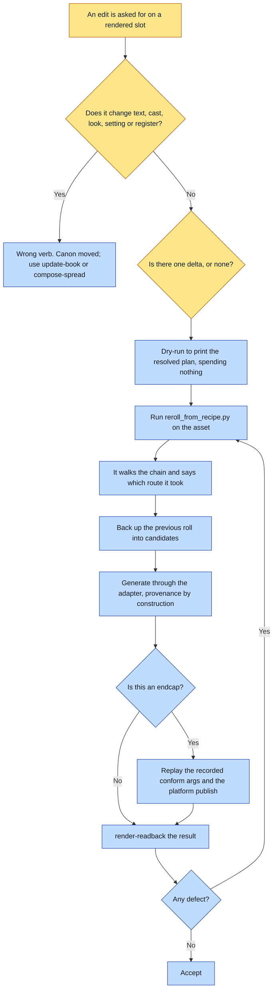

# Purpose

An art-only change to an already-rendered slot happens in ONE command and ONE image call, with the
new roll carrying its own provenance, instead of a session spent re-reading the framework to
reconstruct context that already sits in the slot's own recipe.

The recipe beside every rendered asset is the complete reproduction context: model, full prompt,
every reference path, size, quality, and for an endcap the conform and publish steps that
followed. This skill is the verb that reads it back.

# When to use (Trigger)

Someone says "re-roll this image", "same but warmer", "regenerate the closing plate as-is", "run
that render again", "identical but without X", or any art-only tweak to an existing rendered slot.

**The wrong verb the moment the edit changes words, cast, a look, a setting or the register.** The
recipe is a snapshot of a render, not of canon, so a faithful replay would reproduce the stale
truth. Those edits go through `update-book` and `compose-spread`, which re-resolve canon.

# Inputs / Prerequisites

- The asset, or its `.recipe.json`. The script walks the chain itself.
- Optionally ONE intended delta as `--note`, which the render's own vocabulary can absorb: light,
  weather, mood, a small compositional nudge, "no lettering this time".
- Nothing else. Zero canon reads.

# Roles

| Role | Responsibility |
|---|---|
| **Human operator** | Names the one delta, and rules whether the edit is art-only or has moved canon. That routing decision is the whole gate. |
| **Agent executor** | Points the script at the asset, does not re-orient on canon, reads the printed route, and reads the result back before accepting it. |

# Procedure

Steps say WHAT happens. The flowchart says who; Automation Opportunities holds the ROI.

1. Decide the route. If the edit changes no text, no cast, no look, no setting and no register,
   this is the verb. Otherwise fall through to `update-book`.
2. Optionally `--dry-run` first, which prints the full resolved plan (prompt source, refs, replay
   steps) without spending anything.
3. Run `scripts/reroll_from_recipe.py <asset> [--note "<the one delta>"]`. It walks the chain: a
   derive sidecar is followed back to the generation, and a chain broken by the old in-place
   conform is recovered from `sourceRender` plus the closest-matching sibling generation recipe.
   The output says which route it took.
4. Generation goes through the provider adapter, never a raw model call, so the new roll carries
   its own recipe. Endcap chains replay the recorded conform args and the byte-identical platform
   publish with a derivative recipe. The previous roll is backed up first.
5. READ IT BACK before accepting. Any defect re-rolls from scratch by running the command again,
   never an edit pass on the defective roll.

# Process Flowchart

Amber = irreducibly human. Blue = agent-executed or agent-proposed.

# Done / Verification

The new roll exists with its own `.recipe.json`, written by the adapter rather than by hand. The
previous roll is in `candidates/pre-reroll-<ts>/`. For an endcap, the conform and publish were
replayed rather than hand-copied. The read-back passed every invariant.

The efficiency check is the one worth naming: this should be ONE command and ONE image call. If
the run is re-reading canon, it is in the wrong verb.

# Exceptions & Troubleshooting

- **The incident that earned this verb is the whole argument.** A trivial closing-plate edit took
  85 tool calls, and the first render-adjacent call was number 57: roughly 70% of the run was spent
  re-reading the framework, SPEC and canon to reconstruct context that sat, complete, in the
  slot's own recipe the whole time. Recipes are written for reproducibility; nothing consumed them.
- **Orientation is only necessary when the answer is not already written down.**
- **The `--note` is for deltas the render's own vocabulary absorbs.** Anything larger has moved
  canon, and a faithful replay would then reproduce a stale truth confidently.
- **Never a raw model call.** The adapter is what writes provenance, and a re-roll with no recipe
  breaks the chain for every future re-roll of the same slot.
- **A re-roll is a render, so the gate still applies.** The script prints the read-back reminder
  itself so a headless run cannot forget it.
- **A broken pre-v0.33 in-place conform chain is recovered rather than refused**, and the output
  names the route, so the recovery is visible rather than silent.

# Automation Opportunities

**Already automated:** essentially all of it. Chain resolution including derive sidecars and the
broken-conform recovery, the dry run, generation through the adapter with provenance by
construction, the endcap conform and publish replay, the backup of the prior roll, and the printed
read-back reminder.

**Irreducibly human:** the routing decision, and naming the delta. The routing one is load-bearing
in both directions: using this verb on an edit that moved canon reproduces stale truth, and using
`update-book` on an art-only tweak costs the 85-call run.

**Strongest next candidate:** a refusal when `--note` names something the recipe's own prompt does
not already govern, such as a garment, a cast member or a setting. That is the wrong-verb case
stated in the skill, the script already has the full prompt in hand, and today the only thing
standing between a stale replay and canon is an agent classifying the request correctly.

# Related

- [update-book](../update-book/SKILL.md): its step 0 routes here first, and is where an edit that
  moved canon belongs.
- [pave-the-path](../pave-the-path/SKILL.md): named this as its worked example of building the
  highway rather than paving the roundabout.

# Revision History

| Version | Date | Changes |
|---|---|---|
| 0.1 | 2026-09-14 | Written from the skill file, read rather than recalled. |
