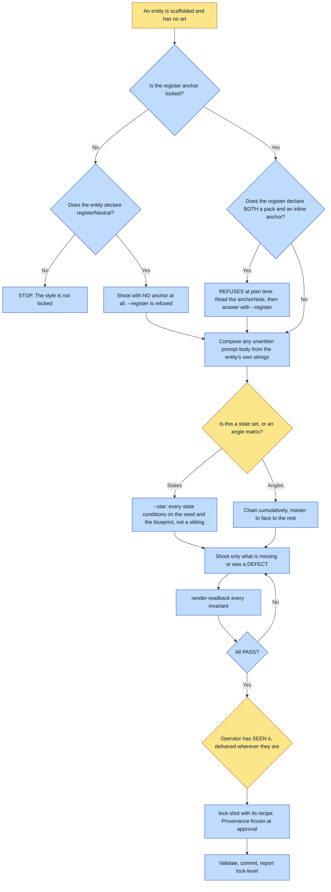

# Purpose

A scaffolded entity gets a body. Three things happen in order: SHOOT, READ BACK, LOCK. Locking is
the last of the three, not the point of them.

The name was `lock-references` until 2026-07-26, and agents reaching for "make the art for this
character" did not find it, because locking sounds like a metadata operation on art that already
exists.

# When to use (Trigger)

After an `add-*` skill has scaffolded an entity and you want to SEE it: "shoot the references",
"make the art for X", "generate X's sheets", "give X its body", "X is still unlocked".

# Inputs / Prerequisites

- The universe and the entity id.
- `identity.register`. If `register.anchor` is null, STOP: the style is not locked. **Unless** the
  entity declares `structured.registerNeutral`, which is the one legitimate exception.
- `identity.register.stylePack` and the notes beside it. A universe that declares a pack usually
  declares it BECAUSE its inline anchor misbehaved, and the note says how.
- `reference/<id>/prompts.md` with every shot body filled. `chain_matrix.py` REFUSES while a body
  still says `TODO(author)`.
- For a real person, the photo stack, pointed at as a FOLDER.

# Roles

| Role | Responsibility |
|---|---|
| **The subject, when real** | Owns the approval. This skill NEVER flips `realPerson.approval.state` from gated; that is the subject's own blessing, recorded separately. |
| **Human operator** | SEES every shot. No shot locks until a person has actually seen it, and that delivery has to reach them wherever they are. |
| **Agent executor** | Resolves what remains, composes prompt bodies from the entity rather than typing them, shoots only what is missing, reads back every invariant, and locks passers WITH their recipes. |

# Procedure

Steps say WHAT happens. The flowchart says who; Automation Opportunities holds the ROI.

1. Resolve the work. Read the entity and `prompts.md`, and run `abu lock-level` to see what
   remains. Compose any unwritten prompt body with `scripts/compose_prompts.py`, which builds each
   body out of the entity's OWN strings, then READ what it wrote.
2. For each shot missing or previously DEFECT, generate with `chain_matrix.py`: register anchor
   first, rejected poles as negatives, the photo stack for a real person, and any already-locked
   shots so the face and build stay consistent. Locked passers are skipped, so re-runs are cheap.
3. Read back with `render-readback`, crop-zooming each invariant. On any DEFECT regenerate that
   shot FROM SCRATCH with the defect named, never an edit pass.
4. SHOW THE OPERATOR EVERY SHOT, by sending the files with the harness's own file-delivery tool. A
   batch of four or more goes as one contact sheet plus individual files for anything being
   approved. Build the sheet with `contact_sheet.py --cover <the reference dir>`, which REFUSES
   unless every shot in that batch is on it; `chain_matrix.py` prints the exact invocation when a
   chain completes, so the artifact is not something to remember.
5. Lock each passer WITH its recipe: `lock-shot <universe> <id> <shot> <path> --recipe <path>`.
   This sets the sheet, promotes `requiredForRender` as the required shots lock, and freezes
   provenance at approval.
6. Validate and commit. `lock-level` reaches `partial` once the required shots pass and `locked`
   once the full matrix does.

# Process Flowchart

Amber = irreducibly human. Blue = agent-executed or agent-proposed.

# Done / Verification

`abu validate` is green. `lock-level` reports `partial` or `locked`. Every locked sheet has a
single `<asset>.recipe.json` beside it, never two. A real person's entity is still `gated`. The
operator has received the files, not just had them opened on one machine.

**The tell that delivery was skipped: a session that generated a dozen images and whose transcript
contains no delivery, only reads the agent made to itself.**

# Exceptions & Troubleshooting

- **A reference shoot is the sparsest render there is**, which is exactly where an anchor's own
  SUBJECT comes back wholesale. A universe declaring both a pack and an inline anchor refuses at
  plan time; the refusal is free and fires before any generation, while a wrong seed is a paid
  image and a blessed wrong seed is a whole matrix.
- **The identity master owes the register nothing.** A photoreal master from which every register
  rendition is DERIVED cannot wait for a blessed register, because it is what the conversions are
  made FROM. Declare it on the ENTITY, never at the command line: a flag cannot refuse a re-shoot
  it is not passed, and a plate cannot be un-baked.
- **Shoot the RENDITIONS from the master, never from the photographs again.** Two independent
  shoots of one subject produce two subjects.
- **The photographs decide the SHOOTING ORDER, and the order is load-bearing.** When the
  photographs cover a NON-default era, shoot that era FIRST and chain the others off it. One
  entity runs fully inverted: elder from the two public photographs, the young default chained off
  elder, and bedfast chained off young. Shooting three in parallel from prose returns three
  different men who merely share a description.
- **Never write the prompt into a throwaway script.** Faced with a stub, an agent wrote its prompts
  inline in five throwaway bash scripts and called the provider directly; the tool it needed
  already existed and already did chaining, the register and skip-existing. A prompt in
  `prompts.md` is versioned, reviewable and reused; the same prompt in a temp file is gone when
  the session ends.
- **A hand-typed prompt paraphrases the invariants slightly, and read-back then checks the art
  against the OTHER wording.** A composed prompt cannot diverge from the rule it will be judged by,
  because it is the same string.
- **Never write a second recipe sidecar.** Two for one asset can diverge, and did.
- **ONE recipe, and never a bare `--star` on an angle matrix.** Use `--star` when shots are STATES
  rather than angles: a cold night plate and a warm-gold noon plate chained serially walk the night
  into the noon, and a negative cannot undo a reference image.
- **The blueprint holds the OBJECT, not the FRAMING.** Two states seeded off one blueprint came back
  with different cover proportions and read as two different books. Pin the shared dimensions as
  NUMBERS in every state's prompt and put it on the entity as an invariant.
- **Replacing the seed invalidates the whole matrix, and it is not bookkeeping.** The temptation is
  to edit each recipe's input digest to today's bytes, which is laundering: it turns "nobody has
  re-judged these" into "these were all approved", silently. Re-shoot instead; nine plates cost
  nine calls and under a minute. And check whether the staleness is real: the same swap changed a
  character's jewellery, visible in six of the nine plates.
- **`open-in-preview` alone is NOT delivery.** Half the time the operator is remote or on a phone.
- **A cross-entity selector can only ADD.** The field that lets you say more must not become a way
  to skip a plate the entity's own gate demands.

# Automation Opportunities

**Already automated:** prompt composition from the entity's own strings, the both-anchors refusal,
the register-neutral shoot with a recipe that records the absence as a statement, automatic
discovery and passing of a code-drawn blueprint, the star topology, `--print-plan` for a free
pre-flight, skip-existing idempotence, provenance merged into the single sidecar, the prompts
backfill and scaffold for old entities, and the multi-character scale plate as a verb.

**Irreducibly human:** the approval, both the subject's and the operator's look at every shot. A
golden IS human judgement frozen, so a shoot that locks without one has frozen nothing.

**Partly built, v0.49.** The sheet can no longer be SHORT: `contact_sheet.py --cover` refuses a
sheet that does not cover its batch, which is the refusal this skill's own method already claimed
the script performed and which no code performed. And the command that builds it is printed where a
shoot ends, so it is a step rather than a technique.

**Strongest next candidate, still open and genuinely the owner's call:** a refusal to `lock-shot` a
slot with no recorded delivery. The blocker is not effort, it is a definition -- what COUNTS as
shown, and what happens when the operator is absent. The framework already has one human-gate
primitive to copy, the `--bless-seed` marker that `chain_matrix.py` refuses a chain without
("golden is not something the agent may award itself"), and extending it to every shot changes the
cost of every shoot, which is a decision rather than an implementation.

# Related

- [add-character](../add-character/SKILL.md) and siblings: author the entity and its prompts.
- [render-readback](../render-readback/SKILL.md): step 3, and the crop and measure tooling.
- [create-style-pack](../create-style-pack/SKILL.md): the pack a declared `stylePack` resolves to.

# Revision History

| Version | Date | Changes |
|---|---|---|
| 0.1 | 2026-09-14 | Written from the skill file, read rather than recalled. |
