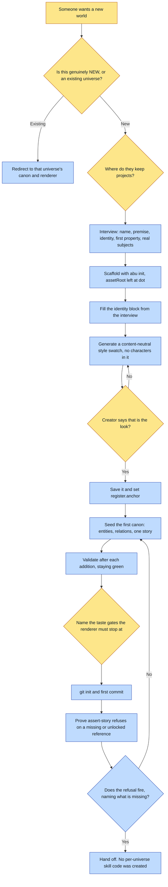

# Purpose

A genuinely new world exists as a one-repo, typed, git-versioned canon conforming to a named spec
version, with references made load-bearing so their absence is a crash rather than a drift, and
quality wired as gates rather than remembered.

The handoff is a universe that validates green AND demonstrably refuses to render on a missing or
unlocked reference. That refusal is the feature.

# When to use (Trigger)

The operator says "start a new story universe", "spin up a universe for X", "I want a canon world
for Y", or is about to build the first property of a NEW world.

**Not for a new book inside an existing universe.** If the world already exists, add to canon and
use the book renderer.

# Inputs / Prerequisites

- Confirmation that this is a NEW world.
- Where they keep projects. Ask; never assume.
- The name and one-line premise, the identity constants, the first property with its declared
  spine and what carries it, and whether any real people are subjects.
- The SPEC, read rather than re-derived, since it is the source of truth for every field contract.

# Roles

| Role | Responsibility |
|---|---|
| **The creator** | Names the world, declares the first property's spine, approves the style anchor with "that's the look", and names the taste gates the renderer must stop at. |
| **A real subject, if any** | Blesses the property. It stays gated until they do, and no private detail enters canon. |
| **Agent executor** | Confirms the scope, scaffolds with the tested CLI rather than hand-writing files, seeds the first canon, wires the gates, and proves the refusal fires. |

# Procedure

Steps say WHAT happens. The flowchart says who; Automation Opportunities holds the ROI.

0. Route and confirm scope. If they name an existing universe, stop and redirect. Pick the canon
   repo home. One repo per universe; never a shared multi-universe store.
1. Interview, one question at a time, for only what canon needs to begin: name and premise; asset
   root left at `.`; the identity block including mark, theme, closing ornament, voice term rules
   and the register with its rejected poles; the first property with its spine and whether a
   character, a setting or a visual metaphor carries it; and any real-person subjects.
2. Scaffold with `abu init <repo>/<slug>-universe --name <slug> [--example]`, which writes
   `universe.json` with spec provenance, the canon directories, and the load-bearing gate. Fill the
   identity block. Style-lock the register: generate a content-neutral swatch, get the creator's
   approval, save it, and point `identity.register.anchor` at it.
3. Seed the first canon: the first property's entities, any known relations, and one story as
   `stub` or `full`. Run `validate` after each addition.
4. Wire the quality gates: name the taste gates, encode craft-canon as it is earned rather than
   assumed up front, and require per-beat provenance.
5. Version, verify, hand off: `git init` and a first commit, `validate` green, and `assert-story`
   behaving correctly, meaning green if assets exist or a clear refusal naming exactly what is
   missing.

# Process Flowchart

Amber = irreducibly human. Blue = agent-executed or agent-proposed.

# Done / Verification

A new one-repo universe exists, git-initialised, first commit made. `universe.json` names the SPEC
VERSION and the canonical wiki, and its identity block is filled. `assetRoot` is `.` and every
referenced asset lives inside the repo: you could clone this folder alone and every ref would
resolve. The register anchor is locked and points at a real file. `validate` is GREEN and the first
story is registered. **The load-bearing gate is wired and DEMONSTRABLY refuses** on a missing or
unlocked reference. Real-subject properties are gated. **No per-universe skill code was created.**

# Exceptions & Troubleshooting

- **Do NOT set `assetRoot` to `..` to reach sibling property repos.** That is the scatter the
  framework exists to kill; Nation of Fire started that way and had to be consolidated back in. A
  universe you can clone as one folder, whose refs all resolve, is the guarantee.
- **Never scaffold or fork a per-universe skill.** The operations are framework skills the universe
  inherits, parameterised by its path and identity. A universe ships DATA, not skill code, and the
  worst version of this failure is a forked compiler, which drifts into a disjoint feature set.
- **Never scaffold a universe that does not name its spec version.** An unpinned universe conforms
  to nothing anyone can check, and cannot detect its own drift.
- **The style anchor must be content-neutral.** A character portrait leaks a face into every render
  the anchor will ever condition, and a reference outranks a negative word.
- **Craft is discovered then encoded, never assumed up front.** Encode a world's invariants as they
  are earned.
- **Name the repo folder `<slug>-universe`, not the generic `universe`**, so it stands on its own.
- **`--example` is for the operator's first-ever universe only.** It drops a worked
  character, setting, story and relation so the shape is obvious; omit it once they know the shape.
- **The scaffold must not bake in any single property's specifics.** Those live in that property's
  own surfaces, not in canon-wide files.

# Automation Opportunities

**Already automated:** the whole scaffold with spec provenance, the canon directory shape, the
load-bearing assert gate, schema validation after each addition, and `lock-level` for reading a
matrix's completeness.

**Irreducibly human:** the premise, the first property's spine, the style approval, and the taste
gates. These are what the world IS, and none of them can be derived.

**Strongest next candidate:** a post-scaffold self-containment check, proving `assetRoot` is `.`
and that no reference escapes the repo, run at handoff rather than left to the definition-of-done
prose. The scatter it prevents is the one failure mode this skill calls out by name from a real
universe, `lint-universe` already resolves refs for other reasons, and the point where it is cheap
to catch is before any canon has been seeded.

# Related

- [abu](../abu/SKILL.md): the loop the creator lives in afterwards.
- [create-style-pack](../create-style-pack/SKILL.md): the fuller form of the style lock, which a
  register may source its anchor and poles from.
- [shoot-references](../shoot-references/SKILL.md): where the seeded entities get their bodies.

# Revision History

| Version | Date | Changes |
|---|---|---|
| 0.1 | 2026-09-14 | Written from the skill file, read rather than recalled. |
