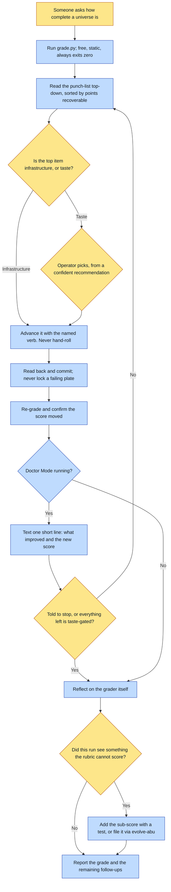

# Purpose

A universe stops being "done by feel". The scorecard replaces the vibe: a letter grade, a score per
dimension, and a punch-list ordered by impact where each item names the exact framework verb that
closes it.

The rubric IS the framework's working definition of a done, good universe, which is why a blind
spot in it is a blind spot everywhere.

# When to use (Trigger)

Someone says "grade this universe", "how complete is X", "universe checkup", "what's left to do",
or wants to know whether a universe is ready to render or ship. Also wired in as the last step of
`make-a-book`, because a book run is the moment the universe was just exercised hardest.

# Inputs / Prerequisites

- A universe directory. The grader is self-contained: it reads the files directly, with no engine
  import, no generation and no cost.
- For Doctor Mode, a channel to text the operator each gain, so they can veto or steer.

# Roles

| Role | Responsibility |
|---|---|
| **Human operator** | Owns every taste fork: selecting a golden, a story's logline and spine, a register or palette decision, anything that changes the universe's identity. Also says when Doctor Mode stops. |
| **Agent executor** | Grades, reads the punch-list top-down, works each item with the RIGHT verb rather than hand-rolling a fix, re-grades to confirm the score moved, and ends every run with a reflection on the grader itself. |

# Procedure

Steps say WHAT happens. The flowchart says who; Automation Opportunities holds the ROI.

1. Grade it with `scripts/grade.py <universe-dir>`, adding `--json` for machine output. It prints
   the letter grade, the per-dimension bars, and the punch-list.
2. Read the punch-list top-down. It is already sorted by points recoverable, and each line names
   the framework verb that delivers the fix.
3. Work the issues with the RIGHT verb, never a hand-rolled fix. A partly-filled matrix goes to
   `shoot-references`; a missing renderable entity to the matching `add-*` then `shoot-references`;
   a setting that cannot prove its size to `add-setting`; no stories to `add-story`; no craft-canon
   to `create-lookbook` plus a register-rule; images with no recipe are regenerated through the
   provider adapter.
4. Re-grade after a work session to confirm the score moved and nothing regressed.
5. End every run with a reflection on the doctor itself: what this run saw that the rubric cannot
   score, what it over- or under-weighted, and what the operator asked that the report did not
   answer. Act on the answers through `evolve-abu`.

In Doctor Mode the loop runs itself: grade, pick the highest-impact item it can advance
autonomously, execute it with the right verb, read back and commit, re-grade, text one short line,
continue. It stops only when told, or when every remaining item is taste-gated.

# Process Flowchart

Amber = irreducibly human. Blue = agent-executed or agent-proposed.

# Done / Verification

The grade is reported with its per-dimension scores, and after a work session a re-grade shows the
score moved and nothing regressed. Every fix was made by the verb the punch-list named, and none by
editing JSON to look complete: the grader checks that files actually RESOLVE.

The grade is the definition of done. Aim to raise it deliberately rather than to feel finished.

# Exceptions & Troubleshooting

- **A low grade is a report, not a failure.** A young universe SHOULD grade low, and the punch-list
  is the plan. The script always exits 0 for exactly this reason. Framed otherwise, people quit
  at C.
- **Never fake a sub-score by writing a path that does not resolve.** The grader checks resolution,
  so faking it just moves the lie downstream.
- **Entity matrices carry the heaviest weight on purpose.** A universe whose references are not
  locked will drift on every render, which is the exact failure the framework exists to kill.
- **Doctor Mode's auto-versus-propose split is load-bearing.** Infrastructure advances
  autonomously: plates, descriptor prose, missing provenance sidecars, scaffolding a scale
  descriptor, wiring existing blessed art into a contract. Taste forks are proposed: a golden, a
  logline and spine, a register or palette decision, anything that changes identity.
- **A render is not reproducible, so never delete an un-locked candidate before its winner is
  locked**, even inside an autonomous loop.
- **Keep the loop's texts to one or two lines.** The loop is the value, not the narration.
- **A grader that never learns converges on grading yesterday's universes.** One paved improvement
  per run is a good pace; zero on a run that surfaced friction means the reflection was skipped.
- **Its neighbours answer different questions.** `validate` asks whether the canon is schema-valid;
  `lint-universe` asks whether there are static warnings; this asks whether it is complete and
  high-quality and what the next highest-leverage fix is.

# Automation Opportunities

**Already automated:** the whole rubric with its eight weighted dimensions, the resolution checks
that make faking pointless, the impact-sorted punch-list with the closing verb named per item,
machine-readable output, and the Doctor Mode loop with its auto-versus-propose classification.

**Irreducibly human:** every taste fork, and the decision to stop. The auto-versus-propose split is
precisely the line between what a rubric can settle and what it cannot.

**Strongest next candidate:** the self-reflection at step 5 producing a written artifact rather than
three questions asked in prose. The rule already says one paved improvement per run is a good pace
and that zero on a friction-heavy run means the section was skipped, which is a claim nobody can
check, because nothing records whether the reflection happened.

# Related

- [abu](../abu/SKILL.md): reports this grade as the score, and does not invent its own.
- [lint-universe](../lint-universe/SKILL.md): the static warning list, free and instant.
- [book-doctor](../book-doctor/SKILL.md): the same posture applied to one rendered book.

# Revision History

| Version | Date | Changes |
|---|---|---|
| 0.1 | 2026-09-14 | Written from the skill file, read rather than recalled. |
