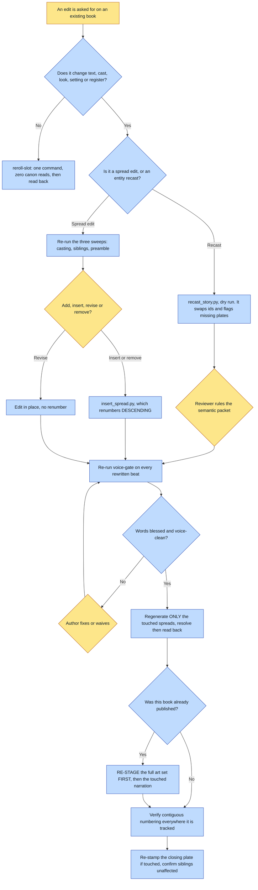

# Purpose

A book whose words are blessed, whose art is on disk and which is usually already shipped gets
changed, without breaking beat numbering, canon, narration or a sibling property's delivery.

Minimal regeneration is the point: only the touched spreads and their downstream narration
regenerate, which is what makes this different from re-running the renderer over the whole story.

# When to use (Trigger)

Add, insert, revise or remove one or more spreads on an existing book. Recast one canon entity as
another across a whole story. Or an art-only re-roll, which routes out of here in one step.

Not for creating a brand-new book.

# Inputs / Prerequisites

- The universe and the story id of the book being edited.
- The requested edit, stated precisely enough to know which beats it touches.
- Whatever asset manifest the target renderer or platform uses for this book.
- For an already-published book: the knowledge that the local interiors and audio are probably
  GONE, because the publish step prunes them.

# Roles

| Role | Responsibility |
|---|---|
| **Author** | Blesses any new or revised text before art, decides the thematic insert point when it is an authorial call, and rules the review packet on a recast. A removal is itself an authorial call and gets the same blessing. |
| **The subject, when real** | Their confusion-flags and likeness approval on a revised beat count the same as the author's. |
| **Agent executor** | Routes an art-only edit out in one step, re-runs the three sweeps a revision needs, uses the renumber script rather than hand-rolling it, and re-stages before any redelivery. |

# Procedure

Steps say WHAT happens. The flowchart says who; Automation Opportunities holds the ROI.

0. FIRST: is this an art-only re-roll? If the edit changes no text, no cast, no look, no setting
   and no register, do NOT re-orient on canon. One command against the slot's own recipe, read the
   result back, and you are done.
1. Load the story and the edit, and identify exactly which beats it touches. Leave everything else
   alone.
2. Re-run the three sweeps the book was BUILT with, because a revision is a new build against
   canon that has moved: a casting sweep on every proper noun in the new text, a sweep of sibling
   properties for the SCRIPTURE and the argument rather than just the cast, and a diff of the
   render-spec's own preamble against a recently-built sibling's.
3. Apply the structural edit. Add or insert at the strongest thematic point and renumber; revise
   in place; remove and renumber down. Verify contiguous `1..LAST` across the manuscript, the asset
   manifest and any narration index. Record in `aimDiscipline` when new beats re-value something an
   existing beat argued against.
4. Words-before-art on any changed text: run `voice-gate` before any art or narration for that beat
   is touched.
5. Regenerate only the touched spreads, with the same discipline as a fresh render: resolve,
   generate anchor-first, read back, and re-cut narration only where text changed.
6. Leave untouched spreads alone. A renumber may shift a filename; it does not invalidate the art.
7. For an already-published book, RE-STAGE THE FULL ART SET FIRST, then regenerate the touched
   narration, then publish.
8. Verify contiguous numbering everywhere it is tracked, re-stamp the mark or closing ornament if
   the edit touched the closing plate, and confirm sibling properties on the platform are
   unaffected.

# Process Flowchart

Amber = irreducibly human. Blue = agent-executed or agent-proposed.

# Done / Verification

Beat and spread numbering is contiguous `1..LAST` across the manuscript, the render-spec, the asset
manifest and the narration index. Every changed beat's words passed the voice gate BEFORE its art
regenerated. Untouched spreads were not regenerated, re-read-back or re-narrated. Sibling
properties on the platform are unaffected.

After any subject change, grep the WHOLE scene and the WHOLE negatives block for the thing you just
replaced. If the old wording is still there, the edit is not done.

# Exceptions & Troubleshooting

- **Redelivery of an already-published book is the single most expensive trap here, and it costs
  real money.** Publish prunes the local copies, so a shipped book has NO local interiors and NO
  local audio. Regenerate one narration clip, run publish, and three things happen in order: the
  art check fails, the run reports it shipped NOTHING, and **the prune runs anyway and deletes the
  clip you just paid to generate.** You end worse off than before, under a success-shaped message.
- **Never hand-roll the renumber.** An insert is a THREE-artifact edit with a silent ordering trap:
  renaming ASCENDING overwrites, because spread 05 to 06 lands on a 06 that has not moved yet. You
  end up with the right file count and the wrong pages, and nothing errors. The script moves
  DESCENDING, which is the whole point, and it moves each recipe with its image.
- **A revision is not a small edit.** All three sweeps were skipped on a real revision because it
  felt like a text tweak. The sibling sweep matters for the SCRIPTURE and the argument, not just
  the cast: the obvious verse for a new movement is often the entire spine of a shipped sibling.
- **A recast refuses to fake the semantic half.** Two heuristics were tried on the real case and
  both failed the same way: sweeping the old entity's contract words buried the two true hits under
  character names, scale prose and the entity's own NEGATIONS about itself, and subtracting the new
  entity's vocabulary left ordinary discursive English. A sweep a human learns to ignore is worse
  than no sweep, so it emits a REVIEW PACKET to a reader instead.
- **An entity swap is a MANUSCRIPT event.** Five beats shipped wrong under finished paintings while
  the caption-drift check correctly reported all seventy-three captions verbatim: it compares the
  spec to the story, and both were stale.
- **A reader who does not understand a beat is a DEFECT IN THE BEAT**, including when the reader is
  the author. Check whether the ART is doing its job first; a caption-only fix is common and far
  cheaper than a re-render.
- **When you CHANGE a subject, delete the old description in the same edit.** A scene said a pendant
  hung from it in one paragraph and that nothing hung from it three paragraphs later; the pendant
  kept reappearing across several increasingly emphatic re-rolls, every one wasted, because the
  spec was asking for it.
- **Beat-number citations cannot be fixed by any tool.** `aimDiscipline`, spine notes and provenance
  lines saying "beat 12" are invalidated by a shift, and nothing can know which 12 was meant. The
  script reports them: swap what you can prove, report what you cannot.

# Automation Opportunities

**Already automated:** the descending renumber with its dry run, its endcap exemption, its refusal
when story and spec are already out of sync, and its report of unfixable citations; the recast's
deterministic id swaps and its plate-key flagging; and the empty `scene` on an inserted spread,
which the compiler refuses so the hole cannot ship by accident.

**Irreducibly human:** the insert point when it is authorial, the recast review packet, and the
blessing on changed or removed words.

**Strongest next candidate:** a refusal in the publish step to prune on a run that shipped nothing.
This skill already names it as a bug worth fixing at the source, it is the trap that costs real
money, and the current defence is a paragraph of prose telling people to re-stage first.

# Related

- [reroll-slot](../reroll-slot/SKILL.md): step 0, and the right verb for an art-only change.
- [render-book](../render-book/SKILL.md): creating a brand-new book.
- [judge-slot](../judge-slot/SKILL.md): the role protocol the recast review packet follows.

# Revision History

| Version | Date | Changes |
|---|---|---|
| 0.1 | 2026-09-14 | Written from the skill file, read rather than recalled. |
