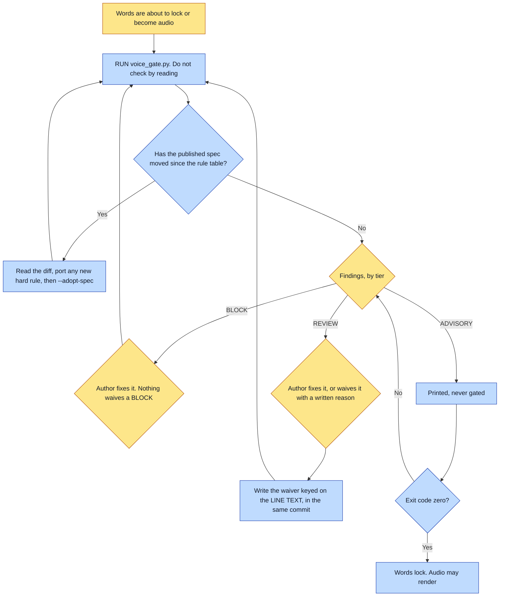

# Purpose

No words lock and no audio renders until the manuscript has passed a voice check that EXITS
NON-ZERO. The rules come from the published voice spec rather than a restated copy, and the gate
proves its own rule table is current before it passes anything.

# When to use (Trigger)

At the words-before-art blessing gate, and before every narration render. Any manuscript,
narration script, or overlaid caption text.

# Inputs / Prerequisites

- The universe, for its own `identity.voice` term rules.
- The manuscript and any other files being checked.
- Network, optionally. The script fetches the published spec, hashes it, and compares against the
  hash its rule table was derived from. Network failure never fails the gate: it falls back to the
  vendored copy and says so.
- A waivers file beside the manuscript, in the same commit, for anything adjudicated rather than
  fixed.

# Roles

| Role | Responsibility |
|---|---|
| **Author** | Fixes each finding, or waives a REVIEW finding with a written reason. The reason is the decision; an emitted stub is not one. |
| **Agent executor** | RUNS THE SCRIPT rather than performing the check by reading, reports the findings, and refuses to proceed while the exit code is non-zero. Does not rewrite the text. |

# Procedure

Steps say WHAT happens. The flowchart says who; Automation Opportunities holds the ROI.

1. Run `scripts/voice_gate.py <universe> <manuscript.md> [more files...]`.
2. On a spec-drift failure, read the diff, port any new hard rule into the rule table, then run
   `--adopt-spec`. Adopting without porting silences the alarm and changes nothing else.
3. Adjudicate the findings by tier. BLOCK is fixed and nothing waives it. REVIEW is fixed, or
   waived with a written reason. ADVISORY is printed and never gated.
4. Write waivers into `<manuscript>.voice-waivers.json`, beside the manuscript, in the same commit.
   `--emit-waivers` writes the stubs ready to annotate, and refuses rather than clobbering reasons
   already adjudicated.
5. Re-run until it exits zero. Only then do the words lock and the audio render.

# Process Flowchart

Amber = irreducibly human. Blue = agent-executed or agent-proposed.

# Done / Verification

The script exits zero. Every BLOCK is fixed. Every REVIEW is fixed or carries a waiver with a real
reason, in the same commit as the manuscript. No waiver still reads TODO. The rule table's hash
matches the published spec, or the run said out loud that it fell back to the vendored copy.

# Exceptions & Troubleshooting

- **A check you perform by READING is a check you skip when you are carrying a book's momentum.**
  This skill shipped for months as prose describing checks an agent was supposed to carry out by
  eye, and the checks did not happen: three totalizing-emphasis violations reached two finished
  books on 2026-08-02, in a chain whose step 4 already said to run voice-gate first. The script
  exits non-zero, so it cannot be agreed with and forgotten.
- **When the published spec moves, the gate FAILS with the diff** rather than passing against stale
  rules, because the failure that actually happens is silent: totalizing emphasis was added to the
  spec and was still unenforced here five days later.
- **A reason still reading TODO waives nothing.** An emitted stub is not a decision.
- **A waiver is keyed on the LINE TEXT, never the line number**, so inserting a spread does not
  shift a waiver onto a sentence nobody adjudicated. Edit the sentence and the waiver retires
  itself and is reported as STALE, which is correct: the reasoning was about a sentence that no
  longer exists.
- **Quotation marks are NOT an exemption**, and that one decision is why the rules did not bind: a
  picture book is almost entirely authored dialogue inside quotes, so the manuscript was exempt
  from its own voice rules. Two of the three totalizing hits sat inside dialogue. Only a markdown
  blockquote and the closing-verse convention are exempt.
- **ADVISORY exists because some rules are genuinely undecidable by grep.** One universe's own note
  says a capitalisation rule INVERTS on the possessive, where capitalising is a doctrinal error
  rather than a style win. A checker that blocked on that would train the author to force the gate,
  and a forced gate is worse than none because it also lies about having checked.
- **Expect a handful of REVIEW items on any real manuscript** and adjudicate them one at a time.
  Fixing is the default; a waiver is for a use that is genuinely concrete or temporal.
- **This skill does not rewrite the text.** It reports; the author fixes.

# Automation Opportunities

**Already automated:** the whole check, the spec fetch with hash comparison so a stale rule table
fails rather than passes, the offline fallback that says so, the three-tier severity model, the
waiver stubs with clobber protection, and line-text keying so waivers survive a renumber.

**Irreducibly human:** the fix, and the waiver reason. The reason is the entire value of a waiver:
without it the file is a mute button.

**Strongest next candidate:** porting a new hard rule from the spec diff automatically where the
rule is a literal token, leaving only the judgement rules for a human. Today `--adopt-spec` is one
command away from silencing an alarm without porting anything, which the skill names as the failure
mode, and the mechanical half of the port is exactly the half a script can do.

# Related

- [render-book](../render-book/SKILL.md): step 3, the words-before-art gate this fills.
- [update-book](../update-book/SKILL.md): runs this on any changed or rewritten beat, including
  every beat a recast rewrote.

# Revision History

| Version | Date | Changes |
|---|---|---|
| 0.1 | 2026-09-14 | Written from the skill file, read rather than recalled. |
